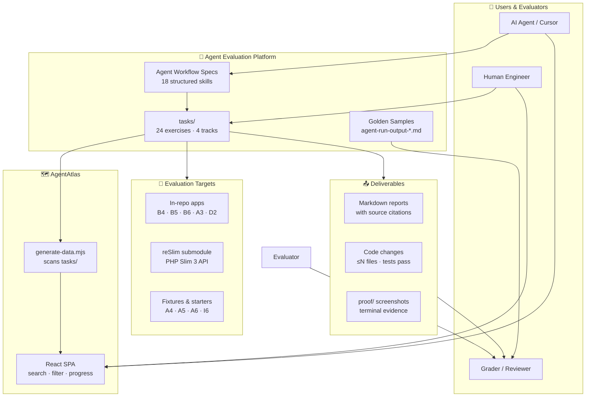
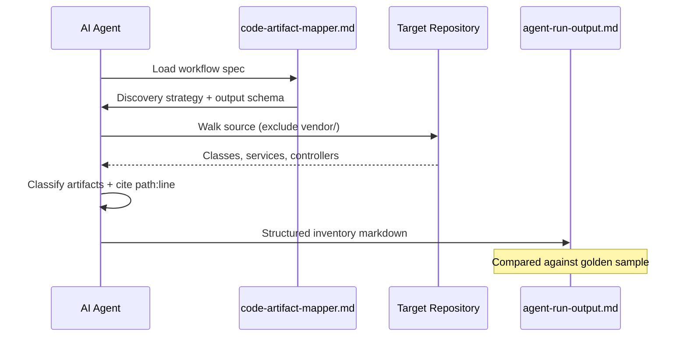
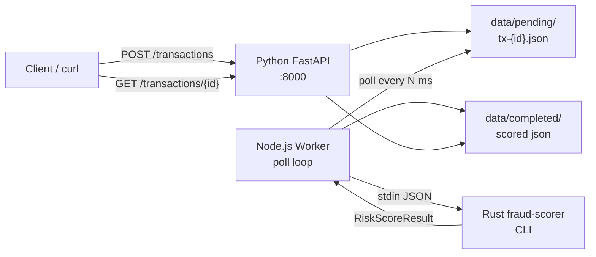
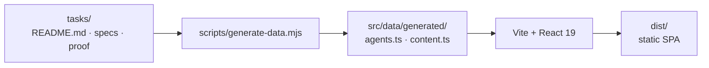
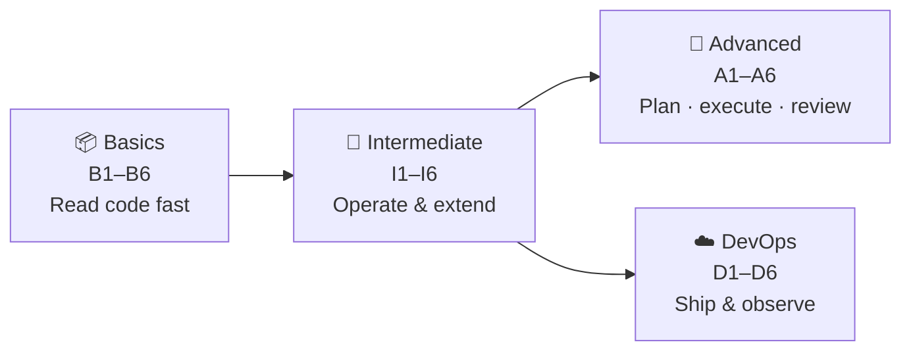
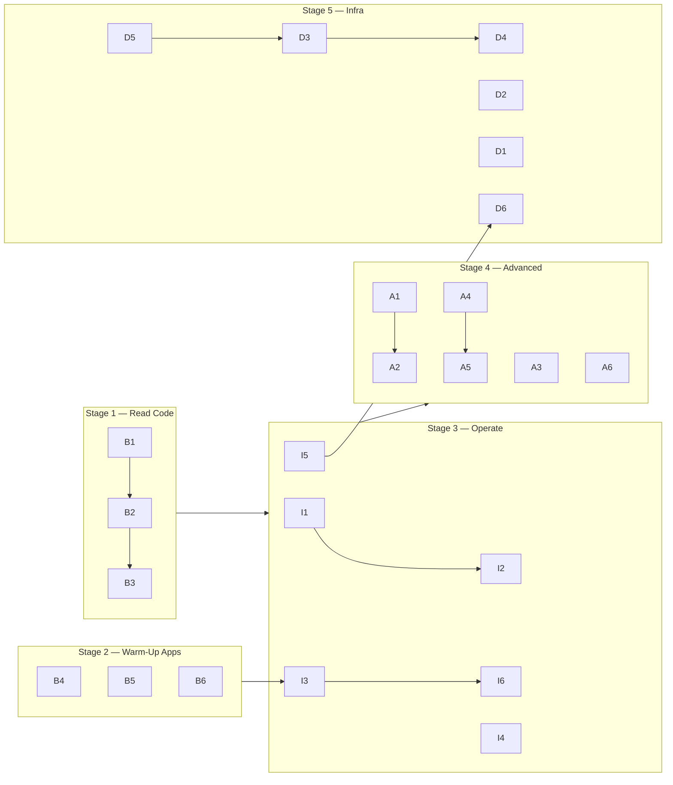

<div align="center">

# 🤖 AI Tasks

### *Benchmark, teach, and ship with AI agents — across every layer of the stack.*

[](https://github.com/mayank3213/Intern-Cohort-AI-Tasks/stargazers)
[](#-task-catalog)
[](#-four-difficulty-tracks)
[](#-agent-workflow-specs)
[](#-tech-stack)

<br />

**A curated library of timed engineering exercises for humans and AI agents — plus an interactive explorer that turns every task into a browsable, verifiable capability map.**

[Explore Tasks](#-task-catalog) · [AgentAtlas UI](#-agentatlas-interactive-explorer) · [Architecture](#-architecture) · [Quick Start](#-quick-start)

<br />

```
┌─────────────────────────────────────────────────────────────────────────────┐
│  tasks/          24 eval exercises · 4 tracks · golden samples · proof      │
│  extras/         AgentAtlas UI · reSlim submodule · generated task data     │
│  agent specs     Repeatable AI workflows mapped to Cursor skills            │
└─────────────────────────────────────────────────────────────────────────────┘
```

</div>

---

## 📑 Table of Contents

- [Why This Project Exists](#-why-this-project-exists)
- [Features](#-features)
- [Architecture](#-architecture)
- [Repository Structure](#-repository-structure)
- [Four Difficulty Tracks](#-four-difficulty-tracks)
- [Task Catalog](#-task-catalog)
- [Agent Workflow Specs](#-agent-workflow-specs)
- [AgentAtlas Interactive Explorer](#-agentatlas-interactive-explorer)
- [Tech Stack](#-tech-stack)
- [Prerequisites & Tooling](#-prerequisites--tooling)
- [Quick Start](#-quick-start)
- [Recommended Learning Path](#-recommended-learning-path)
- [Verification & Golden Samples](#-verification--golden-samples)
- [Hygiene & Conventions](#-hygiene--conventions)
- [Deployment](#-deployment)
- [Documentation Index](#-documentation-index)

---

## 💡 Why This Project Exists

### The Problem

AI coding agents are powerful — but **power without measurement is noise**. Teams need a way to answer hard questions with evidence:

| Question | Without this repo | With this repo |
|----------|-------------------|----------------|
| Can an agent read an unfamiliar codebase? | Anecdotes | **B1–B3** with source citations |
| Can it patch safely without breaking tests? | Hope | **I3, I6** with ≤2-file diffs |
| Can it plan parallel work across git lanes? | Unknown | **A1 → A2** with worktree proof |
| Can it ship polyglot systems? | Demos | **A3, I4** with passing test suites |
| Can it review its own PRs? | Trust | **A5** with structured verdicts |
| Can it deploy and observe infra? | Slides | **D1–D6** with runnable stacks |

### The Motivation

Modern software delivery spans **discovery → operation → parallel execution → review → infrastructure**. Most agent benchmarks test one narrow slice (e.g. single-file edits or trivia). This platform tests the **full engineer lifecycle** — the same skills a staff engineer expects from a new hire on day one.

### What You Get

- **24 timed exercises** with explicit deliverables, pass criteria, and time boxes (15–90 min)
- **18 agent workflow specs** — structured, repeatable prompts for AI-assisted eval runs
- **Golden sample outputs** — a quality bar for humans and agents to compare against
- **Runnable reference systems** — FastAPI ledgers, fraud pipelines, Docker stacks, Terraform modules
- **AgentAtlas** — a zero-backend React explorer that auto-generates from `tasks/`

---

## ✨ Features

<table>
<tr>
<td width="50%" valign="top">

### 🧠 Multi-Agent Architecture

Every analysis and build task ships with an **agent workflow spec** (`*-mapper.md`, `*-splitter.md`, `*-executor.md`) defining inputs, discovery strategy, output schema, and stop conditions. Specs map 1:1 to **Cursor skills** in the parent agent hub.

</td>
<td width="50%" valign="top">

### 🔀 Parallel Execution

**A1** decomposes features into 2–5 git lanes with disjoint file ownership. **A2** executes the plan with real worktrees, merges, conflict resolution, and verification — the closest thing to a CI/CD pipeline for human+agent collaboration.

</td>
</tr>
<tr>
<td width="50%" valign="top">

### 🌍 Polyglot by Design

Same concepts across **Python, Node.js, Rust, PHP, Terraform, Docker, and Kubernetes**. Shared API contracts (B4/B5 ledgers), shared JSON schemas (A3 fraud pipeline), and cross-language test matrices.

</td>
<td width="50%" valign="top">

### 📊 Reports & Verification

Structured markdown deliverables with mandatory **`source: path:line-range`** citations. Golden `agent-run-output-*.md` samples and `proof/` screenshot evidence for runnable systems.

</td>
</tr>
<tr>
<td width="50%" valign="top">

### 🗺️ AgentAtlas Explorer

Auto-generated React UI scans `tasks/` at build time — search, filter, progress heatmap, markdown viewer with Mermaid, command palette (`⌘K`), and per-task verification commands.

</td>
<td width="50%" valign="top">

### 🧩 Modular & Extensible

Each task is self-contained in its own folder. Add a new task → AgentAtlas picks it up automatically. Agent specs follow a universal output contract — no repo-specific assumptions baked in.

</td>
</tr>
</table>

| Capability | Tasks | Output |
|------------|-------|--------|
| Artifact inventory | B1 | Structured class/service/controller map |
| Route discovery | B2 | HTTP endpoint → handler table |
| Test execution | B3 | Framework detection + live test run |
| ER diagrams | I1 | Mermaid `erDiagram` with FK citations |
| Flow tracing | I2 | Mermaid `sequenceDiagram` |
| Surgical patching | I3 | Minimal diff + risk report |
| Polyglot build | I4, A3 | Multi-runtime services + tests |
| Docker / K8s / IaC | I5, D1–D6 | Containers, manifests, Terraform |
| Parallel git | A1, A2 | Plan + worktree execution log |
| PR review | A5 | Structured issues + verdict |
| Performance | A6 | Baseline → fix → ≥10% improvement |

---

## 🏗 Architecture

### High-Level System



### Data Flow — Analysis Task (e.g. B1)



### Data Flow — Polyglot Build (A3)



### AgentAtlas Build Pipeline



---

## 📁 Repository Structure

```
agent/
├── README.md                          ← you are here
├── vercel.json                        ← AgentAtlas deployment config
├── .gitmodules                        ← reSlim submodule pin
│
├── tasks/                             ← ⭐ single source of truth for all eval content
│   ├── README.md                      ← full task catalog + learning path
│   ├── Basics/                        ← B1–B6 · discovery & repo literacy
│   ├── Intermediate/                  ← I1–I6 · operate, patch, polyglot, Docker
│   ├── Advanced/                      ← A1–A6 · parallel git, builds, review, perf
│   └── Infra and DevOps/              ← D1–D6 · Terraform, CI, K8s, observability
│
└── extras/
    ├── README.md
    ├── cloned-repos/
    │   └── reSlim/                    ← git submodule · PHP Slim 3 REST API
    └── frontend/
        └── agent-capability-explorer/ ← AgentAtlas · React/Vite explorer
            ├── scripts/generate-data.mjs
            ├── src/data/generated/    ← auto-generated from tasks/
            └── public/task-assets/    ← proof screenshots
```

### What Lives in a Task Folder

```
{TaskId}/
├── README.md                 # Task brief — goal, deliverables, pass criteria, setup
├── {skill}-*.md              # Agent workflow spec (optional)
├── agent-run-output-*.md     # Golden sample from a completed run
├── scripts/                  # benchmark.sh, verify-*.sh, stack-up.sh
├── fixture/ or starter/      # Target code, patches, seeded bugs
└── proof/                    # Screenshot / terminal evidence
```

---

## 🎯 Four Difficulty Tracks



| Track | Focus | Time Range | Tasks |
|-------|-------|------------|-------|
| [**Basics**](tasks/Basics/README.md) | Discovery & repo literacy | 15–30 min | [B1](tasks/Basics/B1/README.md)–[B6](tasks/Basics/B6/README.md) |
| [**Intermediate**](tasks/Intermediate/README.md) | Operate, patch, polyglot builds | 45–90 min | [I1](tasks/Intermediate/I1/README.md)–[I6](tasks/Intermediate/I6/README.md) |
| [**Advanced**](tasks/Advanced/README.md) | Parallel git, systems, review, perf | 45–90 min | [A1](tasks/Advanced/A1/README.md)–[A6](tasks/Advanced/A6/README.md) |
| [**Infra & DevOps**](tasks/Infra%20and%20DevOps/README.md) | IaC, CI/CD, K8s, observability | 45–60 min | [D1](tasks/Infra%20and%20DevOps/D1/README.md)–[D6](tasks/Infra%20and%20DevOps/D6/README.md) |

---

## 📋 Task Catalog

<details>
<summary><strong>📦 Basics — Discovery & Repo Literacy (B1–B6)</strong></summary>

| Task | Time | Type | Goal |
|------|------|------|------|
| [B1](tasks/Basics/B1/README.md) | 30 min | Analysis | Structured artifact inventory with citations |
| [B2](tasks/Basics/B2/README.md) | 30 min | Analysis | Map every HTTP route to its handler |
| [B3](tasks/Basics/B3/README.md) | 15 min | Analysis | Detect test framework, run tests, interpret failures |
| [B4](tasks/Basics/B4/README.md) | — | Sample app | FastAPI transaction ledger (Python + pytest) |
| [B5](tasks/Basics/B5/README.md) | — | Sample app | Express transaction ledger (Node + Vitest) |
| [B6](tasks/Basics/B6/README.md) | — | Sample app | Rust log-counter CLI (cargo test) |

**Shared ledger API** (B4 + B5): `POST /transactions` · `GET /transactions` · `GET /balance`

</details>

<details>
<summary><strong>🔧 Intermediate — Repo Operator & Polyglot Builder (I1–I6)</strong></summary>

| Task | Time | Goal |
|------|------|------|
| [I1](tasks/Intermediate/I1/README.md) | 45 min | ER inventory + Mermaid `erDiagram` |
| [I2](tasks/Intermediate/I2/README.md) | 45 min | End-to-end flow trace + `sequenceDiagram` |
| [I3](tasks/Intermediate/I3/README.md) | 60 min | Minimal surgical patch (≤2 prod files) |
| [I4](tasks/Intermediate/I4/README.md) | 90 min | FastAPI `/convert` + Node CLI + tests |
| [I5](tasks/Intermediate/I5/README.md) | 60 min | Dockerfile + running container proof |
| [I6](tasks/Intermediate/I6/README.md) | 60 min | Reproduce seeded bug, root cause, minimal fix |

</details>

<details>
<summary><strong>🚀 Advanced — Plan, Execute, Review & Perform (A1–A6)</strong></summary>

| Task | Time | Goal |
|------|------|------|
| [A1](tasks/Advanced/A1/README.md) | 45 min | Parallel lane plan (**plan only — no git mutations**) |
| [A2](tasks/Advanced/A2/README.md) | 90 min | Execute A1 plan with worktrees + merges |
| [A3](tasks/Advanced/A3/README.md) | ~90 min | **Flagship:** Python + Node + Rust fraud pipeline |
| [A4](tasks/Advanced/A4/README.md) | 90 min | Modernization findings + one safe first step |
| [A5](tasks/Advanced/A5/README.md) | 60 min | Structured review of agent-generated PR |
| [A6](tasks/Advanced/A6/README.md) | 90 min | Profile bottleneck → fix → ≥10% improvement |

**Task chains:** A1 → A2 · A4 → A5

</details>

<details>
<summary><strong>☁️ Infra & DevOps — Ship, Deploy & Observe (D1–D6)</strong></summary>

| Task | Time | Goal | Stack |
|------|------|------|-------|
| [D1](tasks/Infra%20and%20DevOps/D1/README.md) | 60 min | Terraform small service | Terraform + LocalStack |
| [D2](tasks/Infra%20and%20DevOps/D2/README.md) | — | Multi-service Compose stack | FastAPI + PostgreSQL + worker |
| [D3](tasks/Infra%20and%20DevOps/D3/README.md) | 45 min | CI pipeline | GitHub Actions + ruff + Docker |
| [D4](tasks/Infra%20and%20DevOps/D4/README.md) | 60 min | Kubernetes manifests | kind + kubectl |
| [D5](tasks/Infra%20and%20DevOps/D5/README.md) | — | One-command repo bootstrap | mise + Makefile |
| [D6](tasks/Infra%20and%20DevOps/D6/README.md) | 60 min | Observability stack | structlog + Prometheus + Grafana |

**Pipeline chain:** D5 → D3 → D4 → D6

</details>

→ Full catalog with agent specs, tooling, and learning path: **[tasks/README.md](tasks/README.md)**

---

## 🤖 Agent Workflow Specs

Each `*-mapper.md`, `*-splitter.md`, or `*-agent.md` file defines a **repeatable AI workflow**: inputs, discovery strategy, output schema, and stop conditions. These map to Cursor skills in the parent agent hub.

| Agent Spec | Cursor Skill | Task |
|------------|--------------|------|
| [code-artifact-mapper.md](tasks/Basics/B1/code-artifact-mapper.md) | `code-artifact-mapper` | B1 |
| [route-discovery-mapper.md](tasks/Basics/B2/route-discovery-mapper.md) | `route-discovery-mapper` | B2 |
| [test-discovery-executor.md](tasks/Basics/B3/test-discovery-executor.md) | `test-discovery-executor` | B3 |
| [er-diagram-mapper.md](tasks/Intermediate/I1/er-diagram-mapper.md) | `er-diagram-mapper` | I1 |
| [flow-tracer.md](tasks/Intermediate/I2/flow-tracer.md) | `flow-tracer` | I2 |
| [surgical-patcher.md](tasks/Intermediate/I3/surgical-patcher.md) | `surgical-patcher` | I3 |
| [seeded-bug-diagnoser.md](tasks/Intermediate/I6/seeded-bug-diagnoser.md) | — | I6 |
| [parallel-task-splitter.md](tasks/Advanced/A1/parallel-task-splitter.md) | `parallel-task-splitter` | A1 |
| [parallel-worktree-executor.md](tasks/Advanced/A2/parallel-worktree-executor.md) | `parallel-worktree-executor` | A2 |
| [modernization-first-stepper.md](tasks/Advanced/A4/modernization-first-stepper.md) | `modernization-first-stepper` | A4 |
| [agent-pr-reviewer.md](tasks/Advanced/A5/agent-pr-reviewer.md) | `agent-pr-reviewer` | A5 |
| [targeted-perf-fixer.md](tasks/Advanced/A6/targeted-perf-fixer.md) | `targeted-perf-fixer` | A6 |
| [terraform-small-service-agent.md](tasks/Infra%20and%20DevOps/D1/terraform-small-service-agent.md) | — | D1 |
| [docker-compose-stack-agent.md](tasks/Infra%20and%20DevOps/D2/docker-compose-stack-agent.md) | — | D2 |
| [ci-pipeline-writer.md](tasks/Infra%20and%20DevOps/D3/ci-pipeline-writer.md) | — | D3 |
| [k8s-manifests-agent.md](tasks/Infra%20and%20DevOps/D4/k8s-manifests-agent.md) | — | D4 |
| [repo-bootstrap-agent.md](tasks/Infra%20and%20DevOps/D5/repo-bootstrap-agent.md) | — | D5 |
| [observability-stack-agent.md](tasks/Infra%20and%20DevOps/D6/observability-stack-agent.md) | — | D6 |

### AI Eval Run Protocol

```
1. Read task README.md          → goal, deliverables, pass criteria
2. Load agent workflow spec       → discovery strategy + output contract
3. Execute against target repo    → cite source: path:line on every finding
4. Compare to golden sample       → structure and depth, not copy-paste
```

---

## 🗺 AgentAtlas Interactive Explorer

**AgentAtlas** (`extras/frontend/agent-capability-explorer/`) is a zero-backend React SPA that turns the entire `tasks/` tree into an interactive capability map.

```bash
cd extras/frontend/agent-capability-explorer
npm install
npm run dev        # → http://localhost:5173
```

| Feature | Description |
|---------|-------------|
| **Home** | Hero, animated stats, featured agent cards |
| **Explore** | Search + filters (category, status, language) |
| **Agent Detail** | Requirements, artifacts, markdown reports, evidence, verification commands |
| **Progress** | Completion heatmap across B1–D6 |
| **Timeline** | Chronological task history |
| **Command palette** | `⌘K` search · `⇧⌘K` navigation |
| **Markdown viewer** | GFM tables, syntax highlighting, embedded Mermaid |

Data regenerates automatically on `predev` / `prebuild` via `scripts/generate-data.mjs` — **no backend required**.

→ Details: [extras/frontend/agent-capability-explorer/README.md](extras/frontend/agent-capability-explorer/README.md)

---

## 🛠 Tech Stack

<table>
<tr>
<th>Layer</th>
<th>Technologies</th>
</tr>
<tr>
<td><strong>Evaluation targets</strong></td>
<td>Python 3.9+ · FastAPI · pytest · Node.js 18+ · Express · Vitest · Rust · PHP · Slim 3</td>
</tr>
<tr>
<td><strong>Infrastructure</strong></td>
<td>Terraform · LocalStack · Docker Compose · GitHub Actions · kind · kubectl · Prometheus · Grafana</td>
</tr>
<tr>
<td><strong>AgentAtlas UI</strong></td>
<td>React 19 · TypeScript · Vite 8 · Tailwind CSS 4 · shadcn/ui · framer-motion · Mermaid</td>
</tr>
<tr>
<td><strong>Agent specs</strong></td>
<td>Markdown workflow contracts · Cursor skill integration · golden sample validation</td>
</tr>
<tr>
<td><strong>Deployment</strong></td>
<td>Vercel (static SPA) · git submodules (reSlim)</td>
</tr>
</table>

---

## ⚙️ Prerequisites & Tooling

### One-Time Setup

```bash
# Clone the repository
git clone https://github.com/mayank3213/Intern-Cohort-AI-Tasks.git
cd Intern-Cohort-AI-Tasks

# Initialize the reSlim submodule (required for B1–B3, I1–I2, A1–A2)
git submodule update --init extras/cloned-repos/reSlim
```

### Tooling Matrix

| Tool | Version | Required For |
|------|---------|--------------|
| Python | 3.9+ | B4, I4, I5, A3, D2–D6 |
| Node.js | 18+ | B5, I4, A3, I6, AgentAtlas |
| Rust (`cargo`) | stable | B6, A3 |
| Docker + Compose | 24+ | I5, D2, D3–D6 |
| Terraform | ≥ 1.5 | D1 |
| kind + kubectl | latest | D4 |
| PHP + Composer | 7.4+ / 8.x | reSlim, A4 starter, A6 |

> Create Python virtualenvs locally. **Never commit** `.venv/`, `node_modules/`, `vendor/`, `target/`, or Terraform state.

---

## 🚀 Quick Start

### Option A — Browse with AgentAtlas (fastest)

```bash
cd extras/frontend/agent-capability-explorer
npm install && npm run dev
```

Open **http://localhost:5173** — pick any task, read requirements, copy verification commands.

### Option B — Run your first exercise (~45 min)

```bash
# 1. Warm up with the FastAPI ledger
cd tasks/Basics/B4
python3 -m venv .venv && source .venv/bin/activate
pip install -r requirements.txt
pytest -q

# 2. Practice artifact inventory on a small codebase
# Open tasks/Basics/B1/README.md and follow the brief
# Target: tasks/Basics/B4 (only ~5 source files)

# 3. Compare your output to the golden sample
# tasks/Basics/B1/agent-run-output-reslim.md
```

### Option C — Ship the flagship polyglot system (A3)

```bash
# Terminal 1 — Rust scorer
cd tasks/Advanced/A3/rust-scorer && cargo build --release

# Terminal 2 — FastAPI
cd tasks/Advanced/A3/python-api
python3 -m venv .venv && source .venv/bin/activate
pip install -r requirements.txt
export FRAUD_DATA_DIR="$(cd .. && pwd)/data"
uvicorn app.main:app --reload --host 127.0.0.1 --port 8000

# Terminal 3 — Node worker
cd tasks/Advanced/A3/node-worker
export FRAUD_DATA_DIR="$(cd .. && pwd)/data"
export FRAUD_SCORER_BIN="$(cd ../rust-scorer && pwd)/target/release/fraud-scorer"
npm start
```

→ Full A3 docs: [tasks/Advanced/A3/README.md](tasks/Advanced/A3/README.md)

---

## 🧭 Recommended Learning Path



| Stage | Order | Why |
|-------|-------|-----|
| **1 — Read** | B1 → B2 → B3 | Inventory, routes, tests — zero code changes |
| **2 — Warm-up** | B4 / B5 / B6 | Small targets before reSlim |
| **3 — Operate** | I1 → I2 → I3 → I4 → I5 → I6 | Diagrams, traces, patches, polyglot, Docker, debugging |
| **4 — Advanced** | A1 → A2, A3, A4 → A5, A6 | Parallel git, builds, modernization, review, perf |
| **5 — Infra** | D5 → D3 → D4 + D1/D2/D6 | Bootstrap, CI, Kubernetes, Terraform, observability |

---

## ✅ Verification & Golden Samples

Every eval produces **evidence**, not claims:

| Evidence Type | Location | Used By |
|---------------|----------|---------|
| Golden markdown reports | `agent-run-output-*.md` | Humans + AI quality bar |
| Parallel plan/run logs | `parallel-plan-*.md`, `parallel-run-*.md` | A1, A2 |
| Screenshot proof | `proof/` | B4, B5, B6, A3 |
| Benchmark scripts | `scripts/benchmark.sh` | A6 |
| Test suites | `pytest`, `npm test`, `cargo test` | All build tasks |

**Pass gate examples:**

- **B3:** Primary test command **executed** — exit code + verbatim output captured
- **I3:** ≤2 production files changed, targeted test passes, risk table present
- **A2:** Worktrees created, lanes merged in order, verification commands pass
- **A6:** Same file count + hash, median wall time ≥10% lower than baseline

---

## 🧹 Hygiene & Conventions

- **Source citations** — every analysis finding must include `source: path:line-range`
- **Time boxes** — pass criteria assume stated duration; scope accordingly
- **Do not commit** generated artifacts: `.venv/`, `node_modules/`, `vendor/`, `target/`, `.pytest_cache/`, `*.tfstate*`
- **Canonical apps** — I6 modifies `fixture/sandbox/`, never canonical `Basics/B5`
- **A1 is plan-only** — no worktrees or commits; hand off execution to A2

---

## 🌐 Deployment

AgentAtlas deploys to **Vercel** as a static SPA:

```json
{
  "buildCommand": "npm run build --prefix extras/frontend/agent-capability-explorer",
  "outputDirectory": "extras/frontend/agent-capability-explorer/dist"
}
```

The build pipeline runs `generate-data.mjs` before compilation, ensuring the deployed site always reflects the latest `tasks/` content.

---

## 📚 Documentation Index

| Document | Description |
|----------|-------------|
| [tasks/README.md](tasks/README.md) | Full 24-task catalog, learning path, agent spec index |
| [tasks/Basics/README.md](tasks/Basics/README.md) | Discovery track deep dive |
| [tasks/Intermediate/README.md](tasks/Intermediate/README.md) | Operator track overview |
| [tasks/Advanced/README.md](tasks/Advanced/README.md) | Advanced track + A3 architecture |
| [tasks/Infra and DevOps/README.md](tasks/Infra%20and%20DevOps/README.md) | DevOps track + pipeline chains |
| [tasks/Advanced/A3/README.md](tasks/Advanced/A3/README.md) | Flagship polyglot system (most detailed task doc) |
| [extras/README.md](extras/README.md) | AgentAtlas + reSlim submodule |
| [extras/frontend/agent-capability-explorer/README.md](extras/frontend/agent-capability-explorer/README.md) | AgentAtlas architecture + features |

---

<div align="center">

### Built for engineers who measure agents the way they measure code — with tests, citations, and proof.

**[⭐ Star this repo](https://github.com/mayank3213/Intern-Cohort-AI-Tasks)** · **[📋 Pick a task](tasks/README.md)** · **[🗺 Open AgentAtlas](extras/frontend/agent-capability-explorer/README.md)**

<br />

<sub>24 tasks · 4 tracks · 18 agent specs · 8+ languages · zero backend explorer</sub>

</div>
