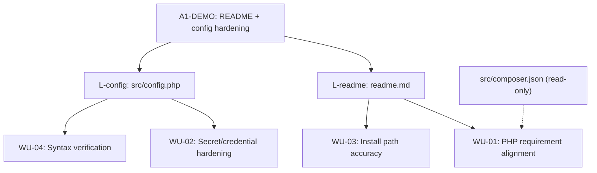
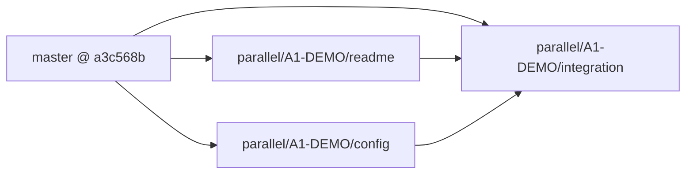
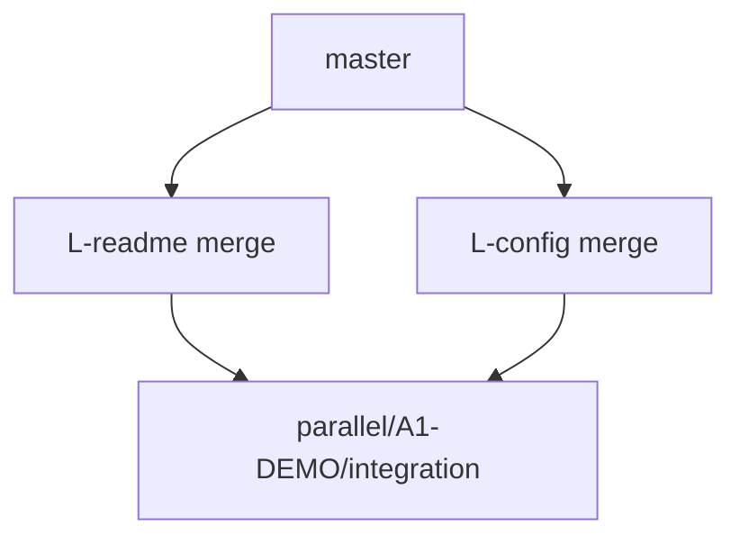
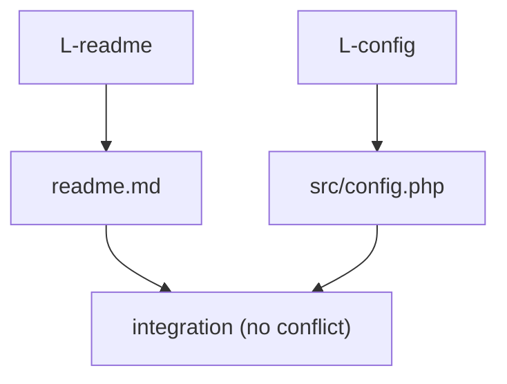
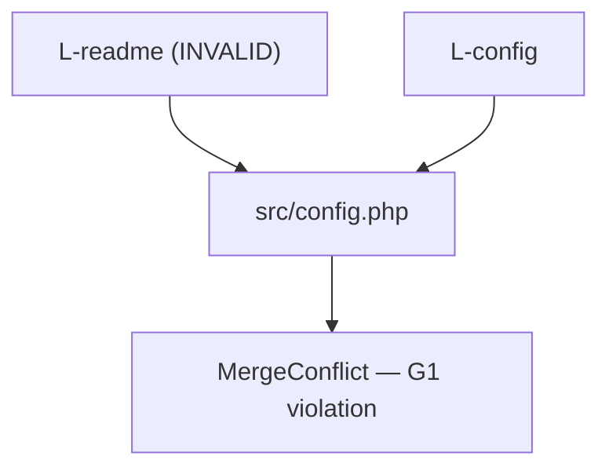

# Parallel Plan — A1-DEMO

> Generated by `parallel-task-splitter` v1.1  
> Repo: `/Users/mayanksrivastava/Desktop/agent/reSlim` · Base SHA: `a3c568be0a0f8d67c4747c4fd855dc90b6be8cdc` (master)

## Table of contents

1. [Execution Summary](#execution-summary)
2. [Task Breakdown](#task-breakdown)
3. [Worktrees & Branches](#worktrees--branches)
4. [Shared Constraints](#shared-constraints)
5. [Agent Prompts](#agent-prompts)
6. [Merge Order](#merge-order)
7. [Risk Analysis](#risk-analysis)
8. [Verification Plan](#verification-plan)

---

## Execution Summary

```yaml
agent: parallel-task-splitter
version: 1.1
task_id: A1-DEMO
repo_root: /Users/mayanksrivastava/Desktop/agent/reSlim
plan_base_sha: a3c568be0a0f8d67c4747c4fd855dc90b6be8cdc
default_branch: master
stack_detected: PHP 7.4+/8.x, Slim 3, Composer, GitHub Actions (php-syntax.yml)
lane_count: 2
merge_order: [readme, config]
result: parallelizable
plan_file: tasks/Advanced/A1/parallel-plan-a1-demo.md
downstream_executor: parallel-worktree-executor
preflight_note: HEAD at preflight was parallel/A1-DEMO/integration @ e83a6e5; lanes fork from master. Untracked .worktrees/ present — executor should not treat as blocker.
```

### Lane overview

| lane_id | branch | worktree_path | blocked_by | scope |
|---|---|---|---|---|
| `L-readme` | `parallel/A1-DEMO/readme` | `/Users/mayanksrivastava/Desktop/agent/reSlim/.worktrees/A1-DEMO-readme` | — | S |
| `L-config` | `parallel/A1-DEMO/config` | `/Users/mayanksrivastava/Desktop/agent/reSlim/.worktrees/A1-DEMO-config` | — | S |

### Top risks

- **R-01 contract_drift:** README PHP wording may diverge from `src/composer.json` if L-readme does not read Composer constraint.
- **R-02 scope_creep (L-readme):** Refactoring feature lists or wiki links beyond AC-1/AC-4.
- **R-03 scope_creep (L-config):** Introducing env-loader or DI refactors instead of placeholder hardening only.
- **R-04 missing_dependency:** Local `php` binary required for L-config lane verification.
- **R-05 merge_conflict:** Very low — G1 pass; disjoint file ownership by design.

### A2 handoff

```
Run the Parallel Worktree Executor Agent (parallel-worktree-executor) on:

Plan: tasks/Advanced/A1/parallel-plan-a1-demo.md
Repo: /Users/mayanksrivastava/Desktop/agent/reSlim
Integration branch: parallel/A1-DEMO/integration

Execute worktrees, commits, merges, verification — not plan-only.
Follow tasks/Advanced/A2/parallel-worktree-executor.md
```

---

## Task Breakdown

**Task:** Parallel README + config hardening (disjoint files)  
**Repo:** `/Users/mayanksrivastava/Desktop/agent/reSlim`  
**Plan base SHA:** `a3c568be0a0f8d67c4747c4fd855dc90b6be8cdc`

### Work units

| id | unit | lane | files | AC trace |
|---|---|---|---|---|
| WU-01 | Align README system requirements with Composer PHP floor (`^7.4 \|\| ^8.0`) and clarify install prerequisites | `L-readme` | `source: readme.md` (write) | AC-1: README no longer advertises PHP 5.5+; matches `source: src/composer.json` |
| WU-02 | Harden default `config.php` — replace placeholder credentials/secrets with safe local-dev defaults and inline guidance | `L-config` | `source: src/config.php` (write) | AC-2: No production-like secrets in defaults; AC-3: DB/SMTP/cache placeholders documented for local setup |
| WU-03 | Verify README install steps still reference correct paths after WU-01 edits | `L-readme` | `source: readme.md` (write, same lane as WU-01) | AC-4: Getting Started section remains accurate |
| WU-04 | Verify config syntax and PHP lint after WU-02 edits | `L-config` | `source: src/config.php` (write, same lane as WU-02) | AC-5: `php -l src/config.php` exits 0 |

### Dependency notes

- **WU-01 / WU-03** and **WU-02 / WU-04** are same-lane bundles; no cross-lane file overlap.
- **Semantic coupling (read-only):** `L-readme` should read `source: src/composer.json` to copy the declared PHP constraint; it must **not** write that file.
- **Semantic coupling (read-only):** `L-config` may read `source: readme.md` for consistency checks; it must **not** write that file.
- No migration, route, or service changes — lanes are fully parallel with **zero write overlap** (G1 pass).
- Master baseline gaps (verified at plan time):
  - `readme.md` line 42: `PHP 5.5 or newer (last tested on PHP7.3)` — must become 7.4+.
  - `src/config.php`: `$config['db']['pass'] = 'root'`, `$config['smtp']['username'] = 'youremail@gmail.com'`, `$config['smtp']['password'] = 'secret'`, `$config['cache']['secretkey'] = 'b372e7fe'` — must be hardened.

### Decomposition diagram



---

## Worktrees & Branches

**Integration branch:** `parallel/A1-DEMO/integration`  
**Base branch:** `master` @ `a3c568be0a0f8d67c4747c4fd855dc90b6be8cdc`

| lane_id | lane_slug | branch | worktree_path | owns_write | blocked_by | estimated_scope |
|---|---|---|---|---|---|---|
| `L-readme` | `readme` | `parallel/A1-DEMO/readme` | `/Users/mayanksrivastava/Desktop/agent/reSlim/.worktrees/A1-DEMO-readme` | `readme.md` | — | S |
| `L-config` | `config` | `parallel/A1-DEMO/config` | `/Users/mayanksrivastava/Desktop/agent/reSlim/.worktrees/A1-DEMO-config` | `src/config.php` | — | S |

### Read-only access

| lane_id | owns_read |
|---|---|
| `L-readme` | `src/composer.json`, `license.md`, `.github/workflows/php-syntax.yml` |
| `L-config` | `readme.md`, `src/composer.json`, `src/app/dependencies.php` |

### Worktree fork diagram



---

## Shared Constraints

### Contract: PHP platform floor

| field | value | source |
|---|---|---|
| minimum PHP | `7.4` | `source: src/composer.json` (`"php": "^7.4 \|\| ^8.0"`) |
| README must state | PHP 7.4+ (or 7.4 / 8.x as appropriate) | AC-1 |
| do not change | `src/composer.json` in this task | out of lane scope |

### Contract: config hardening targets

| config key | current risk (master) | target |
|---|---|---|
| `$config['db']['pass']` | literal `'root'` | empty string or clearly labeled local-dev placeholder with comment |
| `$config['smtp']['username']` | `'youremail@gmail.com'` | empty or `CHANGE_ME` placeholder |
| `$config['smtp']['password']` | `'secret'` | empty or `CHANGE_ME` placeholder |
| `$config['cache']['secretkey']` | hardcoded `'b372e7fe'` | generate-instructions comment; use obvious dev placeholder |
| `$config['displayErrorDetails']` | `true` | keep `true` for local dev; add comment that production should be `false` |

Lanes must **not** rename config keys, change array structure, or alter non-credential settings unless required for hardening comments.

### Coding conventions

- Match existing reSlim style: short array syntax where present, block docblocks above config sections.
- No new PHP dependencies or Composer changes.
- No edits under `src/vendor/`, `src/classes/`, routers, or modules.

### Commit message format

```
A1-DEMO [{lane_id}]: {summary}
```

Examples:

- `A1-DEMO [L-readme]: align README PHP requirement with Composer 7.4+`
- `A1-DEMO [L-config]: replace placeholder secrets with safe local defaults`

### Forbidden actions

- Creating or modifying git worktrees (A2 executor only)
- Editing files outside lane `owns_write` list
- Bumping Composer/Slim dependencies
- Refactoring unrelated README sections (features list, wiki links) unless needed for AC-1/AC-4
- Changing application logic in `src/app/`, routers, or classes
- Committing real credentials or production secrets

---

## Agent Prompts

### Lane L-readme

```
You are executing lane L-readme for task A1-DEMO on reSlim.

Repo root: /Users/mayanksrivastava/Desktop/agent/reSlim
Branch: parallel/A1-DEMO/readme (create from master @ a3c568be0a0f8d67c4747c4fd855dc90b6be8cdc)

## Scope
- Update readme.md so System Requirements reflects PHP 7.4+ (matching src/composer.json), not PHP 5.5+.
- Ensure Getting Started / Installation steps remain accurate (paths: reslim/src, composer install, config.php location).
- Do not change feature lists, badges, or wiki links unless a requirement line directly conflicts with AC-1.

## Owned files
Write: readme.md
Read-only: src/composer.json, license.md, .github/workflows/php-syntax.yml

## Dependencies merged from upstream lanes
None — this lane can start immediately in parallel with L-config.

## Verification (lane-local)
cd /Users/mayanksrivastava/Desktop/agent/reSlim
grep -n "PHP" readme.md   # confirm 7.4+ wording, no 5.5 reference
grep '"php"' src/composer.json

## Stop conditions
- STOP if you need to edit src/config.php or src/composer.json — defer to L-config or a separate task.
- STOP if README changes require code changes outside readme.md.
- STOP and flag [NEEDS CLARIFICATION] if product owner wants different PHP upper-bound wording (7.4 only vs 7.4–8.x).

Commit format: A1-DEMO [L-readme]: {summary}
```

### Lane L-config

```
You are executing lane L-config for task A1-DEMO on reSlim.

Repo root: /Users/mayanksrivastava/Desktop/agent/reSlim
Branch: parallel/A1-DEMO/config (create from master @ a3c568be0a0f8d67c4747c4fd855dc90b6be8cdc)

## Scope
- Harden src/config.php default values for local development:
  - Replace obvious placeholder secrets (smtp password 'secret', gmail placeholder, cache secretkey 'b372e7fe') with empty/CHANGE_ME values and brief comments.
  - Add production note on displayErrorDetails (true for dev, false for prod).
  - Keep all existing config keys and array structure intact.
- Do not change DB host/name defaults beyond credential placeholders unless necessary.

## Owned files
Write: src/config.php
Read-only: readme.md, src/composer.json, src/app/dependencies.php

## Dependencies merged from upstream lanes
None — this lane can start immediately in parallel with L-readme.

## Verification (lane-local)
cd /Users/mayanksrivastava/Desktop/agent/reSlim
php -l src/config.php
grep -E "(secret|youremail@gmail.com|b372e7fe)" src/config.php || true

## Stop conditions
- STOP if you need to edit readme.md — defer to L-readme.
- STOP if hardening requires new env-loader code or composer packages.
- STOP and flag [NEEDS CLARIFICATION] if team policy requires .env file support (out of scope for this lane).

Commit format: A1-DEMO [L-config]: {summary}
```

---

## Merge Order

**Integration branch:** `parallel/A1-DEMO/integration`  
**Base:** `master` @ `a3c568be0a0f8d67c4747c4fd855dc90b6be8cdc`

### Ordered merges

1. **`L-readme`** → `parallel/A1-DEMO/integration` — **rationale:** documentation-only change; zero conflict risk with config lane; establishes AC-1 before integration verification.
2. **`L-config`** → `parallel/A1-DEMO/integration` — **rationale:** touches disjoint file (`src/config.php`); merge after or before readme with equal safety; listed second for convention (docs before runtime config).

Both merges are **expected conflict-free** (disjoint `owns_write` paths). No ordering dependency between lanes.

### Conflict resolution playbook

| hot file | lanes | expected outcome |
|---|---|---|
| `readme.md` | L-readme only | N/A — single writer |
| `src/config.php` | L-config only | N/A — single writer |

If an executor accidentally edits both files on one branch, **abort parallel merge** and re-run affected lane from plan.

### Merge dependency diagram



Arrows mean lanes fork from `master` independently; both merge into integration with **no ordering dependency** between lanes.

---

## Risk Analysis

### Risk register

| id | type | lanes | location | likelihood | impact | mitigation |
|---|---|---|---|---|---|---|
| R-01 | contract_drift | L-readme, L-config | `readme.md` vs `src/composer.json` PHP wording | low | med | L-readme reads `src/composer.json`; shared constraint table fixes floor at 7.4+ |
| R-02 | scope_creep | L-readme | `readme.md` | med | low | Forbidden: refactor feature list; only AC-1/AC-4 sections |
| R-03 | scope_creep | L-config | `src/config.php` | med | med | Forbidden: DI/env-loader refactors; harden placeholders only |
| R-04 | missing_dependency | L-config | local PHP binary | low | low | Lane verification requires `php -l`; document in verification plan |
| R-05 | test_order | integration | CI path filters | low | low | Integration PR includes both files → triggers `.github/workflows/php-syntax.yml` |
| R-06 | merge_conflict | — | — | very low | low | G1 pass: disjoint ownership; no shared-file writers |

### Shared-file conflict diagram

No shared write ownership — diagram shows **absence** of merge conflict by design:



Invalid scenario (G1 violation — does **not** apply to this plan):



---

## Verification Plan

**Stack detected:** PHP 7.4+/8.x, Slim 3, Composer, GitHub Actions (`php-syntax.yml`)  
**Repo root:** `{repo_root}` = `/Users/mayanksrivastava/Desktop/agent/reSlim`

| stage | when | commands | pass criteria |
|---|---|---|---|
| lane-local (L-readme) | before merge | grep PHP wording; confirm no 5.5 | README states PHP 7.4+; no PHP 5.5 reference |
| lane-local (L-config) | before merge | `php -l src/config.php` | exit 0; placeholder secrets removed |
| post-merge (per merge) | after each lane merge to integration | optional diff review | only expected files changed |
| integration | all lanes merged on `parallel/A1-DEMO/integration` | full syntax + AC spot checks | all commands exit 0; AC-1–AC-5 met |

### Lane-local commands

#### L-readme

```bash
cd {repo_root}
grep -i "PHP" readme.md
! grep -E "5\.5|PHP5" readme.md
grep '"php"' src/composer.json
```

**Pass:** README mentions PHP 7.4 or 7.4+; no PHP 5.5 requirement text.

#### L-config

```bash
cd {repo_root}
php -l src/config.php
grep -n "displayErrorDetails" src/config.php
```

**Pass:** syntax check exit 0; production comment present near `displayErrorDetails`.

### Integration commands

```bash
cd {repo_root}
git checkout parallel/A1-DEMO/integration

# PHP syntax (matches CI)
failed=0
while IFS= read -r -d '' file; do
  php -l "$file" || failed=1
done < <(find src -name '*.php' -not -path 'src/vendor/*' -print0)
exit "$failed"

# Composer manifest validity
cd src && composer validate --no-check-publish --no-check-lock 2>/dev/null || composer validate --no-check-publish

# AC spot checks
cd {repo_root}
grep -i "7.4" readme.md
! grep -E "youremail@gmail.com|'secret'" src/config.php
```

**Pass criteria:**

| AC | check |
|---|---|
| AC-1 | README PHP requirement ≥ 7.4 |
| AC-2 | No production-like secrets in config defaults |
| AC-3 | Config comments guide local setup |
| AC-4 | README install paths unchanged in substance |
| AC-5 | `php -l src/config.php` exit 0 |

### CI alignment

Existing workflow `source: .github/workflows/php-syntax.yml` runs on PHP 8.2 with `find src -name '*.php' | php -l`. Integration branch PR to `master` should trigger the same gate when `src/config.php` changes.

**Note:** `[NEEDS VERIFICATION]` — `composer validate` requires Composer installed locally; CI does not currently run it.
