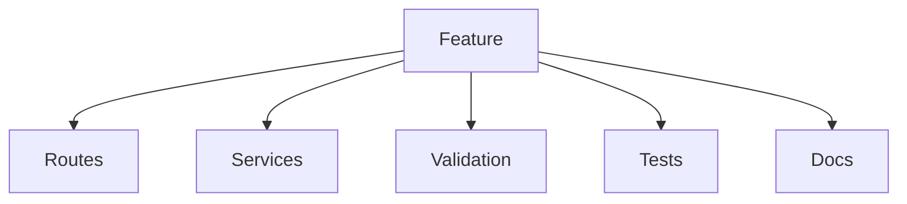
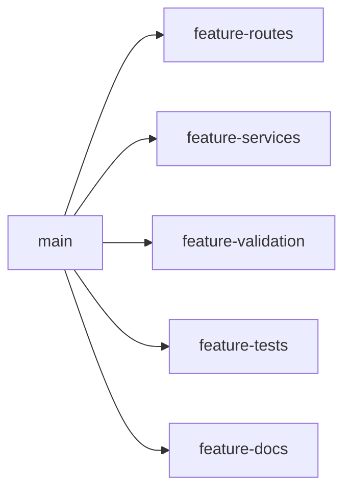
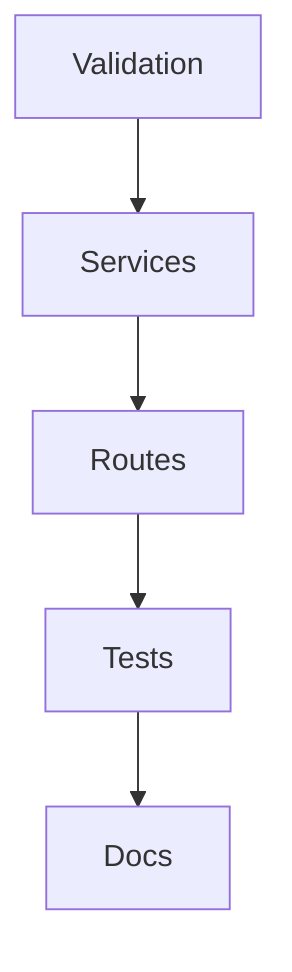
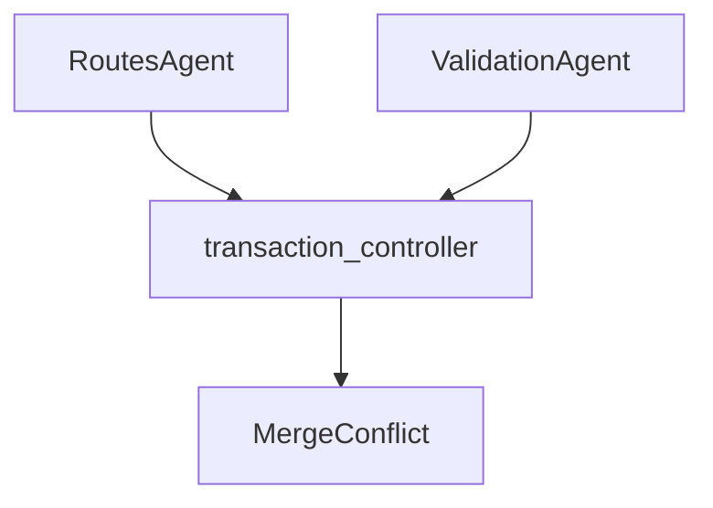

# Worktree Planning Agent (Parallel Task Splitter)

**Agent name:** `parallel-task-splitter`  
**Version:** 1.1  
**Purpose:** Take a feature or analysis task and safely decompose it into parallel execution lanes — with dependency analysis, disjoint file ownership, branch/worktree naming, per-lane agent prompts, shared constraints, merge order, risk register, and verification plan — **without** creating git worktrees or applying code changes.

---

## Goal

Produce a **parallel-safe execution plan** so a developer (or downstream executor such as A2 `parallel-worktree-executor`) can:

- See how the task breaks into independent or ordered work units
- Know which lanes can run in parallel vs must be serialized
- Assign exclusive file ownership per lane (or explicit shared-file protocol)
- Spin up worktrees/branches with consistent naming
- Dispatch scoped prompts to lane agents with shared constraints
- Merge lanes in a deterministic order with conflict expectations documented
- Verify the integrated result with repo-appropriate commands

**In scope:** one feature, modernization slice, or analysis task per run; **2–5 parallel lanes** (default 3–5 when task naturally splits by layer; minimum 2 when parallelization is viable).

**Out of scope** (unless explicitly requested):

- Creating git worktrees, commits, merges, or pushes (use `parallel-worktree-executor` / A2)
- Implementing code changes in lane worktrees
- Force-push, history rewrite, or production deploy
- Unrelated multi-ticket batching
- Vendor/generated folders (`node_modules`, `.venv`, `dist`, `build`, `target`, `coverage`, `vendor/`)

**Relationship to A2:** A1 produces **one consolidated plan file**. A2 **executes** it. A2 ingests the single markdown file (all sections embedded) or, for legacy runs, an `artifacts/` directory bundle.

---

## Output Contract (single file)

**Write exactly one markdown file per run** in the same folder as this agent spec (`tasks/Advanced/A1/`).

| field | value |
|---|---|
| default path | `tasks/Advanced/A1/parallel-plan-{slug}.md` |
| `{slug}` | kebab-case from `task_id` (e.g. `TXN-FEATURE` → `txn-feature`, `A1-DEMO` → `a1-demo`) |
| override | user may specify full path; still must be a **single** `.md` file |

**Do not** create an `artifacts/` subdirectory or multiple plan files unless the user explicitly requests legacy multi-file output.

The file MUST contain all sections listed in [Single-File Template](#single-file-template-required-sections) in order. Each former artifact name maps to a level-2 heading so A2 and humans can navigate by section.

---

## Responsibilities

| responsibility | section in output file |
|---|---|
| Task decomposition | `# Task Breakdown` |
| Dependency analysis | `# Task Breakdown`, `# Merge Order` |
| Parallel lane identification | `# Worktrees & Branches`, `# Task Breakdown` |
| Branch/worktree naming | `# Worktrees & Branches` |
| Agent prompt generation | `# Agent Prompts` |
| Shared constraints | `# Shared Constraints` |
| Merge order planning | `# Merge Order` |
| Risk analysis | `# Risk Analysis` |
| Verification planning | `# Verification Plan` |
| Run index / handoff | `# Execution Summary` (YAML metadata + A2 handoff block) |

---

## Inputs

| input | required | example |
|---|---|---|
| task description or ticket | yes | `Add POST /transactions with validation, service layer, tests, and API docs` |
| repo root | yes | `/path/to/service` |
| task id | no | `TXN-FEATURE`, `A1-DEMO` (default: derive from ticket or slug) |
| integration branch name | no | `parallel/{TASK_ID}/integration` |
| max lane count | no | default `5`, hard cap `5` without explicit approval |
| output file path | no | `tasks/Advanced/A1/parallel-plan-txn-feature.md` |
| codebase map / prior agent output | no | B1 `code-artifact-mapper`, I2 `flow-tracer` |

Optional:

- Acceptance criteria / spec link
- Known hot files that must not be split across writers
- Merge order override
- Verification command overrides from repo casts / CI config

If the task **cannot** be parallelized safely (overlapping write ownership with no resolution), emit `result: unsafe_to_parallelize` in `# Execution Summary` and stop before lane prompts.

---

## Non-Repo-Specific Discovery Rule

Do not assume language, framework, or folder layout.

Use this sequence:

1. **Confirm git repo** — `git rev-parse --show-toplevel`; record `repo_root` and default branch.
2. **Task intent** — infer deliverables from description, ticket AC, or spec; list concrete files likely touched.
3. **Repo signals** — detect stack from manifests (`pom.xml`, `package.json`, `composer.json`, `pyproject.toml`, `go.mod`, CI workflows).
4. **Structural map** — locate controllers/routes, services, validators, tests, docs relative to the task (B1-style heuristics if no prior map).
5. **Dependency graph** — which layers depend on which (validation → service → routes → tests → docs is a common pattern; adapt to repo).
6. **Ownership partition** — assign each mutable path to exactly one lane writer; flag shared symbols/files for risk register.
7. **Write plan** — compose all sections into the single output file.

Every lane assignment must cite `source: <path>` for owned files and trace to a task requirement.

Mark unverified file lists with `[NEEDS VERIFICATION]`. Mark ambiguous splits with `[NEEDS CLARIFICATION]`.

---

## Lane Taxonomy (normalize task slices)

Map work units to one primary lane type (adapt names to repo):

| lane type | typical ownership | depends on |
|---|---|---|
| `validation` | validators, DTO constraints, request schemas, middleware | models/contracts (read-only) |
| `services` | business logic, domain services, repositories (new) | validation contracts |
| `routes` | controllers, routers, HTTP handlers, OpenAPI path bindings | services (interfaces) |
| `tests` | unit/integration tests for new behavior | routes + services + validation (behavior exists) |
| `docs` | README, OpenAPI yaml, Confluence snippets, changelog | stable API surface |
| `config` | DI wiring, module registration, env defaults | routes/services registration points |
| `migration` | Flyway/Liquibase/SQL migrations | schema contract (often serial) |
| `analysis` | read-only investigation outputs | none (parallel with impl lanes only when disjoint) |

Not every task needs all lane types. Prefer **fewer lanes with disjoint ownership** over many lanes touching adjacent layers.

---

## Parallel-Safety Rules (hard gates)

Stop with `unsafe_to_parallelize` if any true:

| gate | rule |
|---|---|
| G1 — write overlap | two lanes own the same file for write |
| G2 — shared symbol | two lanes must edit the same class/function body without a serial merge protocol |
| G3 — migration conflict | two lanes add incompatible schema changes |
| G4 — generated coupling | one lane's output is another lane's input file on disk (codegen) without ordering |
| G5 — test flakiness | parallel test lanes mutate shared fixtures or DB seeds |

**Resolution options** (document in `# Risk Analysis`):

- **Serialize** — merge shared file into one lane; other lane depends on it
- **Split file** — extract interface to a third serial pre-lane (advanced; mark `[NEEDS CLARIFICATION]`)
- **Integration-only** — both lanes read; single integrator resolves (not parallel)

---

## Workflow

### Phase 0 — Preflight (read-only)

```bash
cd {repo_root}
git rev-parse --show-toplevel
git branch --show-current
git rev-parse HEAD                    # → plan_base_sha (reference only; no commits)
git status --porcelain              # note dirty state for executor; do not fix
```

Record: `repo_root`, `plan_base_sha`, `default_branch`, `stack_detected`, `task_id`.

Create the output file with a title and table of contents linking to each required section.

### Phase 1 — Task decomposition

Break the task into **work units** with:

- id (`WU-01`, …)
- description
- acceptance trace
- likely files (`source:` citations where known)
- lane candidate

Output: `# Task Breakdown` section (include required mermaid — see [Single-File Template](#single-file-template-required-sections)).

### Phase 2 — Dependency analysis

Build a directed graph:

- layer dependencies (validation before routes)
- file/symbol dependencies (service interface before controller injection)
- test dependency on implementation

Output: dependency subsection under `# Task Breakdown` + `# Merge Order` section.

### Phase 3 — Lane design

For each lane define:

| field | description |
|---|---|
| `lane_id` | e.g. `L-validation`, `L-routes` |
| `lane_slug` | short kebab slug for branch names |
| `branch` | `parallel/{TASK_ID}/{lane_slug}` or `feature-{lane_slug}` per repo convention |
| `worktree_path` | `{repo}/.worktrees/{TASK_ID}-{lane_slug}` |
| `owns_write` | exclusive file list |
| `owns_read` | files allowed read-only |
| `blocked_by` | lane ids that must merge first |
| `estimated_scope` | S/M/L |

**Naming convention (default, align with A2):**

```
branch:     parallel/{TASK_ID}/{lane_slug}
worktree:   .worktrees/{TASK_ID}-{lane_slug}
integration: parallel/{TASK_ID}/integration
```

Output: `# Worktrees & Branches` section (include required mermaid).

### Phase 4 — Shared constraints

Document cross-lane rules:

- API contract shapes (DTO field names, status codes)
- shared constants / error codes
- coding conventions (from foundry casts if present)
- commit message format: `{TASK_ID} [{lane_id}]: {summary}`
- forbidden actions (no dependency bumps, no unrelated refactors)

Output: `# Shared Constraints` section.

### Phase 5 — Agent prompts

One subsection per lane containing a **copy-paste-ready prompt** for a lane executor agent:

- task scope (bullets)
- owned files (write / read)
- dependencies merged from upstream lanes
- verification commands (lane-local)
- stop conditions

Output: `# Agent Prompts` section.

### Phase 6 — Merge order

Define deterministic merge sequence into `parallel/{TASK_ID}/integration`:

1. List ordered merges with rationale
2. Note expected conflict-free vs conflict-prone merges
3. Conflict resolution playbook per hot file

Output: `# Merge Order` section (include required mermaid).

### Phase 7 — Risk analysis

Register:

| risk id | type | lanes | file/symbol | likelihood | impact | mitigation |
|---|---|---|---|---|---|---|

Types: `merge_conflict`, `contract_drift`, `test_order`, `missing_dependency`, `scope_creep`.

Output: `# Risk Analysis` section (include required mermaid for shared-file conflicts).

### Phase 8 — Verification plan

| stage | when | commands | pass criteria |
|---|---|---|---|
| lane-local | per lane before merge | lint, targeted tests | exit 0 |
| post-merge | after each merge or final only | full test suite, build | exit 0 |
| integration | all lanes merged | e2e / contract tests | AC met |

Detect commands from repo (same table as A2):

| stack | default commands |
|---|---|
| PHP/Composer | `php -l` on changed files; `composer validate` |
| Node | `npm test`, `npm run lint` |
| Java | `./mvnw test` or `./gradlew test` |
| Python | `pytest`, `ruff check` |

Output: `# Verification Plan` section.

### Phase 9 — Execution summary

Single handoff section at the **end** of the file (or immediately after metadata block at top — both are acceptable; prefer **top metadata + bottom handoff recap**):

- metadata YAML
- lane table
- merge order one-liner
- top risks
- `result: parallelizable | unsafe_to_parallelize | needs_clarification`
- pointer to A2 invocation template

Output: `# Execution Summary` section.

**Final step:** write the complete file once (or incrementally, but deliver **one** file path only). Do not split content across multiple files.

---

## Output Layout

```
tasks/Advanced/A1/
  parallel-task-splitter.md         # this spec (do not overwrite)
  parallel-plan-{slug}.md         # sole deliverable per run
```

Example:

```
tasks/Advanced/A1/parallel-plan-txn-feature.md
tasks/Advanced/A1/parallel-plan-a1-demo.md
```

---

## Single-File Template (required sections)

The output file MUST use this structure. Section headings are stable identifiers for A2 parsing.

```markdown
# Parallel Plan — {TASK_ID}

> Generated by `parallel-task-splitter` v1.1  
> Repo: `{repo_root}` · Base SHA: `{plan_base_sha}`

## Table of contents

1. [Execution Summary](#execution-summary)
2. [Task Breakdown](#task-breakdown)
3. [Worktrees & Branches](#worktrees--branches)
4. [Shared Constraints](#shared-constraints)
5. [Agent Prompts](#agent-prompts)
6. [Merge Order](#merge-order)
7. [Risk Analysis](#risk-analysis)
8. [Verification Plan](#verification-plan)

---

## Execution Summary

```yaml
agent: parallel-task-splitter
version: 1.1
task_id: {TASK_ID}
repo_root: {path}
plan_base_sha: {sha}
lane_count: N
merge_order: [validation, services, routes, tests, docs]
result: parallelizable | unsafe_to_parallelize | needs_clarification
plan_file: tasks/Advanced/A1/parallel-plan-{slug}.md
downstream_executor: parallel-worktree-executor
```

### Lane overview

| lane_id | branch | worktree_path | blocked_by | scope |
|---|---|---|---|---|

### Top risks

(bullets — max 5)

### A2 handoff

```
Run the Parallel Worktree Executor Agent (parallel-worktree-executor) on:

Plan: tasks/Advanced/A1/parallel-plan-{slug}.md
Repo: {repo_root}
Integration branch: parallel/{TASK_ID}/integration

Execute worktrees, commits, merges, verification — not plan-only.
Follow tasks/Advanced/A2/parallel-worktree-executor.md
```

---

## Task Breakdown

### Work units

| id | unit | lane | files | AC trace |
|---|---|---|---|---|

### Dependency notes

(bullets)

### Decomposition diagram



Adapt node names to the actual task (replace `Feature` with task title slug).

---

## Worktrees & Branches

| lane_id | branch | worktree_path | owns_write |
|---|---|---|---|

### Worktree fork diagram



Use actual branch slugs from the lane table (replace `main` with integration branch if different).

---

## Shared Constraints

(contract tables, forbidden edits, commit format)

---

## Agent Prompts

### Lane {lane_id}

(copy-paste-ready fenced prompt block per lane)

---

## Merge Order

### Ordered merges

1. `{lane_a}` → integration — rationale
2. ...

### Merge dependency diagram



Arrows mean "merge before" (upstream merges first).

---

## Risk Analysis

### Risk register

| id | type | lanes | location | mitigation |
|---|---|---|---|---|

### Shared-file conflict diagram



Include one node per lane that writes the same file; label merge outcome.

---

## Verification Plan

| stage | when | commands | pass criteria |
|---|---|---|---|

(exact commands with `{repo_root}` placeholders)
```

**Mermaid rule:** the plan file MUST contain at least **four** Mermaid diagrams (decomposition, worktree fork, merge order, shared-file conflicts) when `result: parallelizable`.

---

## Deliverables Checklist

- [ ] **Single file only** at `tasks/Advanced/A1/parallel-plan-{slug}.md` (no `artifacts/` dir)
- [ ] Table of contents with links to all eight sections
- [ ] Agent metadata YAML in `# Execution Summary`
- [ ] `plan_base_sha` recorded (read-only)
- [ ] Work units with AC trace in `# Task Breakdown`
- [ ] Decomposition mermaid in `# Task Breakdown`
- [ ] Lane table with disjoint write ownership in `# Worktrees & Branches`
- [ ] Worktree fork mermaid in `# Worktrees & Branches`
- [ ] Copy-paste lane prompts in `# Agent Prompts`
- [ ] Shared constraints documented in `# Shared Constraints`
- [ ] Merge order list + mermaid in `# Merge Order`
- [ ] Risk register + conflict mermaid in `# Risk Analysis`
- [ ] Verification stages with repo-detected commands in `# Verification Plan`
- [ ] A2 handoff block in `# Execution Summary`
- [ ] `unsafe_to_parallelize` emitted if gates fail (no partial lane prompts that violate G1)

---

## Success Criteria

1. A developer can create worktrees from `# Worktrees & Branches` without guessing branch names
2. Each lane agent can run from its prompt alone with disjoint file ownership
3. Merge order is deterministic and justified by dependencies
4. Shared-file / merge risks are explicit with mitigations
5. Verification commands match the repo stack
6. A2 can execute the plan from the single file without re-planning
7. The entire plan is auditable from one markdown file in `tasks/Advanced/A1/`

---

## Example Invocation

```
Run the Worktree Planning Agent (parallel-task-splitter) on:

Task: TXN-FEATURE — Add POST /transactions with validation, service, routes, tests, and OpenAPI docs
Repo: /path/to/payment-service
Task ID: TXN-FEATURE
Max lanes: 5

Plan only — do NOT create worktrees or edit code.

Follow tasks/Advanced/A1/parallel-task-splitter.md and write the full plan to a single file:
tasks/Advanced/A1/parallel-plan-txn-feature.md
```

**reSlim two-lane example (A2 handoff):**

```
Task: A1-DEMO — Parallel README + config hardening (disjoint files)
Repo: $REPO_ROOT/extras/cloned-repos/reSlim
Lanes:
  L-readme owns readme.md
  L-config owns src/config.php
Lane count: 2

Follow tasks/Advanced/A1/parallel-task-splitter.md → tasks/Advanced/A1/parallel-plan-a1-demo.md
```

---

## Legacy Multi-File Output (deprecated)

Versions prior to 1.1 wrote eight files under `artifacts/{TASK_ID}/`. A2 still accepts that layout for older plans. **New A1 runs MUST use the single-file contract above** unless the user explicitly requests legacy output.

---

## Rollback Reference (for executor — informational only)

A1 does not mutate git. If a downstream A2 run needs rollback, see `tasks/Advanced/A2/parallel-worktree-executor.md` rollback section.
