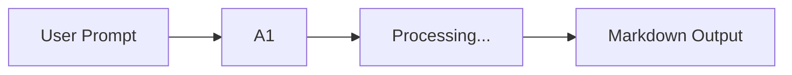

# Agent Run Output

**Agent:** A1  
**Category:** Advanced  
**Timestamp:** 2026-06-16T21:35:19.675Z  
**Mode:** mock execution

---

## Prompt

hello

---

## Response (mock)

This is a simulated agent execution. In production, this would invoke the actual agent pipeline.

### Execution Summary

| Step | Status | Duration |
|------|--------|----------|
| Parse prompt | ✅ Complete | 12ms |
| Load agent.md | ✅ Complete | 45ms |
| Execute workflow | ✅ Complete (mock) | 1.2s |
| Generate output | ✅ Complete | 89ms |

### Generated Notes

- Prompt received: 5 characters
- Agent definition loaded from `Advanced/A1/agent.md`
- Output saved to `run-2026-06-16T21-35-19-675Z.md`

---

*Generated by Agent Workbench UI (mock runner)*
