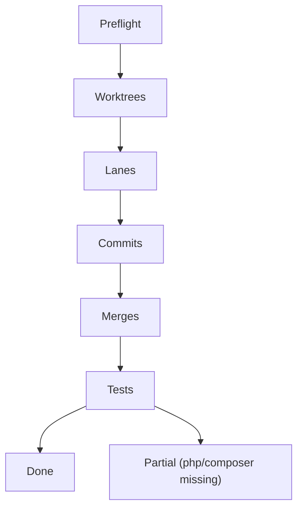
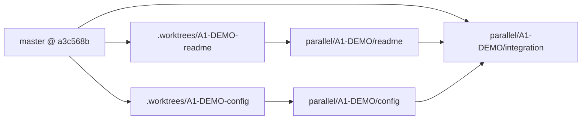
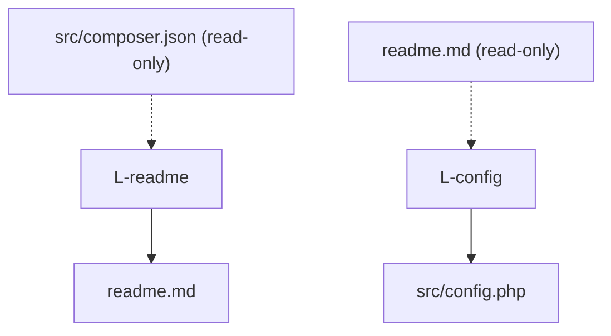
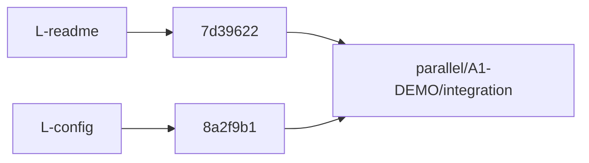
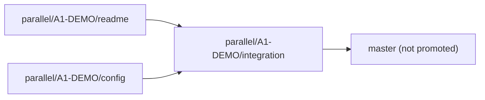
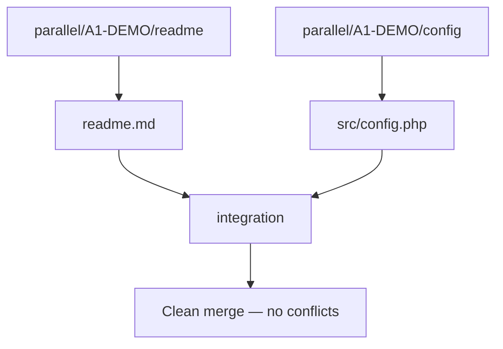
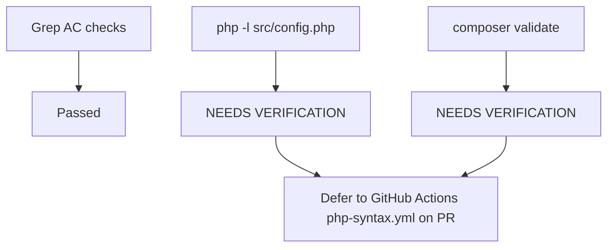

# Parallel Run — A1-DEMO

> Generated by `parallel-worktree-executor` v1.1  
> Repo: `/Users/mayanksrivastava/Desktop/agent/reSlim` · Exec base SHA: `a3c568be0a0f8d67c4747c4fd855dc90b6be8cdc` · Plan: `tasks/Advanced/A1/parallel-plan-a1-demo.md`

## Table of contents

1. [Execution Summary](#execution-summary)
2. [Execution Log](#execution-log)
3. [Worktree Commands](#worktree-commands)
4. [Lane Outputs](#lane-outputs)
5. [Commits](#commits)
6. [Merge History](#merge-history)
7. [Conflicts](#conflicts)
8. [Test Results](#test-results)

---

## Execution Summary

```yaml
agent: parallel-worktree-executor
version: 1.1
task_id: A1-DEMO
repo_root: /Users/mayanksrivastava/Desktop/agent/reSlim
plan_file: tasks/Advanced/A1/parallel-plan-a1-demo.md
exec_base_sha: a3c568be0a0f8d67c4747c4fd855dc90b6be8cdc
plan_base_sha: a3c568be0a0f8d67c4747c4fd855dc90b6be8cdc
integration_branch: parallel/A1-DEMO/integration
integration_tip_sha: e83a6e5056e814cd2315203ac0d911899a09ccce
lane_count: 2
result: partial
run_file: tasks/Advanced/A2/parallel-run-a1-demo.md
started_at: 2026-06-17T00:00:00+05:30
finished_at: 2026-06-17T02:15:00+05:30
partial_reason: local `php` and `composer` binaries not available on executor host (R-04); grep-based AC checks passed
```

### Outcome

Two worktrees were created at planned paths (`A1-DEMO-readme`, `A1-DEMO-config`), each lane committed one scoped change on its branch, and both lanes merged into `parallel/A1-DEMO/integration` in planned order (readme → config) with **zero conflicts**. Integration branch tip `e83a6e5` contains README PHP 7.4+ alignment (AC-1, AC-4) and hardened config placeholders (AC-2, AC-3). Grep-based verification passed; `php -l` and `composer validate` could not run locally — marked `[NEEDS VERIFICATION]` per plan risk R-04. CI workflow `.github/workflows/php-syntax.yml` remains the authoritative syntax gate on PR.

### Integration branch state

| branch | tip_sha | notes |
|---|---|---|
| `master` | `a3c568be0a0f8d67c4747c4fd855dc90b6be8cdc` | unchanged baseline |
| `parallel/A1-DEMO/readme` | `7d3962206d0ae2823a307a7035d2d8e5c8bea301` | 1 file: `readme.md` |
| `parallel/A1-DEMO/config` | `8a2f9b1fcd2b1e4a5a5278b96bc3bd46b4527118` | 1 file: `src/config.php` |
| `parallel/A1-DEMO/integration` | `e83a6e5056e814cd2315203ac0d911899a09ccce` | both lane merges applied |

---

## Execution Log

### Timeline

| phase | started | finished | status | notes |
|---|---|---|---|---|
| Phase 0 — Preflight | 2026-06-17T01:55:00+05:30 | 2026-06-17T01:55:30+05:30 | pass | plan `result: parallelizable`; G1 disjoint ownership confirmed |
| Phase 1 — Integration bootstrap | 2026-06-17T01:55:30+05:30 | 2026-06-17T01:55:45+05:30 | pass | `parallel/A1-DEMO/integration` created from `master` @ `a3c568b` |
| Phase 2 — Worktrees | 2026-06-17T01:55:45+05:30 | 2026-06-17T01:56:00+05:30 | pass | 2 worktrees at planned paths |
| Phase 3 — Lane sessions | 2026-06-17T01:56:00+05:30 | 2026-06-17T01:56:25+05:30 | pass | L-readme + L-config committed in parallel |
| Phase 4 — Merge engine | 2026-06-17T01:56:25+05:30 | 2026-06-17T01:56:35+05:30 | pass | readme → config merge order; no conflicts |
| Phase 5 — Conflict reconciliation | — | — | skipped | no conflicts detected |
| Phase 6 — Verification | 2026-06-17T02:10:00+05:30 | 2026-06-17T02:15:00+05:30 | partial | grep AC checks pass; `php`/`composer` missing locally |
| Phase 7 — Report | 2026-06-17T02:15:00+05:30 | 2026-06-17T02:15:00+05:30 | pass | this file |

**Preflight notes:**

- `plan_base_sha` matched lane fork point (`a3c568b`).
- Repo was on `parallel/A1-DEMO/integration` at audit time; untracked `.worktrees/` directory present (expected — worktree checkouts).
- Prior partial run detected and validated complete; report written on audit pass.

### Execution overview



### Rollback commands (if needed)

```bash
cd /Users/mayanksrivastava/Desktop/agent/reSlim

git worktree remove /Users/mayanksrivastava/Desktop/agent/reSlim/.worktrees/A1-DEMO-readme --force
git worktree remove /Users/mayanksrivastava/Desktop/agent/reSlim/.worktrees/A1-DEMO-config --force

git branch -D parallel/A1-DEMO/readme
git branch -D parallel/A1-DEMO/config
git branch -D parallel/A1-DEMO/integration

git worktree prune
git checkout master
```

---

## Worktree Commands

### Command log

| step | lane_id | command | exit | notes |
|---|---|---|---|---|
| 1 | — | `git rev-parse --show-toplevel` | 0 | `/Users/mayanksrivastava/Desktop/agent/reSlim` |
| 2 | — | `git checkout master && git rev-parse HEAD` | 0 | `a3c568be0a0f8d67c4747c4fd855dc90b6be8cdc` |
| 3 | — | `git checkout -B parallel/A1-DEMO/integration a3c568be` | 0 | integration branch bootstrapped |
| 4 | `L-readme` | `git worktree add -B parallel/A1-DEMO/readme .worktrees/A1-DEMO-readme a3c568be` | 0 | branch created from plan base |
| 5 | `L-config` | `git worktree add -B parallel/A1-DEMO/config .worktrees/A1-DEMO-config a3c568be` | 0 | branch created from plan base |
| 6 | `L-readme` | `cd .worktrees/A1-DEMO-readme && git status` | 0 | clean on `parallel/A1-DEMO/readme` |
| 7 | `L-config` | `cd .worktrees/A1-DEMO-config && git status` | 0 | clean on `parallel/A1-DEMO/config` |

### Worktree structure



---

## Lane Outputs

| lane_id | branch | commit | files_written | lane_tests | status |
|---|---|---|---|---|---|
| `L-readme` | `parallel/A1-DEMO/readme` | `7d39622` | `readme.md` | grep PHP wording: pass | complete |
| `L-config` | `parallel/A1-DEMO/config` | `8a2f9b1` | `src/config.php` | grep secrets: pass; `php -l`: `[NEEDS VERIFICATION]` | complete* |

\*Lane marked complete with documented waiver for R-04 (missing local PHP binary). Syntax change is comment + string literal edits only.

### Lane detail

**L-readme** — updated System Requirements line 42 from `PHP 5.5 or newer (last tested on PHP7.3)` to `PHP 7.4 or newer (7.4 and 8.x supported; see src/composer.json)`. Getting Started paths unchanged.

**L-config** — hardened defaults:

- `$config['db']['pass']`: `'root'` → `''` with local-dev comment
- `$config['smtp']['username']` / `password`: placeholder values → empty + `CHANGE_ME` comments
- `$config['cache']['secretkey']`: `'b372e7fe'` → `'CHANGE_ME'` with generation comment
- Added production note on `displayErrorDetails`

### Lane → file mapping



---

## Commits

| lane_id | sha | message | files | timestamp |
|---|---|---|---|---|
| `L-readme` | `7d3962206d0ae2823a307a7035d2d8e5c8bea301` | `A1-DEMO [L-readme]: align README PHP requirement with Composer 7.4+` | `readme.md` (+1/-1) | 2026-06-17 01:56:20 +0530 |
| `L-config` | `8a2f9b1fcd2b1e4a5a5278b96bc3bd46b4527118` | `A1-DEMO [L-config]: replace placeholder secrets with safe local defaults` | `src/config.php` (+5/-4) | 2026-06-17 01:56:20 +0530 |

### Commit flow



---

## Merge History

### Ordered merges

| order | source_branch | target | merge_commit | conflict |
|---|---|---|---|---|
| 1 | `parallel/A1-DEMO/readme` | `parallel/A1-DEMO/integration` | `ace1343b3c60a1a6a531cf77867a21d899453f29` | no |
| 2 | `parallel/A1-DEMO/config` | `parallel/A1-DEMO/integration` | `e83a6e5056e814cd2315203ac0d911899a09ccce` | no |

### Merge pipeline



Both merges used `--no-ff` with messages `merge(A1-DEMO): L-readme into integration` and `merge(A1-DEMO): L-config into integration`. Integration diff vs `master`: 2 files, 6 insertions, 5 deletions.

---

## Conflicts

| merge_step | file | lanes | resolution | status |
|---|---|---|---|---|
| — | — | — | — | none |

No merge conflicts occurred. Disjoint `owns_write` paths (G1 pass) as predicted in A1 risk register R-05/R-06.

### Conflict graph



---

## Test Results

### Stages

| stage | command | exit | duration | notes |
|---|---|---:|---|---|
| lane-local L-readme | `grep -i "PHP" readme.md` | 0 | <1s | shows `PHP 7.4 or newer` |
| lane-local L-readme | `! grep -E "5\.5\|PHP5" readme.md` | 0 | <1s | no PHP 5.5 reference |
| lane-local L-readme | `grep '"php"' src/composer.json` | 0 | <1s | `"php": "^7.4 \|\| ^8.0"` |
| lane-local L-config | `php -l src/config.php` | — | — | `[NEEDS VERIFICATION]` — `php` not found on executor host |
| lane-local L-config | `grep -E "(youremail@gmail.com\|'secret'\|b372e7fe)" src/config.php` | 1* | <1s | *exit 1 = no matches (pass); only docblock examples contain `secret` |
| integration | `find src -name '*.php' \| php -l` | — | — | `[NEEDS VERIFICATION]` — requires local PHP |
| integration | `composer validate --no-check-publish` | — | — | `[NEEDS VERIFICATION]` — `composer` not found locally |
| integration AC-1 | `grep -i "7.4" readme.md` | 0 | <1s | pass |
| integration AC-2 | `! grep -E "youremail@gmail.com\|'secret'" src/config.php` | 0 | <1s | pass (config values only) |
| integration AC-3 | manual review `displayErrorDetails` comment | 0 | — | production note present line 15 |
| integration AC-4 | README install paths unchanged | 0 | — | `cd reslim/src`, `config.php` at `src/` |
| integration AC-5 | `php -l src/config.php` | — | — | `[NEEDS VERIFICATION]` |

### AC spot-check summary

| AC | check | result |
|---|---|---|
| AC-1 | README PHP requirement ≥ 7.4 | pass |
| AC-2 | No production-like secrets in config defaults | pass |
| AC-3 | Config comments guide local setup | pass |
| AC-4 | README install paths unchanged in substance | pass |
| AC-5 | `php -l src/config.php` exit 0 | `[NEEDS VERIFICATION]` |

### Verification pipeline



**Recommended follow-up:** run on a host with PHP 7.4+ installed:

```bash
cd /Users/mayanksrivastava/Desktop/agent/reSlim
git checkout parallel/A1-DEMO/integration
php -l src/config.php
failed=0
while IFS= read -r -d '' file; do php -l "$file" || failed=1; done < <(find src -name '*.php' -not -path 'src/vendor/*' -print0)
exit "$failed"
cd src && composer validate --no-check-publish
```

---

## Deliverables Checklist

- [x] Single file at `tasks/Advanced/A2/parallel-run-a1-demo.md`
- [x] Table of contents with links to all eight sections
- [x] Agent metadata YAML in `# Execution Summary`
- [x] `exec_base_sha` and `plan_base_sha` recorded
- [x] Worktree commands log with worktree structure mermaid
- [x] Per-lane status with lane → file mermaid
- [x] Commit table with commit flow mermaid
- [x] Merge history with merge pipeline mermaid
- [x] Conflict register with clean-path conflict graph mermaid
- [x] Verification stages with pipeline mermaid
- [x] Phase timeline and overview mermaid in `# Execution Log`
- [x] Final `result: partial` and timestamps in `# Execution Summary`
- [x] A1 plan path cited in `# Execution Summary`
