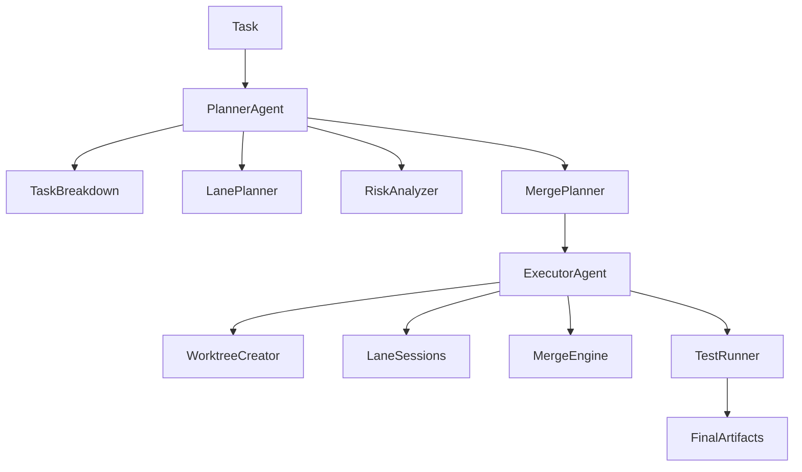
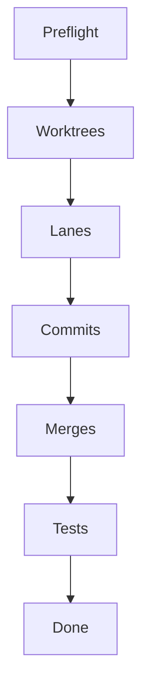
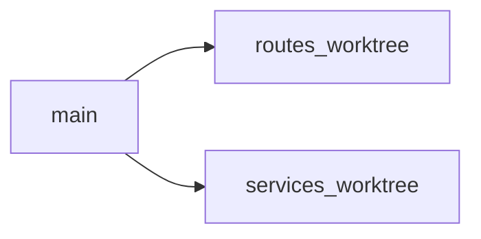
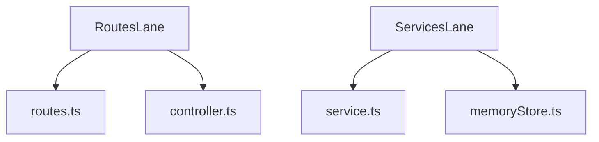
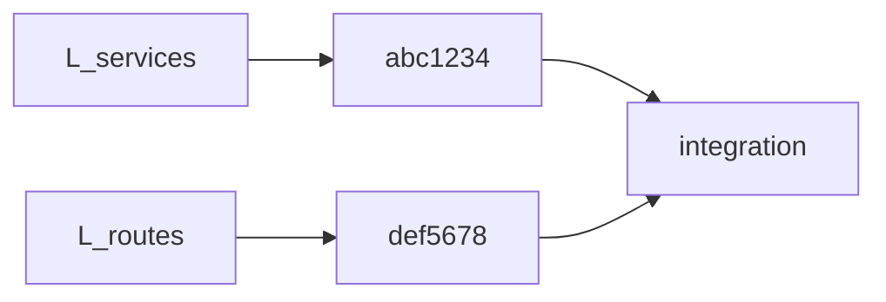
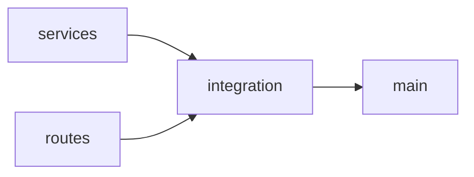
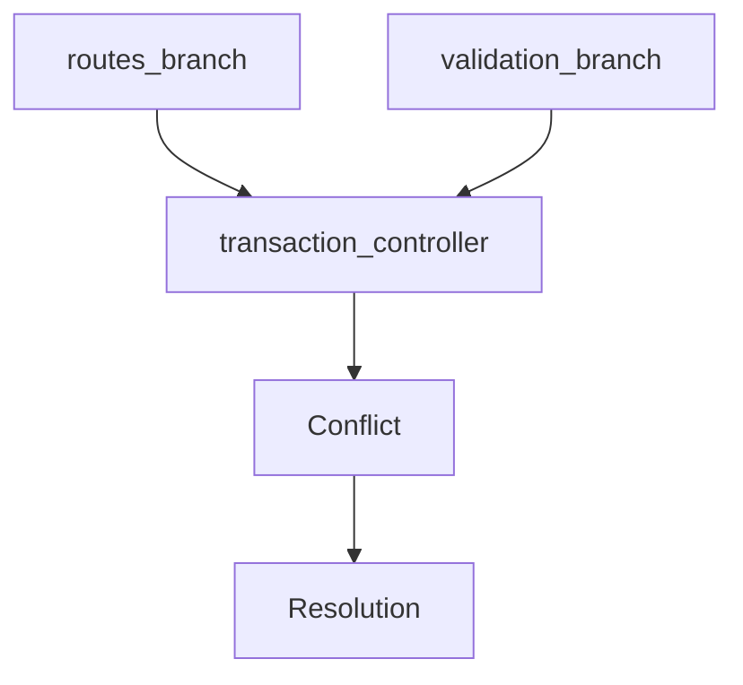
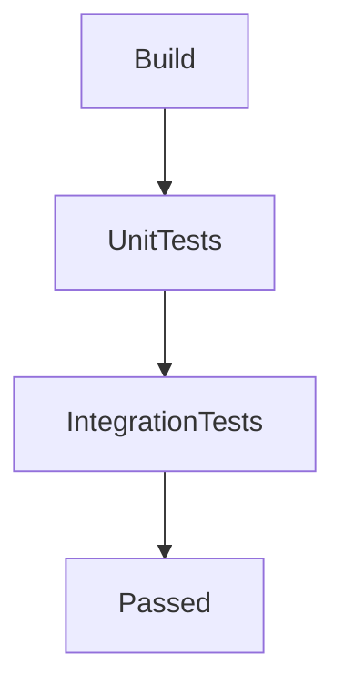

# Worktree Execution Agent (Parallel Worktree Executor)

**Agent name:** `parallel-worktree-executor`  
**Version:** 1.1  
**Purpose:** Ingest an A1 parallel execution plan (single markdown file or legacy artifact bundle), **create git worktrees**, **launch lane agent sessions**, **apply lane prompts**, **commit changes**, **merge branches** in planned order, **detect and reconcile conflicts**, **run verification**, and **produce proof artifacts** — with Mermaid diagrams in every markdown output section.

---

## Goal

Actually create worktrees and execute parallel lanes end-to-end:

- Spin up isolated worktrees/branches per lane
- Dispatch scoped prompts to lane sessions (human or subagent)
- Commit lane work with traceable messages
- Merge lanes into an integration branch in deterministic order
- Detect, document, and resolve merge conflicts
- Run repo-appropriate tests and capture evidence
- Emit **one consolidated execution report** in the same folder as this spec for audit and handoff

**In scope:** executing a plan produced by A1 `parallel-task-splitter` (or a compatible artifact bundle); **2–5 parallel lanes**; integration branch merges; conflict reconciliation; verification per the plan's `# Verification Plan` section.

**Out of scope** (unless explicitly requested):

- Re-planning lanes when A1 marked `unsafe_to_parallelize` (stop and return to A1)
- Force-push to `main`/`master` or production deploy
- History rewrite (`rebase -i`, `reset --hard` on shared branches)
- Unrelated multi-ticket batching
- Vendor/generated folders (`node_modules`, `.venv`, `dist`, `build`, `target`, `coverage`, `vendor/`)

**Relationship to A1:** A1 **plans**; A2 **executes**. A2 ingests A1's **single plan file** (`parallel-plan-{slug}.md` with all sections embedded) or, for legacy runs, an `artifacts/` directory bundle. A2 writes **one execution file** back to `tasks/Advanced/A2/`.

---

## Output Contract (single file)

**Write exactly one markdown file per run** in the same folder as this agent spec (`tasks/Advanced/A2/`).

| field | value |
|---|---|
| default path | `tasks/Advanced/A2/parallel-run-{slug}.md` |
| `{slug}` | kebab-case from `task_id` (e.g. `TXN-FEATURE` → `txn-feature`, `A1-DEMO` → `a1-demo`) |
| override | user may specify full path; still must be a **single** `.md` file |

**Do not** create an `artifacts/` subdirectory or multiple execution files unless the user explicitly requests legacy multi-file output.

The file MUST contain all sections listed in [Single-File Template](#single-file-template-required-sections) in order. Each former artifact name maps to a level-2 heading so humans can navigate by section.

**Mermaid rule:** the execution file MUST contain at least **seven** Mermaid diagrams (one per execution section) when `result: success` or `result: partial`.

---

## Responsibilities

| responsibility | module (conceptual) | section in output file |
|---|---|---|
| Validate plan & preflight | `executor/session_manager` | `# Execution Log` |
| Create git worktrees | `executor/worktree_creator` | `# Worktree Commands` |
| Launch lane agent sessions | `executor/session_manager` | `# Lane Outputs`, `# Execution Log` |
| Apply lane prompts | `executor/session_manager` | `# Lane Outputs` |
| Commit lane changes | `executor/session_manager` | `# Commits` |
| Merge branches (planned order) | `executor/merge_engine` | `# Merge History` |
| Detect conflicts | `executor/merge_engine` | `# Conflicts` |
| Reconcile changes | `executor/conflict_resolver` | `# Conflicts` |
| Run tests / verification | `executor/test_runner` | `# Test Results` |
| Produce proof & index | `reporters/markdown_reporter`, `reporters/mermaid_reporter` | entire `parallel-run-{slug}.md` |

---

## Module Architecture (conceptual)

A2 is the **ExecutorAgent** in the combined pipeline. Planning modules belong to A1; execution modules belong to A2.



### Folder structure (reference layout)

```
agent/
  planner/                          # A1 — parallel-task-splitter
    task_analyzer/
    dependency_analyzer/
    lane_planner/
    prompt_generator/
    risk_detector/
    merge_planner/
  executor/                         # A2 — parallel-worktree-executor
    worktree_creator/
    session_manager/
    merge_engine/
    conflict_resolver/
    test_runner/
  reporters/
    markdown_reporter/
    mermaid_reporter/
```

A2 runs **only** the `executor/` and `reporters/` paths at execution time; it **reads** planner outputs from disk rather than re-deriving them.

---

## Inputs

| input | required | example |
|---|---|---|
| A1 plan file | yes* | `tasks/Advanced/A1/parallel-plan-a1-demo.md` |
| repo root | yes | `/path/to/service` |
| task id | yes | `TXN-FEATURE` (must match plan) |
| integration branch | no | `parallel/{TASK_ID}/integration` (default from plan) |
| output file path | no | `tasks/Advanced/A2/parallel-run-a1-demo.md` |
| dry-run | no | log commands only; no worktree/commit/merge |

\*If no A1 plan file exists, stop with `missing_plan` unless user explicitly supplies equivalent content (either a single `.md` with required A1 sections or legacy files under `artifacts/`).

### Required plan content (from A1 single file)

Parse these **level-2 headings** from the A1 plan file (or legacy filenames):

| section / legacy file | used for |
|---|---|
| `# Execution Summary` | metadata, `result`, `plan_base_sha`, lane count |
| `# Worktrees & Branches` | branch names, worktree paths, ownership |
| `# Agent Prompts` | per-lane session prompts |
| `# Shared Constraints` | commit format, forbidden edits, contracts |
| `# Merge Order` | merge sequence, conflict playbook |
| `# Verification Plan` | lane-local and post-merge commands |
| `# Risk Analysis` | conflict expectations, hot files |
| `# Task Breakdown` | AC trace, work unit ids |

**Hard gate:** if `# Execution Summary` has `result: unsafe_to_parallelize` or `needs_clarification`, stop before creating worktrees.

### Legacy plan input (deprecated)

A2 still accepts A1 plans under `artifacts/{TASK_ID}/` with separate files (`worktrees.md`, `agent_prompts.md`, etc.) when the user points to that directory. **New runs SHOULD use the A1 single-file plan** and write the A2 single-file output.

---

## Non-Repo-Specific Discovery Rule

Do not assume language, framework, or folder layout.

Use this sequence:

1. **Load plan** — parse A1 plan file (or legacy artifacts); validate lane table vs merge order.
2. **Confirm git repo** — `git rev-parse --show-toplevel`; record `repo_root`, default branch, current SHA.
3. **Preflight cleanliness** — note dirty tree; prefer clean base or stash with log entry (do not stash secrets).
4. **Stack detection** — manifests (`pom.xml`, `package.json`, `composer.json`, `pyproject.toml`, `go.mod`, CI workflows) for test/lint commands.
5. **Execute worktrees** — create from `# Worktrees & Branches`; verify each worktree on correct branch.
6. **Lane sessions** — apply prompts from `# Agent Prompts`; track files touched vs `owns_write`.
7. **Merge engine** — follow `# Merge Order`; record each merge attempt.
8. **Verify** — run commands from `# Verification Plan`; capture exit codes and output snippets.
9. **Write output** — compose all execution sections into the single output file.

Mark unverified paths with `[NEEDS VERIFICATION]`. Mark unresolved conflicts with `[NEEDS MANUAL RESOLUTION]`.

---

## Workflow

### Phase 0 — Preflight (read-only + plan validation)

```bash
cd {repo_root}
git rev-parse --show-toplevel
git branch --show-current
git rev-parse HEAD                    # → exec_base_sha
git status --porcelain
git worktree list
```

Validate:

| check | action on fail |
|---|---|
| Plan file exists (or legacy dir) | `missing_plan` — stop |
| `result: parallelizable` | stop — return to A1 |
| Lane write ownership disjoint | stop — return to A1 |
| `plan_base_sha` matches HEAD (or document drift) | warn in `# Execution Log` |
| No existing worktrees at planned paths | remove stale or pick alternate path (log) |

Create the output file with a title and table of contents linking to each required section. Record start metadata in `# Execution Log`.

### Phase 1 — Integration branch bootstrap

```bash
git fetch origin --quiet || true
git checkout {default_branch}
git pull --ff-only || true
git checkout -B parallel/{TASK_ID}/integration
# integration branch tracks integration work; lanes branch from exec_base_sha
```

Log commands to `# Worktree Commands`.

### Phase 2 — Worktree creation

For each lane in `# Worktrees & Branches`:

```bash
git worktree add -B {branch} {worktree_path} {exec_base_sha}
cd {worktree_path}
git status
```

Rules:

- One worktree per lane; path `{repo}/.worktrees/{TASK_ID}-{lane_slug}` unless plan overrides.
- Branch: `parallel/{TASK_ID}/{lane_slug}` unless plan overrides.
- Never create worktrees inside `node_modules`, `vendor`, or other generated dirs.

Output: `# Worktree Commands` (all commands + results).

### Phase 3 — Lane session execution

For each lane (parallel when tooling supports; serial fallback):

1. Open session context: worktree path, branch, prompt from `# Agent Prompts`.
2. Apply **only** `owns_write` files; respect `# Shared Constraints`.
3. Run lane-local verification from `# Verification Plan`.
4. Commit with format: `{TASK_ID} [{lane_id}]: {summary}` (from plan).
5. Record: files changed, commit SHA, verification exit code.

**Session modes:**

| mode | when |
|---|---|
| `subagent` | Task/subagent per lane with scoped prompt |
| `sequential` | Single agent runs lanes one worktree at a time |
| `human` | Prompt emitted; human marks lane complete in log |

Output: `# Lane Outputs`, `# Commits`, append to `# Execution Log`.

### Phase 4 — Merge engine

Follow **exact order** from `# Merge Order`:

```bash
cd {repo_root}
git checkout parallel/{TASK_ID}/integration
git merge --no-ff {lane_branch} -m "merge({TASK_ID}): {lane_id} into integration"
```

After each merge:

- Record merge commit SHA
- If conflict: stop merge; document in `# Conflicts`; invoke Phase 5
- If clean: run optional post-merge smoke from verification plan

Output: `# Merge History`.

### Phase 5 — Conflict detection & reconciliation

When merge returns conflict:

1. Capture `git status`, conflicted file list, conflict markers summary.
2. Map to `# Risk Analysis` entries (expected vs surprise).
3. Apply resolution playbook from `# Merge Order` / `# Risk Analysis`:
   - Prefer lane ownership: later merge lane yields to earlier merged lane on shared symbols unless plan says otherwise
   - For shared-controller-style files: merge both sides per playbook; run targeted tests
4. `git add` resolved files; `git commit` to complete merge.
5. If unresolvable: mark `[NEEDS MANUAL RESOLUTION]`; leave integration branch in merge state; stop.

Output: `# Conflicts` (include resolution mermaid).

### Phase 6 — Final verification (TestRunner)

Run stages from `# Verification Plan`:

| stage | when |
|---|---|
| build | after all merges |
| unit tests | after build green |
| integration tests | after unit green |
| contract / e2e | if defined in plan |

Detect commands from repo when plan is generic:

| stack | default commands |
|---|---|
| PHP/Composer | `composer validate`; `php -l` on changed files |
| Node | `npm run lint`; `npm test` |
| Java | `./mvnw test` or `./gradlew test` |
| Python | `ruff check .`; `pytest` |

Output: `# Test Results` with commands, exit codes, and pass/fail diagram.

### Phase 7 — Final handoff

Compose the complete execution file:

- All sections from [Single-File Template](#single-file-template-required-sections)
- `# Execution Summary` metadata YAML with final `result`, SHAs, and timestamps
- Optional: embed or link the A1 plan path in `# Execution Summary` for audit
- Table of contents at top with anchor links to every section

**Final step:** write the complete file once (or incrementally during execution, but deliver **one** file path only). Do not split content across multiple files.

---

## Output Layout

```
tasks/Advanced/A2/
  parallel-worktree-executor.md     # this spec (do not overwrite)
  parallel-run-{slug}.md          # sole deliverable per run
```

Example:

```
tasks/Advanced/A2/parallel-run-txn-feature.md
tasks/Advanced/A2/parallel-run-a1-demo.md
```

---

## Single-File Template (required sections)

The output file MUST use this structure. Section headings are stable identifiers for humans and downstream tooling.

```markdown
# Parallel Run — {TASK_ID}

> Generated by `parallel-worktree-executor` v1.1  
> Repo: `{repo_root}` · Exec base SHA: `{exec_base_sha}` · Plan: `{plan_file_path}`

## Table of contents

1. [Execution Summary](#execution-summary)
2. [Execution Log](#execution-log)
3. [Worktree Commands](#worktree-commands)
4. [Lane Outputs](#lane-outputs)
5. [Commits](#commits)
6. [Merge History](#merge-history)
7. [Conflicts](#conflicts)
8. [Test Results](#test-results)

---

## Execution Summary

```yaml
agent: parallel-worktree-executor
version: 1.1
task_id: {TASK_ID}
repo_root: {path}
plan_file: {path to A1 parallel-plan-{slug}.md}
exec_base_sha: {sha}
plan_base_sha: {sha}
integration_branch: parallel/{TASK_ID}/integration
lane_count: N
result: success | partial | failed | missing_plan | unsafe_plan
run_file: tasks/Advanced/A2/parallel-run-{slug}.md
started_at: {iso}
finished_at: {iso}
```

### Outcome

(one paragraph: worktrees created, lanes committed, merges completed, verification pass/fail)

### Integration branch state

| branch | tip_sha | notes |
|---|---|---|

---

## Execution Log

### Timeline

| phase | started | finished | status | notes |
|---|---|---|---|---|

### Execution overview



### Rollback commands (if needed)

(fenced bash block — see Rollback Reference)

---

## Worktree Commands

### Command log

| step | lane_id | command | exit | notes |
|---|---|---|---|---|

### Worktree structure



Replace node names with actual branch/worktree slugs from the plan (add one node per lane).

---

## Lane Outputs

| lane_id | branch | commit | files_written | lane_tests | status |
|---|---|---|---|---|---|

### Lane → file mapping



Adapt lane and file nodes to actual `owns_write` paths from the plan.

---

## Commits

| lane_id | sha | message | files | timestamp |
|---|---|---|---|---|

### Commit flow



---

## Merge History

### Ordered merges

| order | source_branch | target | merge_commit | conflict |
|---|---|---|---|---|

### Merge pipeline



Use actual lane branch slugs; `main` = default branch or final target per plan.

---

## Conflicts

| merge_step | file | lanes | resolution | status |
|---|---|---|---|---|

### Conflict graph



If no conflicts: diagram shows all merges as clean paths to `Resolution`.

---

## Test Results

### Stages

| stage | command | exit | duration | notes |
|---|---|---:|---|---|

### Verification pipeline



Use `Failed` node instead of `Passed` when any stage fails; link to log excerpts.
```

---

## Parallel Execution Rules

| rule | description |
|---|---|
| P1 — ownership | lane session must not write outside `owns_write` |
| P2 — ordering | do not merge lane B before upstream lanes in `# Merge Order` |
| P3 — integration only | all merges target `integration` branch until final promote step |
| P4 — commit trace | every lane commit includes `{TASK_ID}` and `[{lane_id}]` |
| P5 — proof | no lane marked complete without verification exit 0 or documented waiver |
| P6 — conflict stop | unexpected conflict on unregistered file → stop and document |
| P7 — single file | deliver one `parallel-run-{slug}.md` only (no `artifacts/` dir unless legacy requested) |

---

## Rollback Reference

If execution fails or must be abandoned:

```bash
# remove worktrees (from plan paths)
git worktree remove {worktree_path} --force

# delete lane and integration branches (local only)
git branch -D parallel/{TASK_ID}/{lane_slug}
git branch -D parallel/{TASK_ID}/integration

# prune worktree metadata
git worktree prune
```

Record rollback commands in `# Execution Log`. **Never** force-push shared remote branches unless explicitly requested.

---

## Deliverables Checklist

- [ ] **Single file only** at `tasks/Advanced/A2/parallel-run-{slug}.md` (no `artifacts/` dir)
- [ ] Table of contents with links to all eight sections
- [ ] Agent metadata YAML in `# Execution Summary`
- [ ] `exec_base_sha` and `plan_base_sha` recorded
- [ ] `worktree_commands` log with worktree structure mermaid in `# Worktree Commands`
- [ ] Per-lane status with lane → file mermaid in `# Lane Outputs`
- [ ] Commit table with commit flow mermaid in `# Commits`
- [ ] Merge history with merge pipeline mermaid in `# Merge History`
- [ ] Conflict register with conflict graph mermaid in `# Conflicts` (or clean-path diagram)
- [ ] Verification stages with pipeline mermaid in `# Test Results`
- [ ] Phase timeline and overview mermaid in `# Execution Log`
- [ ] Final `result` and timestamps in `# Execution Summary`
- [ ] A1 plan path cited in `# Execution Summary`

---

## Success Criteria

1. All planned worktrees exist (or clean rollback documented in `# Execution Log`)
2. Each lane has at least one commit matching the shared commit format
3. Merges completed in planned order with history in `# Merge History`
4. Conflicts detected, documented, and resolved or escalated with `[NEEDS MANUAL RESOLUTION]`
5. Verification commands run with evidence in `# Test Results`
6. Every section contains Mermaid diagrams for structure, merge order, dependencies, or conflict paths
7. A developer can audit the full run from one markdown file in `tasks/Advanced/A2/` without re-running git commands

---

## Example Invocation

```
Run the Worktree Execution Agent (parallel-worktree-executor) on:

Plan: tasks/Advanced/A1/parallel-plan-txn-feature.md
Repo: /path/to/payment-service
Task ID: TXN-FEATURE
Integration branch: parallel/TXN-FEATURE/integration

Execute worktrees, lane sessions, commits, merges, and verification.
Do NOT re-plan lanes.

Follow tasks/Advanced/A2/parallel-worktree-executor.md and write the full run report to a single file:
tasks/Advanced/A2/parallel-run-txn-feature.md
```

**reSlim two-lane example (after A1):**

```
Run parallel-worktree-executor:

Plan: tasks/Advanced/A1/parallel-plan-a1-demo.md
Repo: /Users/mayanksrivastava/Desktop/agent/reSlim
Task ID: A1-DEMO

Lanes: L-readme (readme.md), L-config (src/config.php)
Follow tasks/Advanced/A2/parallel-worktree-executor.md
Output: tasks/Advanced/A2/parallel-run-a1-demo.md
```

**Dry-run:**

```
Run parallel-worktree-executor in dry-run mode:
Plan: tasks/Advanced/A1/parallel-plan-txn-feature.md
Log all git commands to # Worktree Commands without executing merges.
Write single output: tasks/Advanced/A2/parallel-run-txn-feature.md
```

---

## Legacy Multi-File Output (deprecated)

Versions prior to 1.1 wrote execution artifacts under `artifacts/{TASK_ID}/` (`worktree_commands.md`, `lane_outputs.md`, etc.) plus an optional `agent-run-output-{slug}.md` index. **New A2 runs MUST use the single-file contract above** unless the user explicitly requests legacy output.

Legacy layout (reference only):

```
tasks/Advanced/A2/artifacts/{TASK_ID}/
  worktree_commands.md
  lane_outputs.md
  commits.md
  merge_history.md
  conflicts.md
  test_results.md
  execution_log.md
```

---

## A1 Upstream Template (when plan missing)

```
Run the Worktree Planning Agent (parallel-task-splitter) first:

Task: {description}
Repo: {repo_root}
Task ID: {TASK_ID}

Follow tasks/Advanced/A1/parallel-task-splitter.md → tasks/Advanced/A1/parallel-plan-{slug}.md

Then run parallel-worktree-executor (this agent) on that plan file.
Output: tasks/Advanced/A2/parallel-run-{slug}.md
```
