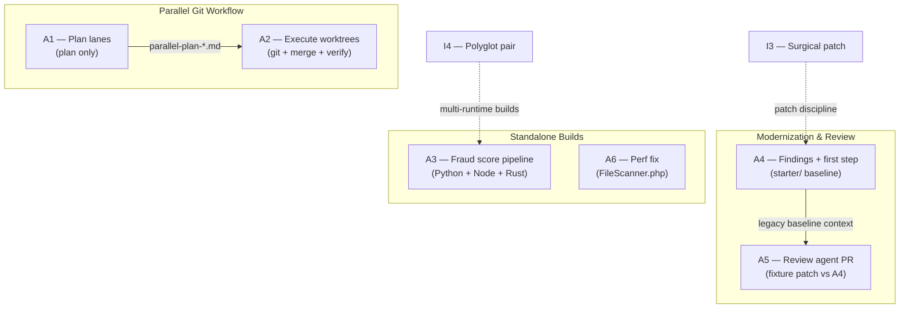

# Advanced Eval — Plan, Execute, Review & Perform

Six exercises for engineers who already know how to read and operate unfamiliar repos. This track tests **planning at scale**, **parallel git workflows**, **polyglot system building**, **legacy modernization**, **PR review discipline**, and **evidence-backed performance work**.

Each task lives in its own folder with a **task brief** (`README.md`), optional **agent workflow spec**, **golden sample output**, and where applicable **fixtures**, **scripts**, and **evaluator answer keys**.

---

## Table of contents

- [What this track covers](#what-this-track-covers)
- [Folder structure](#folder-structure)
- [Task catalog at a glance](#task-catalog-at-a-glance)
- [How the tasks connect](#how-the-tasks-connect)
- [Recommended learning path](#recommended-learning-path)
- [Prerequisites & tooling](#prerequisites--tooling)
- [What each task folder contains](#what-each-task-folder-contains)
- [Agent workflow specs](#agent-workflow-specs)
- [External dependencies](#external-dependencies)
- [Hygiene & conventions](#hygiene--conventions)
- [Quick start](#quick-start)
- [Quick links](#quick-links)

---

## What this track covers

| Skill area | Tasks | What you prove |
|------------|-------|----------------|
| **Parallel planning** | [A1](A1/README.md) | Decompose one feature into 2–5 lanes with disjoint file ownership — **plan only, no git mutations** |
| **Parallel execution** | [A2](A2/README.md) | Create worktrees, execute lanes, merge in order, verify — **hands-on git orchestration** |
| **Polyglot build** | [A3](A3/README.md) | Ship a three-service pipeline: Python FastAPI + Node worker + Rust scorer |
| **Modernization** | [A4](A4/README.md) | Evidence-backed findings, prioritized roadmap, one safe first step |
| **Code review** | [A5](A5/README.md) | Structured review of an agent-generated PR — security, correctness, tests |
| **Performance** | [A6](A6/README.md) | Baseline → profile → minimal fix → ≥10% improvement with proof |

**Time range:** 45 min (A1) to 90 min (A2, A4, A6). Total track: ~7 hours if done sequentially.

**Prerequisite track:** [Intermediate](../Intermediate/README.md) — especially I3 (surgical patch) and I4 (polyglot build) before A3/A6.

---

## Folder structure

```
Advanced/
├── README.md                          ← you are here (track overview)
│
├── A1/  Multi-worktree parallel plan
│   ├── parallel-task-splitter.md      ← agent workflow spec
│   └── parallel-plan-a1-demo.md       ← golden sample (reSlim A1-DEMO)
│
├── A2/  Execute parallel worktrees
│   ├── parallel-worktree-executor.md
│   └── parallel-run-a1-demo.md        ← golden sample (partial run)
│
├── A3/  Mini fraud score system       ← flagship polyglot build
│   ├── python-api/                    ← FastAPI ingestion
│   ├── node-worker/                   ← queue poller + Rust invoker
│   ├── rust-scorer/                   ← deterministic risk scoring CLI
│   ├── docs/data-contract.json        ← shared JSON schema
│   ├── data/pending|completed/        ← file-based queue
│   └── proof/                         ← screenshot evidence
│
├── A4/  Repository modernization
│   ├── starter/                       ← legacy Contact API baseline
│   ├── scripts/                       ← verify-baseline.sh, verify-first-step.sh
│   ├── modernization-first-stepper.md
│   └── EVALUATOR.md                   ← graders only
│
├── A5/  Agent-generated PR review
│   ├── fixture/                       ← patch + PR description (+ optional sandbox)
│   ├── scripts/                       ← show-fixture.sh, apply-fixture.sh
│   ├── agent-pr-reviewer.md
│   └── EVALUATOR.md
│
└── A6/  Performance profiling + fix
    ├── fixture/FileScanner.php        ← intentional O(n²) bottleneck
    ├── grader/                        ← reference fix (do not read during exercise)
    ├── scripts/benchmark.sh           ← before/after numbers
    ├── targeted-perf-fixer.md
    └── EVALUATOR.md
```

---

## Task catalog at a glance

| Task | Time | Type | Target | Deliverable | Details |
|------|------|------|--------|-------------|---------|
| [**A1**](A1/README.md) | 45 min | Analysis | `extras/cloned-repos/reSlim/` | `parallel-plan-{slug}.md` | [parallel-task-splitter](A1/parallel-task-splitter.md) |
| [**A2**](A2/README.md) | 90 min | Execution | `extras/cloned-repos/reSlim/` | `parallel-run-{slug}.md` | [parallel-worktree-executor](A2/parallel-worktree-executor.md) |
| [**A3**](A3/README.md) | ~90 min | Build | `A3/` (in-repo) | Running pipeline + passing tests | Full system README |
| [**A4**](A4/README.md) | 90 min | Analysis + patch | `A4/starter/` | Modernization report + one safe change | [modernization-first-stepper](A4/modernization-first-stepper.md) |
| [**A5**](A5/README.md) | 60 min | Analysis | `A5/fixture/` | Structured PR review + verdict | [agent-pr-reviewer](A5/agent-pr-reviewer.md) |
| [**A6**](A6/README.md) | 90 min | Analysis + patch | `A6/fixture/` | Perf report + ≥10% improvement | [targeted-perf-fixer](A6/targeted-perf-fixer.md) |

### A1 — Multi-Worktree Parallel Plan

**Goal:** Split one feature into 2–5 parallel lanes with **disjoint file ownership**, per-lane agent prompts, merge order, and verification plan.

**Critical rule:** A1 is **plan-only**. No worktrees, commits, or code changes.

**Practice task (A1-DEMO):** Parallel README alignment + config hardening in `extras/cloned-repos/reSlim/` — two lanes, two files, zero overlap.

**Golden sample:** [`A1/parallel-plan-a1-demo.md`](A1/parallel-plan-a1-demo.md)

---

### A2 — Execute Two Parallel Worktrees

**Goal:** Take an A1 plan and **actually run it** — create worktrees, commit per lane, merge in order, resolve conflicts, verify.

**Input:** Your own A1 plan or the bundled [`parallel-plan-a1-demo.md`](A1/parallel-plan-a1-demo.md).

**Golden sample:** [`A2/parallel-run-a1-demo.md`](A2/parallel-run-a1-demo.md) — documents a `partial` result when PHP/Composer were unavailable locally; grep-based AC checks still passed.

---

### A3 — Mini Fraud Score System

**Goal:** Build and run a three-component fraud scoring pipeline end-to-end.

```mermaid
flowchart LR
  Client -->|POST /transactions| API["Python FastAPI"]
  API -->|write tx-{id}.json| Pending["data/pending/"]
  Worker["Node.js worker"] -->|poll| Pending
  Worker -->|fraud-scorer score| Rust["Rust CLI"]
  Rust -->|RiskScoreResult| Worker
  Worker -->|write scored json| Completed["data/completed/"]
  Client -->|GET /transactions/{id}| API
  API -->|read| Completed
```

| Component | Stack | Role |
|-----------|-------|------|
| `python-api/` | FastAPI, pytest | Ingest transactions, expose health + status |
| `node-worker/` | Node 18+, Vitest | Poll file queue, invoke Rust, write results |
| `rust-scorer/` | Rust, clap | Deterministic risk score 0–100 from shared contract |

**Shared contract:** [`A3/docs/data-contract.json`](A3/docs/data-contract.json)

**Run order:** Build Rust → start FastAPI → start Node worker → POST transaction → poll until `scored`.

**Tests:** `cargo test` · `pytest -q` · `npm test` (Rust binary must be built first)

**Proof screenshots:** [`A3/proof/`](A3/proof/)

This is the most detailed single-task README in the repo — see **[A3/README.md](A3/README.md)** for env vars, scoring rules, curl examples, and verification flow.

---

### A4 — Repository Modernization Plan + First Step

**Goal:** Analyze a legacy PHP API, rank modernization opportunities, implement **exactly one** low-risk first step (≤3 prod files, ≤80 lines).

**Target:** [`A4/starter/`](A4/starter/) — self-contained Contact API with intentional gaps (old Monolog, no CI, no tests, debug errors on, etc.).

**Deliverables:** Findings with `source: path:line` citations · prioritized plan table · one implemented step · verification output · rollback notes.

**Recommended first steps:** PHP platform pin in `composer.json` · expand `.gitignore` · add GitHub Actions syntax check.

**Do not:** Slim migration, major dependency bumps, or app logic refactors as the first step.

---

### A5 — Agent-Generated PR Review

**Goal:** Review a simulated agent PR for correctness, security, tests, performance, and maintainability. **Analysis only** — do not implement fixes unless asked.

**Fixture chain:** Reviews a patch against the **A4 starter baseline** — simulates what an agent might ship after A4 (platform pin + CI + SQLite + search endpoint) with **deliberate flaws**.

| Artifact | Path |
|----------|------|
| Base repo | [`A4/starter/`](../A4/starter/) |
| Agent diff | [`A5/fixture/agent-change.patch`](A5/fixture/agent-change.patch) |
| PR description | [`A5/fixture/PR_DESCRIPTION.md`](A5/fixture/PR_DESCRIPTION.md) |

**Verdict options:** `APPROVE` · `APPROVE_WITH_NOTES` · `REQUEST_CHANGES`

**Minimum:** 5 issues (target 8–10); at least one blocking security + one blocking test/CI finding.

---

### A6 — Performance Profiling + Targeted Fix

**Goal:** Find a real bottleneck in [`fixture/FileScanner.php`](A6/fixture/FileScanner.php), profile it, apply one minimal fix, prove **≥10% wall-time improvement** on the same workload.

**Known bug class:** O(n²) **`array_merge`** in recursive directory scan (same pattern as reSlim `Scanner::fileSearch`).

**Workflow:**

```bash
cd tasks/Advanced/A6
./scripts/benchmark.sh          # baseline median ms + file count
# profile → fix → re-measure
./scripts/verify-improvement.sh # optional grader helper
```

**Pass gate:** Same files found (count + hash) · median ≥10% lower · rollback documented.

**Do not read** [`A6/grader/`](A6/grader/) or [`EVALUATOR.md`](A6/EVALUATOR.md) during the exercise.

---

## How the tasks connect

Two intentional **task chains** link exercises together. Standalone tasks (A3, A6) can run in any order.



| Chain | Relationship | Rule |
|-------|--------------|------|
| **A1 → A2** | Plan then execute | A1 never creates worktrees; A2 never re-plans lanes unless A1 marked `unsafe_to_parallelize` |
| **A4 → A5** | Baseline then review | A5 patch is reviewed against `A4/starter/` — do not apply to canonical starter |
| **A3** | Independent | Full polyglot build; no upstream task required |
| **A6** | Independent | Self-contained PHP fixture; reSlim variant documented in golden sample |

---

## Recommended learning path

| Order | Task | Why this sequence |
|-------|------|-------------------|
| 1 | **A1** | Learn lane decomposition and file ownership before touching git |
| 2 | **A2** | Apply the A1 plan with real worktrees and merges |
| 3 | **A3** or **A4** | A3 if you want a build challenge; A4 if you prefer analysis + small patch |
| 4 | **A5** | Best after A4 — you already know the starter baseline |
| 5 | **A6** | Profile/fix skills; benefits from I3 patch discipline |

**Fast path (time-boxed):** A1 → A2 → A3 (skips modernization/review/perf).

**Review path:** A4 → A5 (no git parallelism required).

**From Intermediate:** Complete [I3](../Intermediate/I3/README.md) and [I4](../Intermediate/I4/README.md) before A3/A6 for smoother pass rates.

---

## Prerequisites & tooling

### One-time: reSlim clone (A1, A2, optional A4)

From the **repository root** (sibling to `tasks/`):

```bash
git submodule update --init extras/cloned-repos/reSlim
```

| Task | Requires reSlim? |
|------|------------------|
| A1, A2 | **Yes** (primary target) |
| A3 | No — everything in `A3/` |
| A4 | No — uses `A4/starter/` (reSlim is alternate) |
| A5 | No — uses `A5/fixture/` |
| A6 | No — uses `A6/fixture/` |

### Tooling by task

| Tool | Version | Needed for |
|------|---------|------------|
| Git | 2.x+ | A1 (read), A2 (worktrees) |
| Python | 3.10+ | A3 (`python-api/`) |
| Node.js | 18+ | A3 (`node-worker/`) |
| Rust (`cargo`) | stable | A3 (`rust-scorer/`) |
| PHP | 7.4+ / 8.x | A4 starter, A6 fixture |
| Composer | latest | A4 starter (optional local run) |
| Xdebug (optional) | — | A6 profiling (`XDEBUG_MODE=profile`) |

Create virtualenvs and install deps **locally** — never commit `.venv/`, `node_modules/`, `target/`, or generated fixture trees.

---

## What each task folder contains

Most Advanced folders follow a consistent layout:

```
{TaskId}/
├── README.md                 # Start here — goal, deliverables, pass criteria, setup
├── {skill}-*.md              # Agent workflow spec (step-by-step for AI runs)
├── agent-run-output-*.md     # Golden sample from a completed run
├── EVALUATOR.md              # Answer key for graders (do not read during exercise)
├── scripts/                  # benchmark.sh, verify-*.sh, apply-fixture.sh
├── fixture/ or starter/      # Target code, patches, or seeded scenarios
└── proof/                    # Screenshot evidence (A3)
```

| Artifact | Purpose |
|----------|---------|
| `README.md` | **Single source of truth** for attempting the task |
| `*-splitter.md`, `*-executor.md`, etc. | Repeatable AI workflow: inputs, steps, output schema, stop conditions |
| `agent-run-output-*.md` / `parallel-plan-*.md` | Quality bar — compare your deliverable structure and depth |
| `EVALUATOR.md` | Hidden scoring rubric; candidates must not read during exercise |
| `scripts/` | Repeatable commands so baseline/verify numbers are reproducible |
| `proof/` | Visual evidence that runnable systems work (see A3) |

---

## Agent workflow specs

Each `*.md` agent spec maps to a **Cursor skill** in the parent agent repo. For AI eval runs: read the task `README.md` first, then the agent spec, then produce deliverables matching the golden sample format.

| Agent spec | Cursor skill | Task |
|------------|--------------|------|
| [`A1/parallel-task-splitter.md`](A1/parallel-task-splitter.md) | `parallel-task-splitter` | A1 |
| [`A2/parallel-worktree-executor.md`](A2/parallel-worktree-executor.md) | `parallel-worktree-executor` | A2 |
| [`A4/modernization-first-stepper.md`](A4/modernization-first-stepper.md) | `modernization-first-stepper` | A4 |
| [`A5/agent-pr-reviewer.md`](A5/agent-pr-reviewer.md) | `agent-pr-reviewer` | A5 |
| [`A6/targeted-perf-fixer.md`](A6/targeted-perf-fixer.md) | `targeted-perf-fixer` | A6 |

A3 has no separate agent spec — the task **is** the build; follow [`A3/README.md`](A3/README.md) directly.

---

## External dependencies

### reSlim (PHP Slim 3 REST API)

Used as the primary target for **A1** and **A2**. Provides a realistic multi-file PHP repo for parallel lane planning and worktree execution.

```bash
# from repo root
git submodule update --init extras/cloned-repos/reSlim
```

> If an older checkout used a broken submodule pin, use the clone command above instead of `git submodule update`.

### In-repo fixtures (no external clone)

| Task | Self-contained target |
|------|----------------------|
| A3 | `python-api/`, `node-worker/`, `rust-scorer/`, `data/` |
| A4 | `starter/` legacy Contact API |
| A5 | `fixture/agent-change.patch` + PR description |
| A6 | `fixture/FileScanner.php` + generated tree under `fixture/fixtures/` |

---

## Hygiene & conventions

- **Do not commit** local/generated artifacts: `.venv/`, `node_modules/`, `vendor/`, `target/`, `.pytest_cache/`, `A6/fixture/fixtures/`, `A5/fixture/sandbox/`
- **Source citations** — analysis tasks require `source: path:line-range` on every finding
- **Time boxes** — pass criteria assume the stated duration; scope accordingly
- **EVALUATOR.md** — for graders only; do not read during the exercise
- **Canonical baselines** — apply A5 patches to `fixture/sandbox/`, not `A4/starter/`; tear down A2 worktrees with rollback commands from the A2 README
- **A1 plan-only** — creating worktrees in A1 violates the exercise rules; hand off to A2
- **Proof screenshots** — store under `proof/` when the task asks for visual evidence (A3)

---

## Quick start

### Human attempt

1. Pick a task from the [catalog](#task-catalog-at-a-glance) (or follow the [learning path](#recommended-learning-path)).
2. Open that task's `README.md` — goal, deliverables, setup, and pass criteria live there.
3. Clone [reSlim](https://github.com/aalfiann/reSlim) if the task requires it (A1, A2).
4. Produce your deliverable (markdown report, code changes, or running system).
5. Compare against the golden sample when one exists.

### AI-assisted eval run

1. Read task `README.md`.
2. Load the linked agent workflow spec (`parallel-task-splitter.md`, etc.).
3. Follow the output contract section-by-section.
4. Compare structure and depth to the golden `agent-run-output-*.md` or `parallel-plan-*.md`.

### Runnable system (A3) — three terminals

```bash
# Terminal 1 — Rust
cd tasks/Advanced/A3/rust-scorer && cargo build --release

# Terminal 2 — FastAPI
cd tasks/Advanced/A3/python-api
python3 -m venv .venv && source .venv/bin/activate
pip install -r requirements.txt
export FRAUD_DATA_DIR="$(cd .. && pwd)/data"
uvicorn app.main:app --reload --host 127.0.0.1 --port 8000

# Terminal 3 — Node worker
cd tasks/Advanced/A3/node-worker
export FRAUD_DATA_DIR="$(cd .. && pwd)/data"
export FRAUD_SCORER_BIN="$(cd ../rust-scorer && pwd)/target/release/fraud-scorer"
npm start
```

Full details: **[A3/README.md](A3/README.md)**

---

## Quick links

### Task briefs

- [A1 — Parallel plan](A1/README.md)
- [A2 — Parallel execution](A2/README.md)
- [A3 — Fraud score system](A3/README.md)
- [A4 — Modernization first step](A4/README.md)
- [A5 — Agent PR review](A5/README.md)
- [A6 — Performance fix](A6/README.md)

### Golden samples

- [A1 demo plan](A1/parallel-plan-a1-demo.md)
- [A2 demo run](A2/parallel-run-a1-demo.md)
- [A4 reSlim sample](A4/agent-run-output-reslim.md)
- [A5 reSlim review sample](A5/agent-run-output-reslim.md)
- [A6 reSlim perf sample](A6/perf-run-scanner-filesearch.md)

### Parent catalog

- [All tasks — main README](../README.md)
- [Intermediate track](../Intermediate/README.md)
- [Basics track](../Basics/README.md)

---

**Flagship build:** [A3 — Mini Fraud Score System](A3/README.md) · **Parallel git pair:** [A1](A1/README.md) → [A2](A2/README.md) · **Modernization chain:** [A4](A4/README.md) → [A5](A5/README.md)
