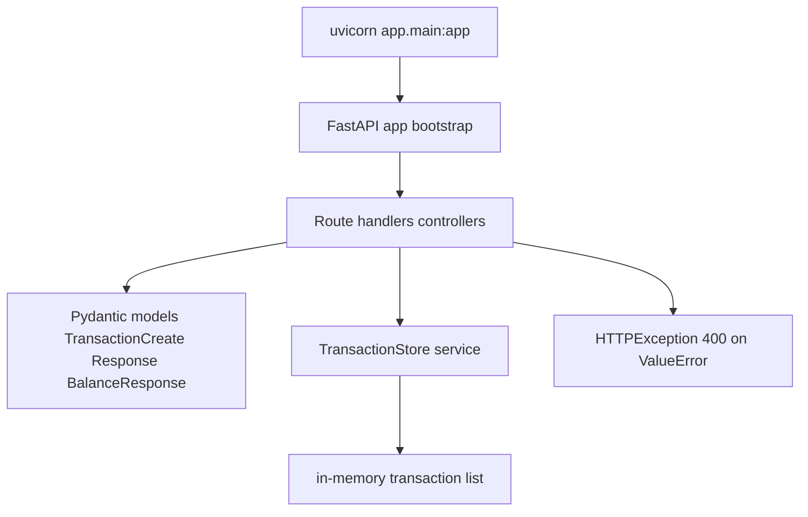

# code-artifact-mapper Report — B4 Transaction Ledger

### 0) Agent Metadata

```yaml
agent_name: code-artifact-mapper
agent_version: "1.0"
generated_at: 2026-06-22T00:00:00Z
repository:
  name: B4 Transaction Ledger
  root_path: $REPO_ROOT/tasks/Basics/B4
  type: single-package
languages_detected: [python]
frameworks_detected: [FastAPI, Pydantic, Uvicorn, pytest]
files_scanned: 6
artifacts_found: 9
scan_excludes: [node_modules, vendor, .git, dist, build, target, coverage, .venv, proof]
```

### 1) Executive Summary

B4 is a **single-module FastAPI REST API** that tracks in-memory credit/debit transactions. HTTP entry points are **functional route handlers** decorated with `@app.get` / `@app.post` in `app/main.py` — there are no controller classes. Business logic and in-memory persistence live in one **service-style class** (`TransactionStore`). Request/response shapes are **Pydantic `BaseModel` schemas** plus a `TransactionType` enum in `app/schemas.py`. There is **no dedicated repository layer**, **no ORM**, and **no background jobs or message consumers**. Configuration is limited to the FastAPI app factory and `requirements.txt`.

### 2) Summary Counts

#### By category

| category | count |
|---|---|
| controller | 3 |
| service | 1 |
| repository | 0 |
| model | 4 |
| job | 0 |
| consumer | 0 |
| config | 1 |
| utility | 0 |
| interface | 0 |
| class | 0 |

#### By language

| language | count |
|---|---|
| python | 9 |

#### By confidence

| confidence | count |
|---|---|
| high | 8 |
| medium | 1 |
| low | 0 |

#### By module/package (top 10)

| module_group | controllers | services | repositories | models | other |
|---|---|---|---|---|---|
| app | 3 | 1 | 0 | 4 | 1 |

### 3) Framework & Architecture Signals

| signal | value |
|---|---|
| primary pattern | Thin FastAPI handlers → in-memory service; functional controllers + Pydantic schemas |
| DI style | Module-level singleton `store = TransactionStore()` in `main.py`; no DI container |
| persistence style | In-memory list inside `TransactionStore`; no database, ORM, or repository abstraction |
| async/event style | None detected |
| entry points | `uvicorn app.main:app`; `app/main.py` defines routes and app instance |

### 4) Complete Artifact Inventory

| symbol | qualified_name | category | secondary_tags | file_path | line_hint | language | framework_hint | visibility | extends | implements | injected_deps | key_methods | evidence | confidence |
|---|---|---|---|---|---|---|---|---|---|---|---|---|---|---|
| create_transaction | app.main.create_transaction | controller | entry-point | tasks/Basics/B4/app/main.py | 19 | python | FastAPI | public | - | - | TransactionStore | - | `@app.post("/transactions")` handler; creates credit/debit | high |
| list_transactions | app.main.list_transactions | controller | entry-point | tasks/Basics/B4/app/main.py | 30 | python | FastAPI | public | - | - | TransactionStore | - | `@app.get("/transactions")` list handler | high |
| get_balance | app.main.get_balance | controller | entry-point | tasks/Basics/B4/app/main.py | 35 | python | FastAPI | public | - | - | TransactionStore | - | `@app.get("/balance")` balance handler | high |
| TransactionStore | app.store.TransactionStore | service | - | tasks/Basics/B4/app/store.py | 6 | python | FastAPI | public | - | - | - | add, list_all, balance | In-memory ledger; enforces insufficient-funds guard on debit | high |
| TransactionType | app.schemas.TransactionType | model | - | tasks/Basics/B4/app/schemas.py | 8 | python | Pydantic | public | str, Enum | - | - | - | Domain enum `credit` / `debit` | high |
| TransactionCreate | app.schemas.TransactionCreate | model | - | tasks/Basics/B4/app/schemas.py | 13 | python | Pydantic | public | BaseModel | - | - | coerce_amount | POST `/transactions` request schema with validators | high |
| TransactionResponse | app.schemas.TransactionResponse | model | - | tasks/Basics/B4/app/schemas.py | 26 | python | Pydantic | public | BaseModel | - | - | - | Transaction item returned by API | high |
| BalanceResponse | app.schemas.BalanceResponse | model | - | tasks/Basics/B4/app/schemas.py | 33 | python | Pydantic | public | BaseModel | - | - | serialize_balance | GET `/balance` response schema | high |
| app bootstrap | app.main.app | config | bootstrap, entry-point | tasks/Basics/B4/app/main.py | 10 | python | FastAPI | public | - | - | - | - | `FastAPI(title="Transaction Ledger")` app factory + route registration | medium |

### 5) Category Highlights

#### controller (3)

| symbol | role |
|---|---|
| `create_transaction` | POST `/transactions` — validates payload, delegates to store, maps `ValueError` → HTTP 400 |
| `list_transactions` | GET `/transactions` — returns all stored transactions |
| `get_balance` | GET `/balance` — returns computed balance as formatted string |

#### service (1)

| symbol | role |
|---|---|
| `TransactionStore` | Sole business-logic artifact — append-only in-memory ledger, balance computation, debit guard |

#### repository

**None found.** Searched `app/` for `*Repository`, `*Dao`, ORM patterns, and database clients. Persistence is an in-memory list on `TransactionStore`.

#### model (4)

| symbol | role |
|---|---|
| `TransactionCreate` | Validated input for new transactions (amount, type, description) |
| `TransactionResponse` | API representation of a stored transaction with assigned `id` |
| `BalanceResponse` | Balance wrapper with two-decimal string serialization |
| `TransactionType` | Enum restricting transaction type to `credit` or `debit` |

#### job

**None found.** Searched for `@Scheduled`, `*Job`, `*Worker`, Celery/cron patterns. No background execution in source.

#### consumer

**None found.** Searched for queue listeners, `@KafkaListener`, `*Consumer`, event handlers. No messaging integration.

#### config (1)

| symbol | role |
|---|---|
| `app bootstrap` | FastAPI application instance and route wiring in `main.py` |

#### utility

**None found.** No `*Util`, `*Helper`, or shared helper modules beyond Pydantic validators on schemas.

#### interface

**None found.** No `Protocol`, `ABC`, or explicit interface declarations in scanned source.

#### class

**None found.** All named classes map to `service` or `model`; middleware/validator classes are absent.

### 6) Dependency Hotspots

| symbol | hub role | injected_deps / dependents |
|---|---|---|
| `TransactionStore` | Central state — all three controllers call `store` | Referenced by `create_transaction`, `list_transactions`, `get_balance` |
| `TransactionCreate` | Request contract for POST `/transactions` | Used by `create_transaction` and `TransactionStore.add` |
| `TransactionResponse` | Shared response shape for create/list | Used by store and list/create handlers |
| `app bootstrap` | HTTP entry — registers all routes | Imports schemas and `TransactionStore` |

### 7) Manual Follow-Up

```
- symbol: create_transaction / list_transactions / get_balance
  file: tasks/Basics/B4/app/main.py
  reason: functional handlers (no Controller class) — classified controller via FastAPI route decorators
  suggested_action: acceptable for FastAPI; confidence medium only on app bootstrap row

- symbol: TransactionStore
  file: tasks/Basics/B4/app/store.py
  reason: combines service logic and in-memory persistence (no repository split)
  suggested_action: intentional for B4 warm-up scope; extract repository if adding a real database

- symbol: app bootstrap
  file: tasks/Basics/B4/app/main.py
  reason: module-level `store = TransactionStore()` is global mutable state reset in tests via fixture
  suggested_action: document test isolation pattern in B4 README (already uses autouse fixture)

- symbol: tests/test_api.py
  file: tasks/Basics/B4/tests/test_api.py
  reason: 5 pytest functions — counted in summary only, not inventoried as artifacts
  suggested_action: no action; aligns with code-artifact-mapper out-of-scope test rule
```

### 8) Architecture Diagram


