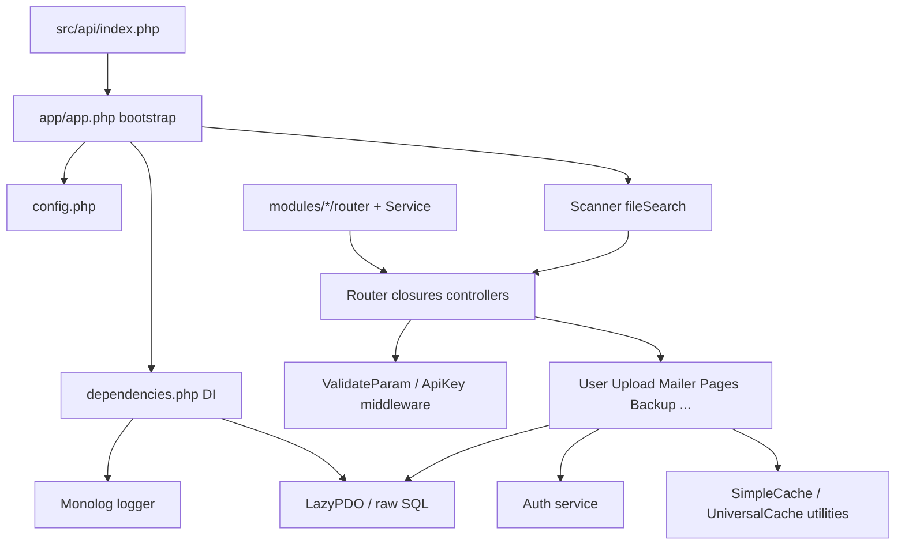

# code-artifact-mapper Report — reSlim

### 0) Agent Metadata

```yaml
agent_name: code-artifact-mapper
agent_version: "1.0"
generated_at: 2026-06-16T00:00:00Z
repository:
  name: reSlim
  root_path: $REPO_ROOT/extras/cloned-repos/reSlim
  type: single-package
languages_detected: [php]
frameworks_detected: [Slim 3, PSR-7, PSR-11, Monolog, PHPMailer, Predis]
files_scanned: 52
artifacts_found: 40
scan_excludes: [node_modules, vendor, .git, dist, build, target, coverage, resources/postman, resources/template]
```

### 1) Executive Summary

reSlim is a **PHP REST API microframework** built on **Slim 3** with a **modular monolith** layout: core routes live under `src/routers/`, pluggable features under `src/modules/`, and shared logic in `src/classes/`. HTTP entry points are **functional Slim route closures** (not MVC controller classes) auto-loaded via `Scanner::fileSearch`. Business logic concentrates in fat **service-style classes** (`User`, `Upload`, `Mailer`, module classes) that embed **raw PDO/SQL** directly — there is **no dedicated repository layer** and **no ORM entity/model classes**. Authentication, API keys, and token lifecycle are centralized in `Auth`. Caching (`SimpleCache`, `UniversalCache`, `Auth` key cache) and maintenance endpoints support multi-server deployments. **No PHP background jobs or message consumers** were found; expired-token cleanup is defined as a **MySQL EVENT** in SQL resources only.

### 2) Summary Counts

#### By category

| category | count |
|---|---|
| controller | 10 |
| service | 9 |
| repository | 0 |
| model | 0 |
| job | 0 |
| consumer | 0 |
| config | 3 |
| utility | 12 |
| interface | 0 |
| class | 6 |

#### By language

| language | count |
|---|---|
| php | 40 |

#### By confidence

| confidence | count |
|---|---|
| high | 32 |
| medium | 8 |
| low | 0 |

#### By module/package (top 10)

| module_group | controllers | services | repositories | models | other |
|---|---|---|---|---|---|
| routers | 6 | 0 | 0 | 0 | 0 |
| modules | 4 | 4 | 0 | 0 | 1 |
| classes | 0 | 5 | 0 | 0 | 17 |
| app | 0 | 0 | 0 | 0 | 2 |

### 3) Framework & Architecture Signals

| signal | value |
|---|---|
| primary pattern | Modular monolith REST API; functional route handlers + fat service classes (active-record-style SQL) |
| DI style | Slim PSR-11 container (`dependencies.php` closures); manual `new Class($this->db)` in route closures |
| persistence style | Raw PDO/SQL via `LazyPDO`; master/slave container bindings (`db`, `dbslave`); no ORM/repository abstraction |
| async/event style | None in PHP; MySQL EVENT `delete_all_expired_auth` in `resources/database/event_delete_all_expired_auth_scheduler.sql` |
| entry points | `src/api/index.php` → `src/app/app.php` → `$app->run()`; routers scanned from `src/routers/` and `src/modules/` |

### 4) Complete Artifact Inventory

| symbol | qualified_name | category | secondary_tags | file_path | line_hint | language | framework_hint | visibility | extends | implements | injected_deps | key_methods | evidence | confidence |
|---|---|---|---|---|---|---|---|---|---|---|---|---|---|---|
| index.router | routers/index.router | controller | entry-point | src/routers/index.router.php | 8 | php | Slim 3 | public | - | - | - | - | `$app->get('/')` welcome/index route with SimpleCache | high |
| user.router | routers/user.router | controller | entry-point | src/routers/user.router.php | 10 | php | Slim 3 | public | - | - | - | - | `/user/*` user CRUD, auth, upload, keys, stats (~50 routes) | high |
| mail.router | routers/mail.router | controller | entry-point | src/routers/mail.router.php | 7 | php | Slim 3 | public | - | - | - | - | `/mail/send` SMTP endpoints | high |
| logs.router | routers/logs.router | controller | entry-point | src/routers/logs.router.php | 8 | php | Slim 3 | public | - | - | - | - | `/logs/data/*` log append/update/clear | high |
| maintenance.router | routers/maintenance.router | controller | entry-point | src/routers/maintenance.router.php | 11 | php | Slim 3 | public | - | - | - | - | `/maintenance/cache/*` cache admin + cross-server listen | high |
| test.router | routers/test.router | controller | entry-point | src/routers/test.router.php | 32 | php | Slim 3 | public | - | - | - | - | `/dev/*` developer test/demo routes | high |
| backup.router | modules/backup/backup.router | controller | entry-point | src/modules/backup/backup.router.php | 15 | php | Slim 3 | public | - | - | - | - | `/backup/*` DB backup module routes | high |
| pages.router | modules/pages/pages.router | controller | entry-point | src/modules/pages/pages.router.php | 12 | php | Slim 3 | public | - | - | - | - | `/page/*` CMS pages module routes | high |
| packager.router | modules/packager/packager.router | controller | entry-point | src/modules/packager/packager.router.php | 15 | php | Slim 3 | public | - | - | - | - | `/packager/*` module install/uninstall routes | high |
| flexibleconfig.router | modules/flexibleconfig/flexibleconfig.router | controller | entry-point | src/modules/flexibleconfig/flexibleconfig.router.php | 17 | php | Slim 3 | public | - | - | - | - | `/flexibleconfig/*` key-value config module routes | high |
| User | classes\User | service | - | src/classes/User.php | 22 | php | reSlim | public | - | - | PDO | register, login, showAll | User management + inline SQL; injected `$db` | high |
| Upload | classes\Upload | service | - | src/classes/Upload.php | 21 | php | reSlim | public | - | - | PDO | process, showAllAsPagination | File upload management + SQL | high |
| Mailer | classes\Mailer | service | - | src/classes/Mailer.php | 20 | php | reSlim/PHPMailer | public | - | - | PHPMailer | send | SMTP orchestration wrapper | high |
| Logs | classes\Logs | service | - | src/classes/Logs.php | 20 | php | reSlim | public | - | - | PDO | updateLog, clearLog | App log file + DB-backed ops | medium |
| Auth | classes\Auth | service | entry-point | src/classes/Auth.php | 22 | php | reSlim | public | - | - | - | validToken, hashPassword, generateApiKey | Token/API-key auth + cache; static service methods | high |
| Backup | modules\backup\Backup | service | - | src/modules/backup/Backup.php | 17 | php | reSlim | public | - | - | PDO | table, viewInfo | Database backup orchestration | high |
| Pages | modules\pages\Pages | service | - | src/modules/pages/Pages.php | 17 | php | reSlim | public | - | - | PDO | - | CMS pages CRUD + pagination | high |
| Packager | modules\packager\Packager | service | - | src/modules/packager/Packager.php | 18 | php | reSlim | public | - | - | PDO | viewInfo | Module package install/uninstall | high |
| FlexibleConfig | modules\flexibleconfig\FlexibleConfig | service | - | src/modules/flexibleconfig/FlexibleConfig.php | 18 | php | reSlim | public | - | - | PDO | - | Flexible key-value config store | high |
| app bootstrap | app/app | config | bootstrap, entry-point | src/app/app.php | 31 | php | Slim 3 | public | - | - | - | - | Autoload, constants, router scan, `$app->run()` | high |
| dependencies | app/dependencies | config | bootstrap | src/app/dependencies.php | 4 | php | Slim 3 | public | - | - | - | - | Slim App + PSR-11 container, PDO, Monolog, error handlers | high |
| config | config | config | - | src/config.php | 16 | php | reSlim | public | - | - | - | - | App/DB/SMTP/cache/redis settings array | medium |
| Validation | classes\Validation | utility | validator | src/classes/Validation.php | 18 | php | reSlim | public | - | - | - | alphabetOnly, integerOnly | Static input sanitizers | high |
| JSON | classes\JSON | utility | mapper | src/classes/JSON.php | 23 | php | reSlim | public | - | - | - | encode, debug_decode | JSON encode/decode helpers | high |
| CustomHandlers | classes\CustomHandlers | utility | - | src/classes/CustomHandlers.php | 19 | php | reSlim | public | - | - | - | getreSlimMessage | Multilingual RS-code message catalog | high |
| Cors | classes\Cors | utility | middleware | src/classes/Cors.php | 19 | php | reSlim | public | - | - | - | modify | CORS header helper for API responses | high |
| SimpleCache | classes\SimpleCache | utility | - | src/classes/SimpleCache.php | 26 | php | reSlim | public | - | - | - | save, load, isCached | File/redis response-output cache | high |
| UniversalCache | classes\UniversalCache | utility | - | src/classes/UniversalCache.php | 25 | php | reSlim | public | - | - | - | writeCache, readCache | Internal key-value file cache | high |
| Pagination | classes\Pagination | utility | - | src/classes/Pagination.php | 20 | php | reSlim | public | - | - | - | paginate | Array pagination helper | high |
| ParallelRequest | classes\ParallelRequest | utility | - | src/classes/ParallelRequest.php | 11 | php | reSlim | public | - | - | - | setRequest, execute | Parallel HTTP/cURL requests | high |
| BaseConverter | classes\BaseConverter | utility | - | src/classes/BaseConverter.php | 16 | php | reSlim | public | - | - | - | convertFromBinary | Base-N encoding for token/API keys | high |
| Scanner | classes\helper\Scanner | utility | - | src/classes/helper/Scanner.php | 5 | php | reSlim | public | - | - | - | fileSearch | Recursive file discovery for router autoload | high |
| StringUtils | classes\helper\StringUtils | utility | - | src/classes/helper/StringUtils.php | 4 | php | reSlim | public | - | - | - | isMatchAny | String matching helpers | high |
| Dictionary | modules\packager\Dictionary | utility | - | src/modules/packager/Dictionary.php | 12 | php | reSlim | public | - | - | - | - | Static i18n message arrays for Packager module | high |
| ValidateParam | classes\middleware\ValidateParam | class | middleware, validator | src/classes/middleware/ValidateParam.php | 21 | php | Slim 3 | public | - | - | - | __invoke | Invokable middleware; body param regex validation | high |
| ValidateParamURL | classes\middleware\ValidateParamURL | class | middleware, validator | src/classes/middleware/ValidateParamURL.php | 21 | php | Slim 3 | public | - | - | - | __invoke | Query-string param validation middleware | high |
| ValidateParamJSON | classes\middleware\ValidateParamJSON | class | middleware, validator | src/classes/middleware/ValidateParamJSON.php | 21 | php | Slim 3 | public | - | - | - | __invoke | JSON body validation middleware | high |
| ApiKey | classes\middleware\ApiKey | class | middleware, entry-point | src/classes/middleware/ApiKey.php | 23 | php | Slim 3 | public | - | - | - | __invoke | API key auth middleware (URL/header) | high |
| SafePDO | classes\middleware\SafePDO | class | - | src/classes/middleware/ApiKey.php | 128 | php | PDO | public | PDO | - | - | __construct | Nested PDO subclass with JSON exception handler | medium |
| LazyPDO | classes\LazyPDO | class | - | src/classes/LazyPDO.php | 19 | php | PDO | public | PDO | - | - | __construct | Lazy-deferred PDO connection for DI container | high |

### 5) Category Highlights

#### controller (10)

| symbol | role |
|---|---|
| `user.router` | Primary API surface — user auth, CRUD, uploads, API keys, token management, statistics |
| `pages.router` | CMS module — page CRUD, public listing, search, admin operations |
| `maintenance.router` | Cache purge/info + cross-server cache transfer listen endpoints |
| `backup.router` | Database backup creation, listing, download |
| `packager.router` | Module package install/uninstall and dependency checks |
| `flexibleconfig.router` | Runtime key-value configuration CRUD |
| `index.router` | Public welcome/metadata endpoint with HTTP cache |
| `mail.router` | SMTP send endpoints (custom or default from-address) |
| `logs.router` | Client log append + admin log update/clear |
| `test.router` | Developer sandbox for cache, validation, API key, JSON debug |

#### service (9)

| symbol | role |
|---|---|
| `User` | Core domain service — registration, login, profile, password, API keys, stats; largest artifact (~1900 lines) |
| `Auth` | Token validation, password hashing, API key encode/cache, role checks — used by middleware and services |
| `Pages` | CMS business logic — page lifecycle, caching, pagination |
| `Upload` | File upload storage, streaming, metadata CRUD |
| `Backup` | mysqldump-style table backup to filesystem |
| `Packager` | Module installation/removal and compatibility checks |
| `FlexibleConfig` | DB + filesystem-backed flexible configuration |
| `Mailer` | PHPMailer wrapper with SMTP config from `config.php` |
| `Logs` | Log file manipulation for admin endpoints |

#### repository

**None found.** Searched `src/classes/`, `src/modules/`, and all PHP files for `*Repository`, `*Dao`, `@Repository`, ORM repository patterns. Data access is inline SQL inside service classes via injected `PDO`.

#### model

**None found.** Searched for `@Entity`, `*Model`, `*Dto`, `*Schema`, dedicated `models/` or `entities/` directories. Domain fields are public `var` properties on service classes (e.g. `User.$username`) mapping directly to SQL tables — active-record-style, not separate model artifacts. Skipped trivial inline JSON response shapes.

#### job

**None found.** Searched for `@Scheduled`, `*Job`, `*Worker`, `*Task`, Celery/cron PHP patterns. MySQL EVENT `delete_all_expired_auth` exists in `resources/database/event_delete_all_expired_auth_scheduler.sql` but is not a PHP artifact.

#### consumer

**None found.** Searched for `@KafkaListener`, `@RabbitListener`, `*Consumer`, `*Subscriber`, queue handler patterns. No message-queue integration in PHP source.

#### config (3)

| symbol | role |
|---|---|
| `app bootstrap` | Application entry — version constants, autoload, timezone, router/module scan, run |
| `dependencies` | Slim container wiring — DB master/slave, Monolog, PHPMailer, HTTP cache, error handlers |
| `config` | Central settings — Slim settings, DB, SMTP, cache/redis toggles, router cache |

#### utility (12)

| symbol | role |
|---|---|
| `SimpleCache` | Server-side JSON response cache (file or Redis via Predis) |
| `UniversalCache` | Internal key-value cache with cross-server transfer |
| `Auth` (cache statics) | API-key cache layer (paired with Auth service) |
| `JSON` | Safe UTF-8 JSON encoding/decoding |
| `CustomHandlers` | RS-code multilingual response messages |
| `Validation` | Static input sanitization helpers |
| `Pagination` | In-memory array pagination |
| `Scanner` | Filesystem scan powering dynamic router loading |
| `Cors` | CORS response header modification |
| `BaseConverter` | Base-62 encoding for tokens/keys |
| `ParallelRequest` | Multi-cURL parallel HTTP client |
| `Dictionary` | Packager module i18n strings |

#### interface

**None found.** No `interface` declarations in scanned PHP source.

#### class (6)

| symbol | role |
|---|---|
| `ValidateParam` | Body form validation Slim middleware |
| `ValidateParamURL` | Query param validation middleware |
| `ValidateParamJSON` | JSON body validation middleware |
| `ApiKey` | Public API key authorization middleware |
| `LazyPDO` | Lazy PDO wrapper registered as `db`/`dbslave` in container |
| `SafePDO` | PDO subclass used by ApiKey middleware for isolated DB reads |

### 6) Dependency Hotspots

| symbol | hub role | injected_deps / dependents |
|---|---|---|
| `User` | Largest service; referenced by `user.router` on nearly every route | PDO; uses `Auth`, `Validation`, `JSON`, `CustomHandlers`, `Pagination` |
| `Auth` | Auth hub — tokens, API keys, roles, cache | Used by `User`, `ApiKey`, `Cors`, `maintenance.router`, all module services |
| `dependencies` | DI root — all routes access `$this->db`, `$this->logger`, `$this->cache` via Slim container | Registers PDO, Monolog, PHPMailer, etag generators |
| `SimpleCache` | Response cache used by index, user profile, pages, flexibleconfig routes | Used across routers + `Auth`/`UniversalCache` maintenance |
| `Scanner` | Boot-time discovery — loads all `*.router.php` files | Called from `app.php` only; enables modular routing |
| `Pages` | Second-largest module service (~1600 lines) | PDO, `Auth`, `UniversalCache`, `Validation` |

### 7) Manual Follow-Up

```
- symbol: Logs
  file: src/classes/Logs.php
  reason: small service (~110 lines) overlapping Monolog `$this->logger` usage in logs.router
  suggested_action: confirm whether Logs DB ops vs Monolog file logging are intentionally separate

- symbol: Cors
  file: src/classes/Cors.php
  reason: classified utility but acts as response middleware helper called on every route
  suggested_action: acceptable as utility; no reclassification needed unless extracting to Slim middleware class

- symbol: SafePDO
  file: src/classes/middleware/ApiKey.php
  reason: nested class in ApiKey.php — unusual placement
  suggested_action: consider extracting to src/classes/SafePDO.php if reused elsewhere

- symbol: MySQL EVENT delete_all_expired_auth
  file: resources/database/event_delete_all_expired_auth_scheduler.sql
  reason: scheduled cleanup exists at DB layer, not as PHP job
  suggested_action: document operational dependency on MySQL EVENT scheduler being enabled

- symbol: config.php
  file: src/config.php
  reason: procedural config array required via `require` from multiple files (including middleware)
  suggested_action: validate no secrets committed; consider env-based override for production

- symbol: User / Upload / Pages
  file: src/classes/User.php, src/classes/Upload.php, src/modules/pages/Pages.php
  reason: service classes embed SQL directly — no repository boundary
  suggested_action: intentional for this framework; extract repositories only if refactoring for testability
```

### 8) Architecture Diagram


