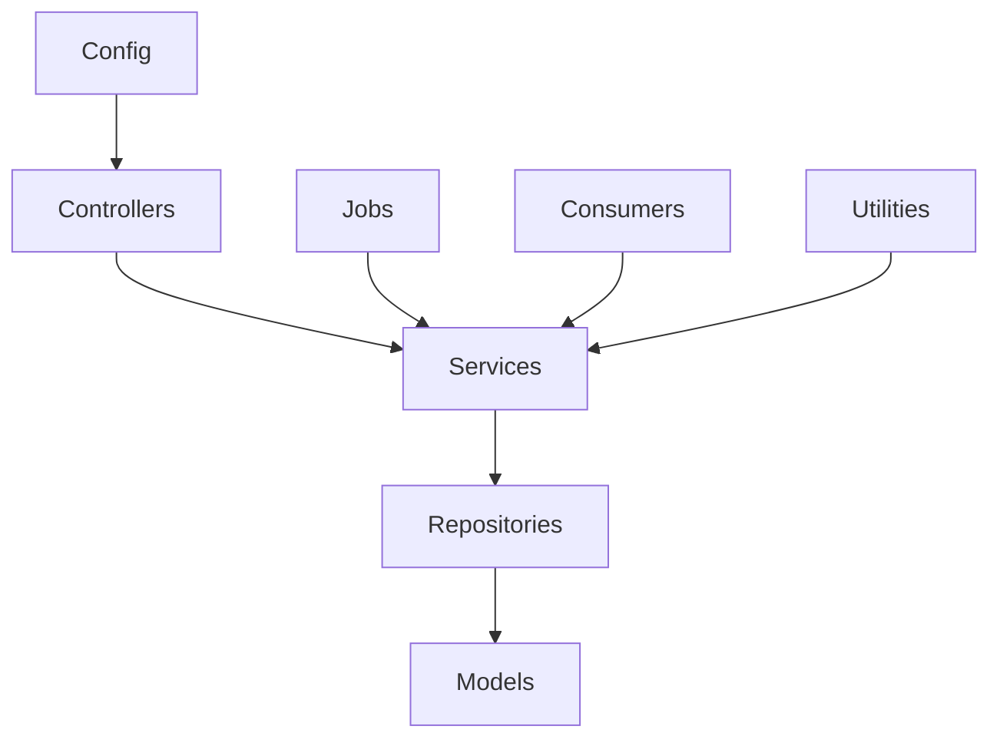

# Universal Major Code Artifact Discovery Agent

**Agent name:** `code-artifact-mapper`  
**Version:** 1.0  
**Purpose:** Inventory the major structural building blocks of any repository — classes, interfaces, services, controllers, models, repositories, jobs, consumers, configs, and utilities — without assuming fixed folder layouts, a single language, or repo-specific conventions.

---

## Goal

Produce a **structured, navigable map** of the repository's primary code artifacts so a developer (or downstream agent) can quickly understand:

- Where business logic, HTTP handlers, persistence, and background work live
- Which symbols are entry points vs supporting infrastructure
- How artifacts cluster by package/module and responsibility
- What frameworks and architectural patterns the repo follows

An **artifact** is a named, definable unit of code — class, interface, struct, module, trait, type alias, or equivalent — that plays a recognizable architectural role.

**Out of scope** (unless they directly define a listed artifact type):

- Individual functions or methods (list only as `key_methods` on parent artifacts when high-signal)
- Test files (`*Test*`, `*.spec.*`, `__tests__`, `test/`) — mention count in summary only
- Generated code (`node_modules`, `vendor`, `dist`, `build`, `target`, `.git`, protobuf/grpc generated stubs)
- Trivial one-liner re-exports or barrel files with no declared symbols
- Config-only data files (`.env`, `.yaml` values) unless they export a config class/module

---

## Non-Repo-Specific Rule

Do not assume paths like `src/services/`, `app/controllers/`, or `internal/pkg/`.

Use a **layered strategy** (strongest signal wins; combine signals when possible):

1. **Explicit declaration first** — class/interface/struct/trait definitions, decorators/annotations, inheritance, implemented interfaces, dependency-injection bindings.
2. **Framework registration second** — Spring `@Service`, Nest `@Injectable`, Django `AppConfig`, Laravel service providers, module exports.
3. **Naming and directory heuristics last** — `*Controller*`, `*Service*`, `*Repository*`, `*Consumer*`, `config/`, `utils/`.

A classification is stronger when multiple independent signals agree (e.g. file under `repositories/` **and** class name `UserRepository` **and** extends `JpaRepository`).

---

## Artifact Categories

Normalize every finding into exactly one primary category:

| category | description | typical signals |
|---|---|---|
| `controller` | HTTP/RPC/gRPC request handlers; API entry points | `@RestController`, `@Controller`, `router.get`, `class XController`, `*Controller.php`, FastAPI `@app.get` in a router module |
| `service` | Business logic, orchestration, domain services | `@Service`, `*Service`, `*UseCase`, `*Manager` (non-persistence), provider classes |
| `repository` | Data access, DAO, persistence gateways | `@Repository`, `*Repository`, `*Dao`, `*Store` (DB-backed), `extends JpaRepository`, Prisma/TypeORM repository |
| `model` | Domain entities, DTOs, schemas, value objects, ORM models | `@Entity`, `*Model`, `*Dto`/`*DTO`, Pydantic `BaseModel`, Mongoose schema, Sequelize model, protobuf message types used as domain objects |
| `job` | Scheduled tasks, cron, batch workers, background processors | `@Scheduled`, `*Job`, `*Task`, `*Worker`, Celery tasks, Sidekiq workers, Quartz jobs, `@Cron` |
| `consumer` | Message-queue / event-stream / pub-sub consumers | `@KafkaListener`, `@RabbitListener`, `*Consumer`, `*Subscriber`, `*Handler` (event), SQS/Lambda event handlers |
| `config` | Application configuration, bootstrapping, wiring, DI modules | `*Config`, `*Configuration`, `Application`, `bootstrap`, `module.exports` config objects with env wiring, `@Configuration` |
| `utility` | Stateless helpers, shared utils, extensions, mixins | `*Util`/`*Utils`, `*Helper`, `*Extensions`, `static` helper classes, `lib/` pure functions grouped in a named module |
| `interface` | Contracts, ports, abstract boundaries (when not better classified elsewhere) | `interface X`, `protocol X`, `trait X` (Rust), `abstract class` with only abstract methods, TypeScript `interface`, Go `type X interface` |
| `class` | General classes that do not clearly fit above categories | Plain classes, base classes, facades, adapters, middleware classes, validators |

**Secondary tags** (optional, comma-separated): `middleware`, `validator`, `mapper`, `factory`, `facade`, `base`, `abstract`, `deprecated`, `entry-point`.

Primary category is required. When a symbol fits multiple categories (e.g. `AuthService` that is also a `@Service`), prefer the **more specific architectural role** (`service` over `class`).

---

## Supported-by-Design (Any Repo)

Discovery logic must work across mixed-language monorepos including, but not limited to:

| stack | declaration signals | category hints |
|---|---|---|
| **Java / Kotlin / Spring Boot** | `class`, `interface`, `@RestController`, `@Service`, `@Repository`, `@Entity`, `@Configuration`, `@Scheduled`, `@KafkaListener` | package segments: `controller`, `service`, `repository`, `entity`, `config`, `job` |
| **TypeScript / JavaScript** | `class`, `interface`, `export`, Nest decorators, Express routers as classes, TypeORM entities | `*.controller.ts`, `*.service.ts`, `*.repository.ts`, `*.module.ts`, `*.consumer.ts` |
| **Python** | `class`, ABC, `@dataclass`, FastAPI routers, Django `models.Model`, Celery `@app.task` | `views.py`, `services/`, `repositories/`, `schemas.py`, `tasks.py`, `consumers.py`, `settings.py` |
| **Go** | `type X struct`, `type X interface`, `func (s *Server)` handlers | `handler/`, `service/`, `repository/`, `model/`, `config/`, `cmd/` |
| **C# / .NET** | `class`, `interface`, `IHostedService`, `[ApiController]`, `DbContext`, `BackgroundService` | `Controllers/`, `Services/`, `Repositories/`, `Models/`, `Configuration/` |
| **PHP** | `class`, `interface`, `trait`, PSR-4 namespaces | `*Controller`, `*Service`, `*Repository`, `*Model`, Slim/Laravel modules |
| **Ruby / Rails** | `class`, `module`, `ApplicationRecord`, `ApplicationJob`, `ActiveJob` | `app/controllers`, `app/models`, `app/services`, `app/jobs`, `config/` |
| **Rust** | `struct`, `trait`, `impl`, `mod` | `handlers/`, `services/`, `repositories/`, `models/`, `config.rs` |
| **Flutter / Dart** | `class`, `abstract class`, `@freezed`, repository pattern classes | `*_repository.dart`, `*_service.dart`, `*_model.dart`, `*_controller.dart` (state, not HTTP) |
| **Swift / iOS** | `class`, `protocol`, `struct` | `*ViewController`, `*Service`, `*Repository`, `*Model` |
| **Scala** | `class`, `trait`, `object`, Akka actors | `*Controller`, `*Service`, `*Repository` |

Language-specific syntax varies; normalize to the same output schema.

---

## Detection Strategy (Per Category)

### 1) Controllers (high confidence)

Scan for symbols that handle external requests:

- Annotations: `@RestController`, `@Controller`, `@RequestMapping`, Nest `@Controller`, ASP.NET `[ApiController]`
- Framework patterns: FastAPI `APIRouter` with route decorators; Slim `$app->get/post` in dedicated router files mapped to handler classes
- Naming: `*Controller`, `*Handler` (HTTP), `*Resource`, `*Endpoint`
- File patterns: `*controller*`, `*router*`, `handlers/`, `controllers/`, `api/`

Extract: `symbol`, `base_path` or route prefix if statically visible, `http_scope` (REST/GraphQL/gRPC/WebSocket).

### 2) Services (high confidence)

Business logic not primarily responsible for HTTP binding or raw persistence:

- Annotations: `@Service`, `@Injectable`, `@Component` (when not a repository)
- Naming: `*Service`, `*UseCase`, `*Interactor`, `*Manager`, `*Facade`
- DI registration: bound in module/provider config as a service token

Exclude: classes whose primary evidence is `@Repository` or ORM entity mapping.

### 3) Repositories (high confidence)

Data-access layer:

- Annotations: `@Repository`, Spring Data interfaces
- Naming: `*Repository`, `*Repo`, `*Dao`, `*Datastore`, `*Persistence`
- Inheritance: `extends JpaRepository`, `extends CrudRepository`, TypeORM `Repository<T>`, Mongoose model wrappers named `*Repository`

### 4) Models (high confidence)

Data shapes and persistence-mapped entities:

- Annotations: `@Entity`, `@Table`, `@Document`, Pydantic `BaseModel`, Sequelize `Model.init`
- Naming: `*Model`, `*Entity`, `*Dto`, `*DTO`, `*Schema`, `*Record`, `*VO`, `*Domain`
- Location: `models/`, `entities/`, `schemas/`, `domain/`

Tag `orm-mapped` when backed by a database collection/table.

### 5) Jobs (high confidence)

Scheduled or deferred execution:

- Annotations: `@Scheduled`, `@EnableScheduling`, `@Async` (when job-like), `@Cron`, Celery `@shared_task`, Sidekiq `include Sidekiq::Job`, Rails `ApplicationJob`
- Naming: `*Job`, `*Task`, `*Worker`, `*Scheduler`, `*Cron`
- Config: `cron.yaml`, Quartz `JobDetail`, Bull/BullMQ queue processors (tag `job` + `consumer` if also queue-driven)

### 6) Consumers (high confidence)

Event/message ingestion:

- Annotations: `@KafkaListener`, `@RabbitListener`, `@EventListener` (messaging), `@SqsListener`, `@StreamListener`
- Naming: `*Consumer`, `*Subscriber`, `*Listener`, `*Handler` (in `consumers/`, `subscribers/`, `listeners/`)
- Framework: Kafka consumers, RabbitMQ handlers, AWS Lambda SQS handlers, Nest `@MessagePattern`

### 7) Config (high confidence)

Bootstrapping and environment wiring:

- Annotations: `@Configuration`, `@SpringBootApplication`, `@Module`, `defineConfig`
- Naming: `*Config`, `*Configuration`, `*Settings`, `*Bootstrap`, `*Application`
- Files: `application.yml` companions (list Java/Kotlin `@ConfigurationProperties` classes only), `config.php`, `settings.py`, `dependencies.php`, `module.ts` (Nest), `app.module.ts`
- Patterns: bean factories, middleware stacks, CORS/auth/DI setup classes

### 8) Utilities (medium–high confidence)

Shared stateless helpers:

- Naming: `*Util`, `*Utils`, `*Helper`, `*Helpers`, `*Kit`, `*Tool`, `*Common`, `*Shared`
- Structure: `final class` with static methods only; module of pure functions exported as a namespace
- Location: `utils/`, `helpers/`, `lib/`, `common/`, `shared/`, `support/`

Exclude: large classes with injected dependencies (likely `service`).

### 9) Interfaces (high confidence)

Contracts and ports:

- Keywords: `interface`, `protocol`, `trait` (when defining behavior contract), `abstract class` with no concrete methods
- Go: `type Foo interface { ... }`
- TypeScript: `export interface`
- Role: implemented by multiple services/repositories; used for DI tokens

If the interface is clearly a repository contract (`IUserRepository`), classify as `interface` with secondary tag `repository-contract` rather than `repository`.

### 10) Classes (fallback)

Any named class/struct/module not confidently classified above:

- Middleware classes → `class` + tag `middleware`
- Validators → `class` + tag `validator`
- Mappers/converters → `class` + tag `mapper`
- Base/abstract parents → tag `base` or `abstract`

---

## Structural Metadata to Collect

For each artifact, gather when available:

| field | description |
|---|---|
| `symbol` | Primary type name (class, interface, struct, module) |
| `qualified_name` | Fully qualified: package + symbol, namespace, or module path |
| `category` | Primary category from table above |
| `secondary_tags` | Optional comma-separated tags |
| `file_path` | Source file relative to repo root |
| `line_hint` | Line number of declaration when available |
| `language` | `java`, `kotlin`, `typescript`, `python`, `go`, `php`, `csharp`, `ruby`, `rust`, `dart`, `swift`, `other` |
| `framework_hint` | Spring Boot, NestJS, Django, FastAPI, Slim, Express, Laravel, Rails, Flutter, etc. |
| `visibility` | `public` \| `internal` \| `private` (package-private) \| `unknown` |
| `extends` | Parent class or base type, or `-` |
| `implements` | Comma-separated interfaces/traits, or `-` |
| `injected_deps` | Short list of constructor-injected types (max 5), or `-` |
| `key_methods` | Up to 3 public method names if they clarify role (e.g. `handle`, `execute`, `findById`), or `-` |
| `evidence` | One-line reason for classification |
| `confidence` | `high` \| `medium` \| `low` |

---

## Confidence Model

| level | when to use |
|---|---|
| `high` | Explicit decorator/annotation, framework base class, or strong naming + directory agreement |
| `medium` | Naming convention or directory heuristic alone; partial file match |
| `low` | Inferred from imports, test references, or ambiguous `*Manager`/`*Handler` names |

If one file exports multiple artifacts (common in Python/TS barrel files), emit **one row per symbol**.

---

## Normalization Rules

### Symbol naming

- Use the declared type name, not the filename (unless file is the module symbol in JS `export default` patterns)
- For nested classes: `Outer.Inner`
- For Kotlin/Java file/class mismatch: prefer the **public top-level type name**

### Deduplication key

`(qualified_name, category, file_path)`

When the same symbol appears in generated and hand-written code, keep hand-written; note generated duplicate in manual follow-up.

### Package / module grouping

Derive `module_group` from:

1. Package declaration (`com.example.user.service` → `user`)
2. Top-level directory under `src/` (`src/modules/backup` → `backup`)
3. Monorepo package name from `package.json` / `go.mod` module path

Use for summary clustering, not as a required output column (optional in extended reports).

---

## Execution Flow

1. **Repo metadata header** — detect repo name, root path, primary languages, build manifests (`pom.xml`, `package.json`, `composer.json`, `go.mod`, `Cargo.toml`, etc.), monorepo layout.
2. **Scope and exclude** — skip `node_modules`, `vendor`, `.git`, `dist`, `build`, `target`, `coverage`, binary and asset dirs; scan test dirs only for counts.
3. **Framework detection** — infer stack from manifests and entry points; record in framework summary.
4. **Declaration scan** — per language, extract classes, interfaces, structs, traits, enums used as domain types.
5. **Annotation / decorator pass** — upgrade classifications using framework-specific markers.
6. **Directory and naming pass** — classify remaining unlabeled symbols; assign `confidence` accordingly.
7. **Relationship pass** — fill `extends`, `implements`, `injected_deps` from constructors and inheritance clauses.
8. **Deduplicate and rank** — collapse duplicates; within each category, sort by `module_group` then `symbol`.
9. **Produce inventory** — full table, per-category summaries, architecture overview, manual follow-up.
10. **Quality check** — ensure every required category was searched; if none found, state `None found` with evidence of search.

---

## Output Format (Strict)

The final report must include these sections **in this exact order**:

### 0) Agent Metadata

```yaml
agent_name: code-artifact-mapper
agent_version: "1.0"
generated_at: <ISO-8601 timestamp>
repository:
  name: <repo folder or manifest name>
  root_path: <absolute or relative root scanned>
  type: <monorepo | single-package | polyglot | unknown>
languages_detected: [<lang>, ...]
frameworks_detected: [<framework>, ...]
files_scanned: <approximate count>
artifacts_found: <total count>
scan_excludes: [node_modules, vendor, .git, dist, build, target, ...]
```

### 1) Executive Summary

3–6 sentences: dominant architecture style (layered, modular monolith, microservice modules), where controllers/services/repositories concentrate, notable gaps (e.g. no dedicated repository layer — ORM active record only).

### 2) Summary Counts

#### By category
| category | count |

#### By language
| language | count |

#### By confidence
| confidence | count |

#### By module/package (top 10)
| module_group | controllers | services | repositories | models | other |

### 3) Framework & Architecture Signals

| signal | value |
|---|---|
| primary pattern | e.g. MVC, hexagonal, modular monolith, serverless handlers |
| DI style | Spring beans, Nest modules, manual constructor, service locator, unknown |
| persistence style | JPA, raw SQL/PDO, ORM active record, Prisma, in-memory, none detected |
| async/event style | Kafka, RabbitMQ, cron, Celery, none detected |
| entry points | main files, bootstrap, app factory |

### 4) Complete Artifact Inventory

Full table with all columns from **Structural Metadata** section.

Sort order: `category` (fixed order below) → `module_group` → `symbol`.

**Category display order:**  
`controller` → `service` → `repository` → `model` → `job` → `consumer` → `config` → `utility` → `interface` → `class`

### 5) Category Highlights

For each category that has findings, list **top 5–10 most important** artifacts (entry points, largest dependency hubs, root config) with one-line role descriptions.  
If a category has `None found`, say so and cite what was searched.

### 6) Dependency Hotspots (Optional but Recommended)

List artifacts with the most `injected_deps` or that are extended/implemented by many others — likely architectural hubs.

### 7) Manual Follow-Up

Items needing human validation:

```
- symbol: UserManager
  file: src/lib/user.js
  reason: ambiguous name — could be service or utility
  suggested_action: inspect call sites for state and I/O
```

Common triggers:

- `*Manager`, `*Handler`, `*Processor` without framework markers
- Dynamic class loading, plugin/module scanners (runtime discovery)
- Generated code mixed with hand-written sources
- Monorepo packages not wired in the scanned scope

### 8) Optional Diagram

When helpful, a mermaid diagram of layer flow:



Adapt nodes to what was actually found.

---

## Guardrails

- **Do not fabricate** symbols not present in source or config artifacts.
- **Do not assume** a single `src/` layout — search broadly (`app/`, `lib/`, `internal/`, `pkg/`, `modules/`).
- **Do not misclassify** HTTP routers implemented as plain functions — if no class exists, emit a `controller` row with `symbol=<filename-or-handler-group>` and `confidence=medium`, noting functional style.
- **Do not include** every trivial DTO/record — cap `model` at **major** domain models (entities, aggregate roots, primary API schemas); skip internal request/response pairs unless they are central to the API surface (mark skipped count in summary).
- **Do not collapse** interfaces into implementing classes — list interfaces separately.
- **Mark uncertainty explicitly** — runtime-only registration, reflection-based DI, convention-over-configuration frameworks.
- **Prefer completeness over precision** for `confidence=low` entries; list them in manual follow-up.
- **Major artifacts only** — skip private inner classes, anonymous handlers, and single-method lambdas unless they are the sole controller for a route group.

---

## Deliverables Checklist

- [ ] Agent metadata block (name, version, timestamp, repo info)
- [ ] Executive summary
- [ ] Summary counts (category, language, confidence, top modules)
- [ ] Framework & architecture signals table
- [ ] Complete artifact inventory table (all columns)
- [ ] Category highlights (or explicit `None found` per category)
- [ ] Manual follow-up section
- [ ] Optional architecture diagram when layers are discernible

---

## Success Criteria

The agent succeeds when a developer unfamiliar with the repo can:

1. Locate the main API/controller layer within 30 seconds
2. Identify where business rules vs data access live
3. See whether background jobs and message consumers exist and where
4. Find configuration/bootstrap entry points
5. Trust confidence labels to prioritize manual review

---

## Example Invocation

```
Run the Universal Major Code Artifact Discovery Agent (code-artifact-mapper) on this repository.
Follow code-artifact-mapper.md: scan all source, classify artifacts, and return the full structured report.
```

When run against a sample repo, save output as:

`agent-run-output-<repo-slug>.md`

using the same section order and tables defined above.
