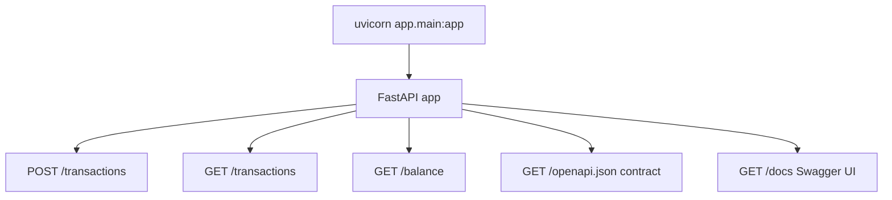

# Externally Exposed Route Discovery — B4 Transaction Ledger

Repository: `$REPO_ROOT/tasks/Basics/B4`

**Framework:** FastAPI (Python REST API) — no SPA frontend routes detected  
**Indexed:** `app/main.py`, auto-generated OpenAPI at `/openapi.json`, runtime curl verification in `proof/routes-b4-verified.txt`

## Summary Counts

### By category
| category | count |
|---|---:|
| api | 3 |
| contract | 3 |

### By http_method (api rows)
| http_method | count |
|---|---:|
| GET | 2 |
| POST | 1 |

### By exposure
| exposure | count |
|---|---:|
| public | 3 |

### By confidence
| confidence | count |
|---|---:|
| high | 3 |

## Framework Detection Summary

| signal | value |
|---|---|
| languages | Python |
| HTTP framework | FastAPI + Uvicorn |
| entry point | `uvicorn app.main:app` |
| router discovery | `@app.get` / `@app.post` decorators in `app/main.py` |
| global middleware | None detected |
| auth models | None — all routes public |
| frontend routes | none (pure JSON API) |
| contract artifact | OpenAPI 3.x at `/openapi.json` (auto-generated by FastAPI) |

## Route Summary Table

| Method | Endpoint | Source |
|---|---|---|
| POST | /transactions | tasks/Basics/B4/app/main.py:14 |
| GET | /transactions | tasks/Basics/B4/app/main.py:29 |
| GET | /balance | tasks/Basics/B4/app/main.py:34 |

## Mount Prefix Diagram

## Complete Route Inventory

| category | http_method | path_pattern | full_path | route_name | handler_symbol | file_path | line_hint | framework_hint | exposure | middleware | evidence | confidence |
|---|---|---|---|---|---|---|---|---|---|---|---|---|
| api | POST | /transactions | /transactions | create_transaction | create_transaction | tasks/Basics/B4/app/main.py | 14 | FastAPI | public | - | `@app.post("/transactions")` registration | high |
| api | GET | /transactions | /transactions | list_transactions | list_transactions | tasks/Basics/B4/app/main.py | 29 | FastAPI | public | - | `@app.get("/transactions")` registration | high |
| api | GET | /balance | /balance | get_balance | get_balance | tasks/Basics/B4/app/main.py | 34 | FastAPI | public | - | `@app.get("/balance")` registration | high |

## Contract-Only Routes

OpenAPI at `/openapi.json` lists the same three paths with matching HTTP methods — no orphan spec entries.

| http_method | path | operationId | verified |
|---|---|---|---|
| POST | /transactions | create_transaction_transactions_post | curl 201 in `proof/routes-b4-verified.txt` |
| GET | /transactions | list_transactions_transactions_get | curl 200 in `proof/routes-b4-verified.txt` |
| GET | /balance | get_balance_balance_get | curl 200 in `proof/routes-b4-verified.txt` |

## Frontend Routes

**None found.** Searched `app/` for SPA route tables, static HTML entry points, and file-based page routing. B4 is a JSON-only REST API.

## Manual Follow-Up

| path | reason | suggested action |
|---|---|---|
| /docs, /redoc | FastAPI auto-generated Swagger/ReDoc UIs | optional to inventory as dev-only frontend if needed |
| /openapi.json | auto-generated contract surface | already correlated with code registrations |
| In-memory store | state resets on process restart | expected for B4 warm-up scope; no routing impact |
