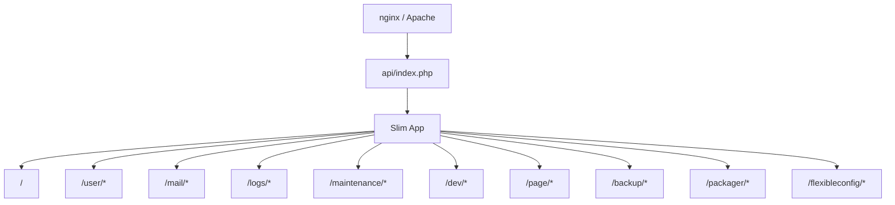

# Externally Exposed Route Discovery — reSlim

Repository: `/Users/mayanksrivastava/Desktop/kyc-mini/reSlim`

**Framework:** Slim 3 (PHP REST API) — no SPA frontend routes detected
**Indexed:** 10 router files, Postman collections, nginx/htaccess configs

## Summary Counts

### By category
| category | count |
|---|---:|
| api | 140 |
| proxy | 1 |

### By http_method (api rows)
| http_method | count |
|---|---:|
| - | 1 |
| GET | 82 |
| OPTIONS | 13 |
| POST | 44 |

### By exposure
| exposure | count |
|---|---:|
| admin | 3 |
| authenticated | 77 |
| dev-only | 16 |
| public | 18 |
| unknown | 27 |

### By confidence
| confidence | count |
|---|---:|
| high | 141 |

## Framework Detection Summary

| signal | value |
|---|---|
| languages | PHP, SQL (schema), JSON (Postman) |
| HTTP framework | Slim 3 (`slim/slim ^3.0`) |
| entry point | `src/api/index.php` → `app/app.php` |
| router discovery | `Scanner::fileSearch()` auto-loads `*router.php` |
| global middleware | `Slim\HttpCache\Cache` (ETag, public cache) |
| auth models | token in URL/body; API key via `ApiKey` middleware |
| frontend routes | none (pure JSON API) |
| deployment proxy | nginx → `api/index.php`; Apache `.htaccess` rewrite |

## Mount Prefix Diagram

## Complete Route Inventory

| category | http_method | path_pattern | full_path | route_name | handler_symbol | file_path | line_hint | framework_hint | exposure | middleware | evidence | confidence |
|---|---|---|---|---|---|---|---|---|---|---|---|---|
| api | GET | /backup/get/info/ | /backup/get/info/ | - | closure | src/modules/backup/backup.router.php | 15 | Slim 3 | authenticated | ApiKey | $app->map registration | high |
| api | OPTIONS | /backup/get/info/ | /backup/get/info/ | - | closure | src/modules/backup/backup.router.php | 15 | Slim 3 | authenticated | ApiKey | $app->map registration | high |
| api | GET | /backup/all/{username}/{token} | /backup/all/{username}/{token} | - | closure | src/modules/backup/backup.router.php | 24 | Slim 3 | authenticated | - | $app->get registration | high |
| api | GET | /backup/table/{tablename}/{username}/{token} | /backup/table/{tablename}/{username}/{token} | - | closure | src/modules/backup/backup.router.php | 35 | Slim 3 | authenticated | - | $app->get registration | high |
| api | GET | /backup/show/all/{username}/{token} | /backup/show/all/{username}/{token} | - | closure | src/modules/backup/backup.router.php | 46 | Slim 3 | authenticated | - | $app->get registration | high |
| api | POST | /backup/delete | /backup/delete | - | closure | src/modules/backup/backup.router.php | 57 | Slim 3 | unknown | ValidateParam,ValidateParam | $app->post registration | high |
| api | POST | /backup/delete/all | /backup/delete/all | - | closure | src/modules/backup/backup.router.php | 70 | Slim 3 | unknown | ValidateParam,ValidateParam,ValidateParam | $app->post registration | high |
| api | GET | /flexibleconfig/get/info/ | /flexibleconfig/get/info/ | - | closure | src/modules/flexibleconfig/flexibleconfig.router.php | 17 | Slim 3 | authenticated | ApiKey | $app->map registration | high |
| api | OPTIONS | /flexibleconfig/get/info/ | /flexibleconfig/get/info/ | - | closure | src/modules/flexibleconfig/flexibleconfig.router.php | 17 | Slim 3 | authenticated | ApiKey | $app->map registration | high |
| api | POST | /flexibleconfig/add | /flexibleconfig/add | - | closure | src/modules/flexibleconfig/flexibleconfig.router.php | 30 | Slim 3 | unknown | ValidateParam,ValidateParam,ValidateParam,ValidateParam | $app->post registration | high |
| api | POST | /flexibleconfig/update | /flexibleconfig/update | - | closure | src/modules/flexibleconfig/flexibleconfig.router.php | 49 | Slim 3 | unknown | ValidateParam,ValidateParam,ValidateParam,ValidateParam | $app->post registration | high |
| api | POST | /flexibleconfig/delete | /flexibleconfig/delete | - | closure | src/modules/flexibleconfig/flexibleconfig.router.php | 68 | Slim 3 | unknown | ValidateParam,ValidateParam | $app->post registration | high |
| api | GET | /flexibleconfig/index/{username}/{token}/{page}/{itemsperpage}/ | /flexibleconfig/index/{username}/{token}/{page}/{itemsperpage}/ | - | closure | src/modules/flexibleconfig/flexibleconfig.router.php | 83 | Slim 3 | authenticated | ValidateParamURL | $app->get registration | high |
| api | GET | /flexibleconfig/read/{key}/{username}/{token} | /flexibleconfig/read/{key}/{username}/{token} | - | closure | src/modules/flexibleconfig/flexibleconfig.router.php | 98 | Slim 3 | authenticated | - | $app->get registration | high |
| api | GET | /flexibleconfig/read/{key}/ | /flexibleconfig/read/{key}/ | - | closure | src/modules/flexibleconfig/flexibleconfig.router.php | 111 | Slim 3 | authenticated | ValidateParamURL,ApiKey | $app->get registration | high |
| api | GET | /flexibleconfig/test/{key} | /flexibleconfig/test/{key} | - | closure | src/modules/flexibleconfig/flexibleconfig.router.php | 128 | Slim 3 | unknown | - | $app->get registration | high |
| api | GET | /packager/get/info/ | /packager/get/info/ | - | closure | src/modules/packager/packager.router.php | 15 | Slim 3 | authenticated | ApiKey | $app->map registration | high |
| api | OPTIONS | /packager/get/info/ | /packager/get/info/ | - | closure | src/modules/packager/packager.router.php | 15 | Slim 3 | authenticated | ApiKey | $app->map registration | high |
| api | GET | /packager/show/all/{username}/{token} | /packager/show/all/{username}/{token} | - | closure | src/modules/packager/packager.router.php | 25 | Slim 3 | authenticated | - | $app->get registration | high |
| api | GET | /packager/install/zip/{username}/{token}/ | /packager/install/zip/{username}/{token}/ | - | closure | src/modules/packager/packager.router.php | 37 | Slim 3 | authenticated | ValidateParamURL | $app->get registration | high |
| api | GET | /packager/install/zip/safely/{username}/{token}/ | /packager/install/zip/safely/{username}/{token}/ | - | closure | src/modules/packager/packager.router.php | 48 | Slim 3 | authenticated | ValidateParamURL,ValidateParamURL | $app->get registration | high |
| api | GET | /packager/uninstall/{username}/{token}/ | /packager/uninstall/{username}/{token}/ | - | closure | src/modules/packager/packager.router.php | 60 | Slim 3 | authenticated | ValidateParamURL | $app->get registration | high |
| api | GET | /page/get/info/ | /page/get/info/ | - | closure | src/modules/pages/pages.router.php | 12 | Slim 3 | authenticated | ApiKey | $app->map registration | high |
| api | OPTIONS | /page/get/info/ | /page/get/info/ | - | closure | src/modules/pages/pages.router.php | 12 | Slim 3 | authenticated | ApiKey | $app->map registration | high |
| api | POST | /page/data/new | /page/data/new | - | closure | src/modules/pages/pages.router.php | 21 | Slim 3 | unknown | ValidateParam,ValidateParam,ValidateParam,ValidateParam,ValidateParam | $app->post registration | high |
| api | POST | /page/data/update | /page/data/update | - | closure | src/modules/pages/pages.router.php | 42 | Slim 3 | unknown | ValidateParam,ValidateParam,ValidateParam,ValidateParam,ValidateParam,ValidateParam | $app->post registration | high |
| api | POST | /page/data/update/draft | /page/data/update/draft | - | closure | src/modules/pages/pages.router.php | 66 | Slim 3 | unknown | ValidateParam,ValidateParam,ValidateParam,ValidateParam,ValidateParam,ValidateParam | $app->post registration | high |
| api | POST | /page/data/delete | /page/data/delete | - | closure | src/modules/pages/pages.router.php | 89 | Slim 3 | unknown | ValidateParam,ValidateParam,ValidateParam | $app->post registration | high |
| api | GET | /page/data/search/{username}/{token}/{page}/{itemsperpage}/ | /page/data/search/{username}/{token}/{page}/{itemsperpage}/ | - | closure | src/modules/pages/pages.router.php | 104 | Slim 3 | authenticated | ValidateParamURL | $app->get registration | high |
| api | GET | /page/data/status/{token} | /page/data/status/{token} | - | closure | src/modules/pages/pages.router.php | 118 | Slim 3 | authenticated | - | $app->get registration | high |
| api | GET | /page/data/read/{pageid}/{username}/{token} | /page/data/read/{pageid}/{username}/{token} | - | closure | src/modules/pages/pages.router.php | 128 | Slim 3 | authenticated | - | $app->get registration | high |
| api | GET | /page/data/public/read/{pageid}/ | /page/data/public/read/{pageid}/ | - | closure | src/modules/pages/pages.router.php | 140 | Slim 3 | authenticated | ValidateParamURL,ApiKey | $app->map registration | high |
| api | OPTIONS | /page/data/public/read/{pageid}/ | /page/data/public/read/{pageid}/ | - | closure | src/modules/pages/pages.router.php | 140 | Slim 3 | authenticated | ValidateParamURL,ApiKey | $app->map registration | high |
| api | GET | /page/data/public/search/{page}/{itemsperpage}/ | /page/data/public/search/{page}/{itemsperpage}/ | - | closure | src/modules/pages/pages.router.php | 157 | Slim 3 | authenticated | ValidateParamURL,ValidateParamURL,ApiKey | $app->map registration | high |
| api | OPTIONS | /page/data/public/search/{page}/{itemsperpage}/ | /page/data/public/search/{page}/{itemsperpage}/ | - | closure | src/modules/pages/pages.router.php | 157 | Slim 3 | authenticated | ValidateParamURL,ValidateParamURL,ApiKey | $app->map registration | high |
| api | GET | /page/data/public/published/{page}/{itemsperpage}/ | /page/data/public/published/{page}/{itemsperpage}/ | - | closure | src/modules/pages/pages.router.php | 177 | Slim 3 | authenticated | ValidateParamURL,ApiKey | $app->map registration | high |
| api | OPTIONS | /page/data/public/published/{page}/{itemsperpage}/ | /page/data/public/published/{page}/{itemsperpage}/ | - | closure | src/modules/pages/pages.router.php | 177 | Slim 3 | authenticated | ValidateParamURL,ApiKey | $app->map registration | high |
| api | GET | /page/data/public/published/{page}/{itemsperpage}/{sort}/ | /page/data/public/published/{page}/{itemsperpage}/{sort}/ | - | closure | src/modules/pages/pages.router.php | 194 | Slim 3 | authenticated | ValidateParamURL,ApiKey | $app->map registration | high |
| api | OPTIONS | /page/data/public/published/{page}/{itemsperpage}/{sort}/ | /page/data/public/published/{page}/{itemsperpage}/{sort}/ | - | closure | src/modules/pages/pages.router.php | 194 | Slim 3 | authenticated | ValidateParamURL,ApiKey | $app->map registration | high |
| api | GET | /page/data/view/{pageid}/ | /page/data/view/{pageid}/ | - | closure | src/modules/pages/pages.router.php | 212 | Slim 3 | authenticated | ApiKey | $app->map registration | high |
| api | OPTIONS | /page/data/view/{pageid}/ | /page/data/view/{pageid}/ | - | closure | src/modules/pages/pages.router.php | 212 | Slim 3 | authenticated | ApiKey | $app->map registration | high |
| api | GET | /page/stats/data/summary/{username}/{token} | /page/stats/data/summary/{username}/{token} | - | closure | src/modules/pages/pages.router.php | 222 | Slim 3 | authenticated | - | $app->get registration | high |
| api | GET | /page/stats/data/chart/{year}/{username}/{token} | /page/stats/data/chart/{year}/{username}/{token} | - | closure | src/modules/pages/pages.router.php | 233 | Slim 3 | authenticated | - | $app->get registration | high |
| api | GET | /page/data/written/{username}/{token}/{user}/{page}/{itemsperpage}/{sort}/ | /page/data/written/{username}/{token}/{user}/{page}/{itemsperpage}/{sort}/ | - | closure | src/modules/pages/pages.router.php | 245 | Slim 3 | authenticated | ValidateParamURL | $app->get registration | high |
| api | GET | /page/data/written/public/{user}/{page}/{itemsperpage}/{sort}/ | /page/data/written/public/{user}/{page}/{itemsperpage}/{sort}/ | - | closure | src/modules/pages/pages.router.php | 261 | Slim 3 | authenticated | ValidateParamURL,ValidateParamURL,ApiKey | $app->map registration | high |
| api | OPTIONS | /page/data/written/public/{user}/{page}/{itemsperpage}/{sort}/ | /page/data/written/public/{user}/{page}/{itemsperpage}/{sort}/ | - | closure | src/modules/pages/pages.router.php | 261 | Slim 3 | authenticated | ValidateParamURL,ValidateParamURL,ApiKey | $app->map registration | high |
| api | GET | /page/taxonomy/page/all/{limit}/{username}/{token} | /page/taxonomy/page/all/{limit}/{username}/{token} | - | closure | src/modules/pages/pages.router.php | 283 | Slim 3 | authenticated | - | $app->get registration | high |
| api | GET | /page/taxonomy/page/seasonal/{limit}/{username}/{token} | /page/taxonomy/page/seasonal/{limit}/{username}/{token} | - | closure | src/modules/pages/pages.router.php | 295 | Slim 3 | authenticated | - | $app->get registration | high |
| api | GET | /page/taxonomy/page/all/{limit}/ | /page/taxonomy/page/all/{limit}/ | - | closure | src/modules/pages/pages.router.php | 307 | Slim 3 | authenticated | ValidateParamURL,ApiKey | $app->get registration | high |
| api | GET | /page/taxonomy/page/seasonal/{limit}/ | /page/taxonomy/page/seasonal/{limit}/ | - | closure | src/modules/pages/pages.router.php | 326 | Slim 3 | authenticated | ValidateParamURL,ApiKey | $app->get registration | high |
| api | GET | /page/taxonomy/tags/all/{limit}/{username}/{token} | /page/taxonomy/tags/all/{limit}/{username}/{token} | - | closure | src/modules/pages/pages.router.php | 345 | Slim 3 | authenticated | - | $app->get registration | high |
| api | GET | /page/taxonomy/tags/seasonal/{limit}/{username}/{token} | /page/taxonomy/tags/seasonal/{limit}/{username}/{token} | - | closure | src/modules/pages/pages.router.php | 357 | Slim 3 | authenticated | - | $app->get registration | high |
| api | GET | /page/taxonomy/tags/all/{limit}/ | /page/taxonomy/tags/all/{limit}/ | - | closure | src/modules/pages/pages.router.php | 369 | Slim 3 | authenticated | ValidateParamURL,ApiKey | $app->get registration | high |
| api | GET | /page/taxonomy/tags/seasonal/{limit}/ | /page/taxonomy/tags/seasonal/{limit}/ | - | closure | src/modules/pages/pages.router.php | 388 | Slim 3 | authenticated | ValidateParamURL,ApiKey | $app->get registration | high |
| api | GET | / | / | - | closure | src/routers/index.router.php | 8 | Slim 3 | public | - | $app->get registration | high |
| api | POST | /logs/data/append | /logs/data/append | - | closure | src/routers/logs.router.php | 8 | Slim 3 | public | ValidateParam,ValidateParam,ValidateParam,ValidateParam | $app->map registration | high |
| api | GET | /logs/data/append | /logs/data/append | - | closure | src/routers/logs.router.php | 8 | Slim 3 | public | ValidateParam,ValidateParam,ValidateParam,ValidateParam | $app->map registration | high |
| api | POST | /logs/data/update | /logs/data/update | - | closure | src/routers/logs.router.php | 21 | Slim 3 | unknown | ValidateParam,ValidateParam,ValidateParam | $app->post registration | high |
| api | GET | /logs/data/clear/{username}/{token} | /logs/data/clear/{username}/{token} | - | closure | src/routers/logs.router.php | 36 | Slim 3 | authenticated | - | $app->get registration | high |
| api | POST | /mail/send | /mail/send | - | closure | src/routers/mail.router.php | 7 | Slim 3 | public | ValidateParam,ValidateParam,ValidateParam | $app->post registration | high |
| api | POST | /mail/send/default | /mail/send/default | - | closure | src/routers/mail.router.php | 31 | Slim 3 | public | ValidateParam,ValidateParam | $app->post registration | high |
| api | GET | /maintenance/cache/data/delete/{username}/{token} | /maintenance/cache/data/delete/{username}/{token} | - | closure | src/routers/maintenance.router.php | 11 | Slim 3 | admin | - | $app->get registration | high |
| api | GET | /maintenance/cache/apikey/delete/{username}/{token} | /maintenance/cache/apikey/delete/{username}/{token} | - | closure | src/routers/maintenance.router.php | 38 | Slim 3 | admin | - | $app->get registration | high |
| api | GET | /maintenance/cache/universal/delete/{username}/{token} | /maintenance/cache/universal/delete/{username}/{token} | - | closure | src/routers/maintenance.router.php | 65 | Slim 3 | admin | - | $app->get registration | high |
| api | GET | /maintenance/cache/data/info | /maintenance/cache/data/info | - | closure | src/routers/maintenance.router.php | 92 | Slim 3 | public | - | $app->get registration | high |
| api | GET | /maintenance/cache/apikey/info | /maintenance/cache/apikey/info | - | closure | src/routers/maintenance.router.php | 99 | Slim 3 | public | - | $app->get registration | high |
| api | GET | /maintenance/cache/universal/info | /maintenance/cache/universal/info | - | closure | src/routers/maintenance.router.php | 106 | Slim 3 | public | - | $app->get registration | high |
| api | POST | /maintenance/cache/data/listen | /maintenance/cache/data/listen | - | closure | src/routers/maintenance.router.php | 118 | Slim 3 | authenticated | - | $app->post registration | high |
| api | POST | /maintenance/cache/data/listen/delete | /maintenance/cache/data/listen/delete | - | closure | src/routers/maintenance.router.php | 129 | Slim 3 | authenticated | - | $app->post registration | high |
| api | POST | /maintenance/cache/apikey/listen | /maintenance/cache/apikey/listen | - | closure | src/routers/maintenance.router.php | 140 | Slim 3 | authenticated | - | $app->post registration | high |
| api | POST | /maintenance/cache/apikey/listen/delete | /maintenance/cache/apikey/listen/delete | - | closure | src/routers/maintenance.router.php | 151 | Slim 3 | authenticated | - | $app->post registration | high |
| api | POST | /maintenance/cache/apikey/listen/delete/key | /maintenance/cache/apikey/listen/delete/key | - | closure | src/routers/maintenance.router.php | 162 | Slim 3 | authenticated | - | $app->post registration | high |
| api | POST | /maintenance/cache/universal/listen | /maintenance/cache/universal/listen | - | closure | src/routers/maintenance.router.php | 173 | Slim 3 | authenticated | - | $app->post registration | high |
| api | POST | /maintenance/cache/universal/listen/delete | /maintenance/cache/universal/listen/delete | - | closure | src/routers/maintenance.router.php | 184 | Slim 3 | authenticated | - | $app->post registration | high |
| api | POST | /maintenance/cache/universal/listen/delete/key | /maintenance/cache/universal/listen/delete/key | - | closure | src/routers/maintenance.router.php | 195 | Slim 3 | authenticated | - | $app->post registration | high |
| api | GET | /maintenance/cache/data/transfer/test | /maintenance/cache/data/transfer/test | - | closure | src/routers/maintenance.router.php | 206 | Slim 3 | public | - | $app->get registration | high |
| api | GET | /maintenance/cache/apikey/transfer/test | /maintenance/cache/apikey/transfer/test | - | closure | src/routers/maintenance.router.php | 215 | Slim 3 | public | - | $app->get registration | high |
| api | GET | /maintenance/cache/universal/transfer/test | /maintenance/cache/universal/transfer/test | - | closure | src/routers/maintenance.router.php | 224 | Slim 3 | public | - | $app->get registration | high |
| api | GET | /dev/response/test/debug/json/valid | /dev/response/test/debug/json/valid | - | closure | src/routers/test.router.php | 32 | Slim 3 | dev-only | - | $app->get registration | high |
| api | GET | /dev/response/test/debug/json/invalid | /dev/response/test/debug/json/invalid | - | closure | src/routers/test.router.php | 40 | Slim 3 | dev-only | - | $app->get registration | high |
| api | GET | /dev/response/test | /dev/response/test | - | closure | src/routers/test.router.php | 53 | Slim 3 | dev-only | - | $app->get registration | high |
| api | GET | /dev/response/test/message/{lang} | /dev/response/test/message/{lang} | - | closure | src/routers/test.router.php | 68 | Slim 3 | dev-only | - | $app->get registration | high |
| api | GET | /dev/response/test/cache/http | /dev/response/test/cache/http | - | closure | src/routers/test.router.php | 100 | Slim 3 | dev-only | - | $app->get registration | high |
| api | GET | /dev/response/test/cache/server | /dev/response/test/cache/server | - | closure | src/routers/test.router.php | 117 | Slim 3 | dev-only | - | $app->get registration | high |
| api | GET | /dev/response/test/cache/server/withparam | /dev/response/test/cache/server/withparam | - | closure | src/routers/test.router.php | 140 | Slim 3 | dev-only | - | $app->get registration | high |
| api | GET | /dev/response/test/api/url/ | /dev/response/test/api/url/ | - | closure | src/routers/test.router.php | 164 | Slim 3 | dev-only | APIKey | $app->get registration | high |
| api | GET | /dev/response/test/api/header | /dev/response/test/api/header | - | closure | src/routers/test.router.php | 173 | Slim 3 | dev-only | APIKey | $app->map registration | high |
| api | POST | /dev/response/test/api/header | /dev/response/test/api/header | - | closure | src/routers/test.router.php | 173 | Slim 3 | dev-only | APIKey | $app->map registration | high |
| api | OPTIONS | /dev/response/test/api/header | /dev/response/test/api/header | - | closure | src/routers/test.router.php | 173 | Slim 3 | dev-only | APIKey | $app->map registration | high |
| api | POST | /dev/middleware/test/param/body | /dev/middleware/test/param/body | - | closure | src/routers/test.router.php | 186 | Slim 3 | dev-only | ValidateParam,ValidateParam,ValidateParam,ValidateParam,ValidateParam,ValidateParam | $app->post registration | high |
| api | POST | /dev/middleware/test/param/json | /dev/middleware/test/param/json | - | closure | src/routers/test.router.php | 198 | Slim 3 | dev-only | ValidateParamJSON,ValidateParamJSON,ValidateParamJSON,ValidateParamJSON,ValidateParamJSON,ValidateParamJSON | $app->post registration | high |
| api | GET | /dev/middleware/test/param/url/ | /dev/middleware/test/param/url/ | - | closure | src/routers/test.router.php | 210 | Slim 3 | dev-only | ValidateParamURL,ValidateParamURL,ValidateParamURL,ValidateParamURL,ValidateParamURL,ValidateParamURL | $app->get registration | high |
| api | POST | /dev/test/log/create | /dev/test/log/create | - | closure | src/routers/test.router.php | 227 | Slim 3 | dev-only | - | $app->map registration | high |
| api | GET | /dev/test/log/create | /dev/test/log/create | - | closure | src/routers/test.router.php | 227 | Slim 3 | dev-only | - | $app->map registration | high |
| api | GET | /user/role/{token} | /user/role/{token} | - | closure | src/routers/user.router.php | 10 | Slim 3 | authenticated | - | $app->get registration | high |
| api | GET | /user/status/{token} | /user/status/{token} | - | closure | src/routers/user.router.php | 20 | Slim 3 | authenticated | - | $app->get registration | high |
| api | GET | /user/data/{page}/{itemsperpage}/{token} | /user/data/{page}/{itemsperpage}/{token} | - | closure | src/routers/user.router.php | 30 | Slim 3 | authenticated | - | $app->get registration | high |
| api | GET | /user/data/search/{page}/{itemsperpage}/{token}/ | /user/data/search/{page}/{itemsperpage}/{token}/ | - | closure | src/routers/user.router.php | 42 | Slim 3 | authenticated | - | $app->get registration | high |
| api | GET | /user/profile/{username}/ | /user/profile/{username}/ | - | closure | src/routers/user.router.php | 55 | Slim 3 | authenticated | ValidateParamURL,ApiKey | $app->map registration | high |
| api | OPTIONS | /user/profile/{username}/ | /user/profile/{username}/ | - | closure | src/routers/user.router.php | 55 | Slim 3 | authenticated | ValidateParamURL,ApiKey | $app->map registration | high |
| api | GET | /user/profile/{username}/{token} | /user/profile/{username}/{token} | - | closure | src/routers/user.router.php | 71 | Slim 3 | authenticated | - | $app->get registration | high |
| api | GET | /user/verify/register/{username} | /user/verify/register/{username} | - | closure | src/routers/user.router.php | 82 | Slim 3 | public | - | $app->get registration | high |
| api | GET | /user/verify/email/{email} | /user/verify/email/{email} | - | closure | src/routers/user.router.php | 96 | Slim 3 | public | - | $app->get registration | high |
| api | GET | /user/verify/{token} | /user/verify/{token} | - | closure | src/routers/user.router.php | 110 | Slim 3 | authenticated | - | $app->get registration | high |
| api | GET | /user/scope/{token} | /user/scope/{token} | - | closure | src/routers/user.router.php | 120 | Slim 3 | authenticated | - | $app->get registration | high |
| api | GET | /user/{token} | /user/{token} | - | closure | src/routers/user.router.php | 130 | Slim 3 | authenticated | - | $app->get registration | high |
| api | POST | /user | /user | - | closure | src/routers/user.router.php | 140 | Slim 3 | unknown | ValidateParam | $app->post registration | high |
| api | POST | /user/register | /user/register | - | closure | src/routers/user.router.php | 151 | Slim 3 | unknown | ValidateParam,ValidateParam,ValidateParam,ValidateParam,ValidateParam,ValidateParam,ValidateParam,ValidateParam | $app->post registration | high |
| api | POST | /user/register/public | /user/register/public | - | closure | src/routers/user.router.php | 178 | Slim 3 | public | ValidateParam,ValidateParam,ValidateParam,ValidateParam,ValidateParam,ValidateParam,ValidateParam,ValidateParam | $app->post registration | high |
| api | POST | /user/login | /user/login | - | closure | src/routers/user.router.php | 204 | Slim 3 | public | ValidateParam,ValidateParam | $app->post registration | high |
| api | POST | /user/logout | /user/logout | - | closure | src/routers/user.router.php | 217 | Slim 3 | unknown | ValidateParam,ValidateParam | $app->post registration | high |
| api | POST | /user/update | /user/update | - | closure | src/routers/user.router.php | 230 | Slim 3 | unknown | ValidateParam,ValidateParam,ValidateParam,ValidateParam,ValidateParam,ValidateParam,ValidateParam,ValidateParam | $app->post registration | high |
| api | POST | /user/delete | /user/delete | - | closure | src/routers/user.router.php | 257 | Slim 3 | unknown | ValidateParam,ValidateParam | $app->post registration | high |
| api | POST | /user/changepassword | /user/changepassword | - | closure | src/routers/user.router.php | 270 | Slim 3 | unknown | ValidateParam,ValidateParam | $app->post registration | high |
| api | POST | /user/resetpassword | /user/resetpassword | - | closure | src/routers/user.router.php | 285 | Slim 3 | unknown | ValidateParam,ValidateParam | $app->post registration | high |
| api | POST | /user/upload | /user/upload | - | closure | src/routers/user.router.php | 299 | Slim 3 | unknown | ValidateParam,ValidateParam,ValidateParam | $app->post registration | high |
| api | POST | /user/upload/update | /user/upload/update | - | closure | src/routers/user.router.php | 322 | Slim 3 | unknown | ValidateParam,ValidateParam,ValidateParam,ValidateParam | $app->post registration | high |
| api | POST | /user/upload/delete | /user/upload/delete | - | closure | src/routers/user.router.php | 342 | Slim 3 | unknown | ValidateParam,ValidateParam,ValidateParam | $app->post registration | high |
| api | GET | /user/upload/status/{token} | /user/upload/status/{token} | - | closure | src/routers/user.router.php | 357 | Slim 3 | authenticated | - | $app->get registration | high |
| api | GET | /user/{username}/upload/data/{page}/{itemsperpage}/{token} | /user/{username}/upload/data/{page}/{itemsperpage}/{token} | - | closure | src/routers/user.router.php | 367 | Slim 3 | authenticated | - | $app->get registration | high |
| api | GET | /user/{username}/upload/data/search/{page}/{itemsperpage}/{token}/ | /user/{username}/upload/data/search/{page}/{itemsperpage}/{token}/ | - | closure | src/routers/user.router.php | 380 | Slim 3 | authenticated | ValidateParamURL | $app->get registration | high |
| api | GET | /user/{username}/upload/data/item/{itemid}/ | /user/{username}/upload/data/item/{itemid}/ | - | closure | src/routers/user.router.php | 395 | Slim 3 | authenticated | ApiKey | $app->map registration | high |
| api | OPTIONS | /user/{username}/upload/data/item/{itemid}/ | /user/{username}/upload/data/item/{itemid}/ | - | closure | src/routers/user.router.php | 395 | Slim 3 | authenticated | ApiKey | $app->map registration | high |
| api | GET | /user/upload/stream/{token}/{filename} | /user/upload/stream/{token}/{filename} | - | closure | src/routers/user.router.php | 406 | Slim 3 | authenticated | - | $app->get registration | high |
| api | POST | /user/forgotpassword | /user/forgotpassword | - | closure | src/routers/user.router.php | 417 | Slim 3 | public | ValidateParam | $app->post registration | high |
| api | POST | /user/verifypasskey | /user/verifypasskey | - | closure | src/routers/user.router.php | 428 | Slim 3 | public | ValidateParam | $app->post registration | high |
| api | POST | /user/keys/create | /user/keys/create | - | closure | src/routers/user.router.php | 440 | Slim 3 | unknown | ValidateParam,ValidateParam | $app->post registration | high |
| api | POST | /user/keys/update | /user/keys/update | - | closure | src/routers/user.router.php | 454 | Slim 3 | unknown | ValidateParam,ValidateParam,ValidateParam | $app->post registration | high |
| api | POST | /user/keys/delete | /user/keys/delete | - | closure | src/routers/user.router.php | 470 | Slim 3 | unknown | ValidateParam,ValidateParam | $app->post registration | high |
| api | GET | /user/{username}/keys/data/search/{page}/{itemsperpage}/{token}/ | /user/{username}/keys/data/search/{page}/{itemsperpage}/{token}/ | - | closure | src/routers/user.router.php | 484 | Slim 3 | authenticated | ValidateParamURL | $app->get registration | high |
| api | GET | /user/token/data/{username}/{token} | /user/token/data/{username}/{token} | - | closure | src/routers/user.router.php | 498 | Slim 3 | authenticated | - | $app->get registration | high |
| api | POST | /user/token/delete | /user/token/delete | - | closure | src/routers/user.router.php | 509 | Slim 3 | unknown | ValidateParam,ValidateParam | $app->post registration | high |
| api | POST | /user/token/delete/all | /user/token/delete/all | - | closure | src/routers/user.router.php | 523 | Slim 3 | unknown | ValidateParam,ValidateParam | $app->post registration | high |
| api | GET | /user/stats/data/summary/{username}/{token} | /user/stats/data/summary/{username}/{token} | - | closure | src/routers/user.router.php | 536 | Slim 3 | authenticated | - | $app->get registration | high |
| api | GET | /user/stats/api/summary/{username}/{token} | /user/stats/api/summary/{username}/{token} | - | closure | src/routers/user.router.php | 547 | Slim 3 | authenticated | - | $app->get registration | high |
| api | GET | /user/stats/upload/summary/{username}/{token} | /user/stats/upload/summary/{username}/{token} | - | closure | src/routers/user.router.php | 558 | Slim 3 | authenticated | - | $app->get registration | high |
| api | GET | /user/stats/data/chart/{year}/{username}/{token} | /user/stats/data/chart/{year}/{username}/{token} | - | closure | src/routers/user.router.php | 569 | Slim 3 | authenticated | - | $app->get registration | high |
| api | GET | /user/stats/api/chart/{year}/{username}/{token} | /user/stats/api/chart/{year}/{username}/{token} | - | closure | src/routers/user.router.php | 581 | Slim 3 | authenticated | - | $app->get registration | high |
| api | GET | /user/stats/upload/chart/{year}/{username}/{token} | /user/stats/upload/chart/{year}/{username}/{token} | - | closure | src/routers/user.router.php | 593 | Slim 3 | authenticated | - | $app->get registration | high |
| proxy | * | / | /* -> api/index.php | nginx_front_door | - | src/example-nginx.conf | 17-18 | nginx | public | - | try_files $uri /api/index.php$is_args$args | high |
| api | - | /src/index.php | /src/index.php | forbidden_json | - | src/index.php | 1 | - | unknown | - | 403 Forbidden static JSON | high |

## Manual Follow-Up

| path | reason | suggested action |
|---|---|---|
| /user/* with {token} | token validation in domain classes, not middleware | trace Auth::validToken per handler |
| /maintenance/cache/*/listen* | auth via secretkey POST body | confirm secret rotation + network ACLs |
| /maintenance/cache/*/info | no auth; exposes cache metadata | verify intentional for prod |
| /mail/send* | open SMTP relay if public | restrict by IP/API key |
| /packager/install/* | remote zip install via GET | confirm admin role checks in Packager |
| Postman (55 URLs) | contract artifact at localhost base | diff vs code for orphans |
| Dynamic modules | Packager installs new routers at runtime | re-scan after module install |
| OPTIONS rows | CORS preflight companions | may omit from external inventory |
