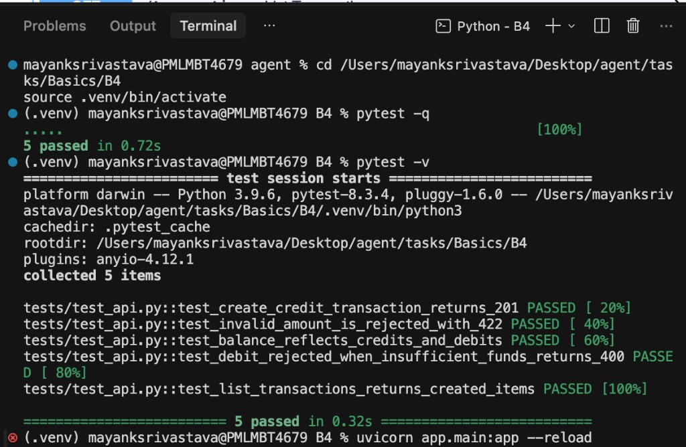
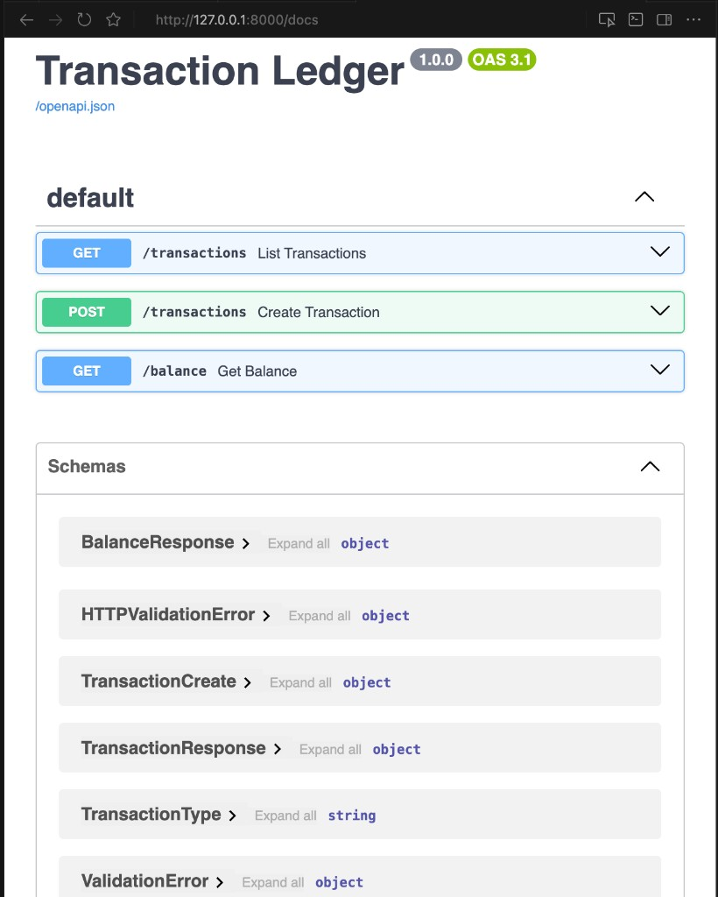

# Transaction Ledger API

Small FastAPI service that tracks credits and debits in memory.

## Endpoints

| Method | Path | Description |
|--------|------|-------------|
| `POST` | `/transactions` | Create a credit or debit transaction |
| `GET` | `/transactions` | List all transactions |
| `GET` | `/balance` | Return the current balance |

### Example request

```bash
curl -X POST http://127.0.0.1:8000/transactions \
  -H "Content-Type: application/json" \
  -d '{"amount": "100.00", "type": "credit", "description": "Opening deposit"}'
```

## Install

```bash
cd tasks/Basics/B4
python3 -m venv .venv
source .venv/bin/activate
pip install -r requirements.txt
```

## Run

From this folder with the virtualenv activated:

```bash
uvicorn app.main:app --reload
```

Open the interactive docs at [http://127.0.0.1:8000/docs](http://127.0.0.1:8000/docs).

## Test

```bash
pytest -q
```

## Validation rules

- `amount` must be greater than zero (max 12 digits, 2 decimal places)
- `type` must be `credit` or `debit`
- `description` is required (1–200 characters)
- debits that would make the balance negative return `400 Bad Request`

## Output

### Tests (`pytest -q` / `pytest -v`)

<p align="center">
  
</p>

### Server (`uvicorn app.main:app --reload`)

Interactive API docs at [http://127.0.0.1:8000/docs](http://127.0.0.1:8000/docs):

<p align="center">
  
</p>
