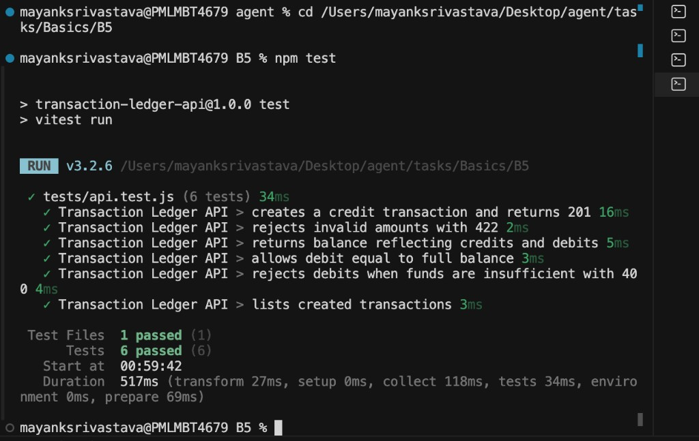

# Transaction Ledger API (Node.js)

Small **Express** service that tracks credits and debits in memory — the Node.js counterpart to the B4 FastAPI ledger.

## Endpoints

| Method | Path | Description |
|--------|------|-------------|
| `POST` | `/transactions` | Create a credit or debit transaction |
| `GET` | `/transactions` | List all transactions |
| `GET` | `/balance` | Return the current balance |

### Example request

```bash
curl -X POST http://127.0.0.1:8000/transactions \
  -H "Content-Type: application/json" \
  -d '{"amount": "100.00", "type": "credit", "description": "Opening deposit"}'
```

## Install

From this directory (`tasks/Basics/B5`):

```bash
npm install
```

Requires **Node.js 18+**.

## Run

```bash
npm start
```

Development mode with auto-reload:

```bash
npm run dev
```

The server listens on [http://127.0.0.1:8000](http://127.0.0.1:8000). Override the port with `PORT=3000 npm start`.

## Test

```bash
npm test
```

## Validation rules

- `amount` must be greater than zero (stored with 2 decimal places)
- `type` must be `credit` or `debit`
- `description` is required (1–200 characters)
- debits that would make the balance negative return `400 Bad Request`
- invalid input returns `422 Unprocessable Entity`

## Project layout

```
B5/
├── src/
│   ├── app.js       # Express app and routes
│   ├── store.js     # In-memory transaction store
│   └── server.js    # HTTP server entry point
├── tests/
│   └── api.test.js  # API tests (Vitest + Supertest)
├── proof/
│   └── npm-test-all-tests-passed.png
├── package.json
└── README.md
```

## Output

### Tests (`npm test`)

<p align="center">
  
</p>
