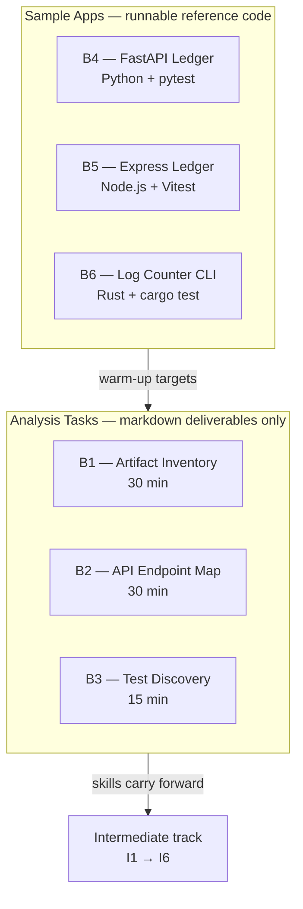
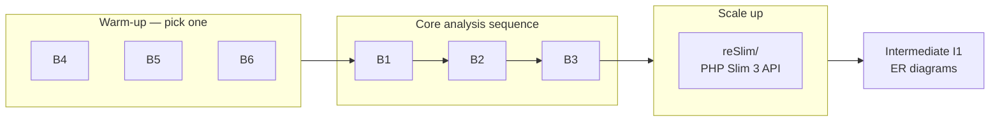

# Basics Track — Discovery & Repo Literacy

Six exercises that teach the **first skill every engineer (or AI agent) needs in an unfamiliar codebase**: read it fast, map it accurately, and run its tests — without changing a single line of production code.

This track is the **entry point** to the full [Agent Evaluation Tasks](../README.md) library. Complete it before moving to [Intermediate](../Intermediate/README.md), where you start operating on and extending repos.

---

## Table of contents

- [What this track teaches](#what-this-track-teaches)
- [Two kinds of content](#two-kinds-of-content)
- [Task catalog at a glance](#task-catalog-at-a-glance)
- [Recommended learning path](#recommended-learning-path)
- [Analysis tasks (B1–B3)](#analysis-tasks-b1b3)
- [Sample applications (B4–B6)](#sample-applications-b4b6)
- [Shared ledger API contract](#shared-ledger-api-contract)
- [Prerequisites & setup](#prerequisites--setup)
- [Agent workflow specs](#agent-workflow-specs)
- [What each task folder contains](#what-each-task-folder-contain)
- [Pass criteria summary](#pass-criteria-summary)
- [Hygiene & conventions](#hygiene--conventions)
- [What's next](#whats-next)

---

## What this track teaches

| Skill | Where you practice it | Why it matters |
|-------|----------------------|----------------|
| **Artifact inventory** | B1 | Know where controllers, services, models, and config live before touching anything |
| **Route mapping** | B2 | Find every externally exposed HTTP endpoint and link it to its handler |
| **Test discovery & execution** | B3 | Detect the test framework, run the right command, interpret failures |
| **Polyglot repo literacy** | B4, B5, B6 | Same concepts across Python, Node.js, and Rust — smaller targets than a full production app |

Every analysis deliverable requires **source citations** (`source: path:line-range`) on every finding. No guessing, no fabricated symbols.

---

## Two kinds of content

The Basics track splits cleanly into **two groups**:



### Analysis tasks (B1–B3)

Timed exercises. You **read** a repo and produce a structured markdown report. You do **not** modify source code.

- **Primary target:** [reSlim](https://github.com/aalfiann/reSlim) — a real PHP Slim 3 REST API with MariaDB schema
- **Alternate targets:** B4 or B5 — smaller single-module apps, ideal for a first pass

### Sample applications (B4–B6)

Runnable in-repo apps used as:

1. **Smaller discovery targets** for B1–B3 when reSlim feels too large
2. **Fixtures for downstream tasks** — Intermediate I3 (surgical patch) and I6 (seeded bug) build on B4/B5
3. **Polyglot warm-up** — three languages, three test runners, one shared API contract (B4 + B5)

---

## Task catalog at a glance

| Task | Type | Time | Goal | Primary target | Start here |
|------|------|------|------|----------------|------------|
| [B1](B1/README.md) | Analysis | 30 min | Structured inventory of classes, services, controllers, configs | `reSlim/` or B4/B5 | [README](B1/README.md) |
| [B2](B2/README.md) | Analysis | 30 min | Map every external HTTP route to its handler | `reSlim/` or B4/B5 | [README](B2/README.md) |
| [B3](B3/README.md) | Analysis | 15 min | Detect test framework, run tests, interpret results | B4, B5, B6, or reSlim | [README](B3/README.md) |
| [B4](B4/README.md) | Sample app | — | FastAPI transaction ledger (Python) | in-repo | [README](B4/README.md) |
| [B5](B5/README.md) | Sample app | — | Express transaction ledger (Node.js) | in-repo | [README](B5/README.md) |
| [B6](B6/README.md) | Sample app | — | Rust log-counter CLI | in-repo | [README](B6/README.md) |

**Total analysis time:** ~75 minutes (B1 + B2 + B3). Sample apps have no time box — run them at your own pace.

---

## Recommended learning path



| Step | Action | Why |
|------|--------|-----|
| **1** | Run one sample app (B4, B5, or B6) — install deps, run tests, hit an endpoint | Builds muscle memory before reading unfamiliar code |
| **2** | B1 on B4 or B5 | Practice artifact inventory on ~5 files instead of a full PHP app |
| **3** | B2 on the same app | Only 3 routes — learn the report format without reSlim complexity |
| **4** | B3 on B4, B5, or B6 | Fastest test-discovery loop (pytest / Vitest / cargo test) |
| **5** | Repeat B1 → B2 → B3 on `reSlim/` | Real-world PHP repo with controllers, models, middleware, and PHPUnit |
| **6** | Move to [Intermediate](../Intermediate/README.md) | I1 (ER diagrams) and I2 (flow traces) build directly on reSlim literacy |

> **Shortcut:** If you already know reSlim or similar PHP APIs, skip the warm-up and go straight to B1–B3 on `reSlim/`.

---

## Analysis tasks (B1–B3)

### B1 — Repo Artifact Inventory

**Goal:** Produce a structured map of every major code artifact — controllers, services, repositories, models, jobs, consumers, configs, utilities — with source citations.

**Deliverables (in order):**

1. Executive summary — repo purpose, languages, frameworks, artifact counts
2. Artifact inventory table — name, category, file path, line range, role
3. Coverage by category
4. Architectural patterns — layering, DI, routing style (with evidence)
5. Gaps & uncertainty — low-confidence inferences, skipped directories

**Key rules:**

- Exclude vendor/generated dirs (`.venv`, `node_modules`, `vendor`, `dist`, `build`, `target`)
- Cite `source: path:line-range` on every row
- Prefer explicit declarations over naming heuristics

| Resource | Link |
|----------|------|
| Task brief | [B1/README.md](B1/README.md) |
| Agent workflow | [code-artifact-mapper.md](B1/code-artifact-mapper.md) |
| Golden sample | [agent-run-output-reslim.md](B1/agent-run-output-reslim.md) |

---

### B2 — API Endpoint Map

**Goal:** Find every externally exposed route — HTTP endpoints and frontend navigation paths — and map each to its handler.

**Deliverables (in order):**

1. Route summary — totals by category (`api`, `frontend`, `proxy`, `contract`)
2. API route table — method, path, handler, `source: path:lines`
3. Frontend routes — or "None" with evidence
4. Contract-only routes — OpenAPI/Swagger/ingress rules not in code
5. Gaps & uncertainty

**Key rules:**

- External clients only (browser, curl, mobile) — no internal function calls or cron jobs
- Prefer declarative registration (router calls, decorators) over naming guesses
- Note ambiguous HTTP methods explicitly

| Resource | Link |
|----------|------|
| Task brief | [B2/README.md](B2/README.md) |
| Agent workflow | [route-discovery-mapper.md](B2/route-discovery-mapper.md) |
| Golden sample | [agent-run-output-reslim.md](B2/agent-run-output-reslim.md) |

---

### B3 — Test Discovery & Execution

**Goal:** Identify the test framework, find relevant test files, run the exact command, and report results with failure interpretation.

**Deliverables (in this exact order):**

1. Test framework and config file — with detection evidence
2. Relevant test files — ranked high / medium / low
3. Exact commands — primary + fallbacks, with reason for primary
4. Actual command result — command string, exit code, verbatim output
5. Any failure and interpretation — status, failure type, likely cause, next step

**Key rules:**

- Do not assume `npm test` — verify from manifests first
- **Execute** the primary command; do not stop at detection
- Never fabricate output — paste observed results only
- Classify failures: assertion, runtime, compile, dependency, config, or environment

| Target | Framework | Command |
|--------|-----------|---------|
| [B4](B4/README.md) | pytest | `pytest -q` |
| [B5](B5/README.md) | Vitest | `npm test` |
| [B6](B6/README.md) | cargo test | `cargo test` |
| `reSlim/` | PHPUnit | `vendor/bin/phpunit` (after `composer install`) |

| Resource | Link |
|----------|------|
| Task brief | [B3/README.md](B3/README.md) |
| Agent workflow | [test-discovery-executor.md](B3/test-discovery-executor.md) |
| Golden sample | [agent-run-output-reslim.md](B3/agent-run-output-reslim.md) |

---

## Sample applications (B4–B6)

Three small, self-contained apps that share design patterns across languages. Each ships with tests, a README, and proof screenshots under `proof/`.

### B4 — FastAPI Transaction Ledger

| | |
|---|---|
| **Stack** | Python 3.9+, FastAPI, Pydantic, pytest |
| **Port** | `8000` (uvicorn) |
| **Layout** | `app/main.py`, `app/store.py`, `app/schemas.py`, `tests/test_api.py` |

```bash
cd tasks/Basics/B4
python3 -m venv .venv && source .venv/bin/activate
pip install -r requirements.txt
pytest -q                              # run tests
uvicorn app.main:app --reload          # start server → http://127.0.0.1:8000/docs
```

→ Full details: [B4/README.md](B4/README.md)

---

### B5 — Express Transaction Ledger

| | |
|---|---|
| **Stack** | Node.js 18+, Express, Vitest, Supertest |
| **Port** | `8000` (override with `PORT=3000`) |
| **Layout** | `src/app.js`, `src/store.js`, `src/server.js`, `tests/api.test.js` |

```bash
cd tasks/Basics/B5
npm install
npm test                               # run tests
npm start                              # start server → http://127.0.0.1:8000
```

→ Full details: [B5/README.md](B5/README.md)

---

### B6 — Rust Log Counter CLI

| | |
|---|---|
| **Stack** | Rust (stable), clap |
| **Type** | Command-line tool (not an HTTP server) |
| **Layout** | `src/main.rs`, `src/lib.rs`, `sample.log` |

```bash
cd tasks/Basics/B6
cargo test                             # run unit tests
cargo run -- sample.log                # INFO: 2, WARN: 1, ERROR: 1
```

Counts log levels per line (case-insensitive). Priority when multiple match: **ERROR > WARN > INFO**.

→ Full details: [B6/README.md](B6/README.md)

---

## Shared ledger API contract

B4 and B5 implement the **same REST contract** — useful when comparing Python vs Node route registration in B2, or when Intermediate tasks (I3, I6) patch the ledger.

| Method | Path | Description |
|--------|------|-------------|
| `POST` | `/transactions` | Create a credit or debit transaction |
| `GET` | `/transactions` | List all transactions |
| `GET` | `/balance` | Return the current balance |

**Validation rules (both apps):**

- `amount` — must be > 0 (max 12 digits, 2 decimal places)
- `type` — `credit` or `debit`
- `description` — required, 1–200 characters
- Negative balance on debit → `400 Bad Request`

**Example:**

```bash
curl -X POST http://127.0.0.1:8000/transactions \
  -H "Content-Type: application/json" \
  -d '{"amount": "100.00", "type": "credit", "description": "Opening deposit"}'
```

---

## Prerequisites & setup

### One-time: clone reSlim

Required for B1–B3 when using the primary target, and for all Intermediate tasks that follow.

```bash
# from repository root (sibling to tasks/)
git clone --depth 1 https://github.com/aalfiann/reSlim.git reSlim
```

> If an older checkout used a broken submodule pin, use the clone command above instead of `git submodule update`.

### Tooling by task

| Tool | Version | Needed for |
|------|---------|------------|
| Python | 3.9+ | B4 |
| Node.js | 18+ | B5 |
| Rust (`cargo`) | stable | B6 |
| PHP + Composer | 7.4+ / 8.x | reSlim (B1–B3 primary target) |

Create Python virtualenvs locally — **never commit** `.venv/`, `node_modules/`, or `target/`.

---

## Agent workflow specs

Each analysis task includes a **repeatable AI workflow** — inputs, discovery strategy, output schema, and stop conditions. These map to Cursor skills in the parent agent repo.

| Task | Spec file | Cursor skill |
|------|-----------|--------------|
| B1 | [code-artifact-mapper.md](B1/code-artifact-mapper.md) | `code-artifact-mapper` |
| B2 | [route-discovery-mapper.md](B2/route-discovery-mapper.md) | `route-discovery-mapper` |
| B3 | [test-discovery-executor.md](B3/test-discovery-executor.md) | `test-discovery-executor` |

**For AI-assisted eval runs:**

1. Read the task [README](B1/README.md) first
2. Then read the agent workflow spec
3. Produce deliverables matching the golden `agent-run-output-*.md` format

---

## What each task folder contains

```
Basics/
├── README.md                         ← you are here
│
├── B1/                               ← analysis task
│   ├── README.md                     # task brief: goal, deliverables, pass criteria
│   ├── code-artifact-mapper.md       # agent workflow spec
│   └── agent-run-output-reslim.md    # golden sample output
│
├── B2/                               ← analysis task
│   ├── README.md
│   ├── route-discovery-mapper.md
│   └── agent-run-output-reslim.md
│
├── B3/                               ← analysis task
│   ├── README.md
│   ├── test-discovery-executor.md
│   └── agent-run-output-reslim.md
│
├── B4/                               ← sample app (FastAPI)
│   ├── README.md
│   ├── app/                          # application source
│   ├── tests/                        # pytest suite
│   ├── requirements.txt
│   └── proof/                        # screenshot evidence
│
├── B5/                               ← sample app (Express)
│   ├── README.md
│   ├── src/                          # application source
│   ├── tests/                        # Vitest suite
│   ├── package.json
│   └── proof/
│
└── B6/                               ← sample app (Rust CLI)
    ├── README.md
    ├── src/                          # lib + main
    ├── sample.log                    # test fixture
    ├── Cargo.toml
    └── proof/
```

| Artifact | Purpose |
|----------|---------|
| `README.md` | **Start here** for each task — goal, setup, deliverables, pass criteria |
| `*-mapper.md`, `*-executor.md` | Step-by-step workflow for AI-assisted runs |
| `agent-run-output-*.md` | Reference quality bar for human or agent deliverables |
| `proof/` | Visual evidence that apps run (screenshots of tests, server, CLI output) |

---

## Pass criteria summary

| Task | Pass when |
|------|-----------|
| **B1** | All major artifact categories addressed; every row cites `path:line`; vendor code excluded; done in 30 min |
| **B2** | Every external API route listed with method + path + handler; each cites `source: path:line`; frontend/proxy/contract sections present; done in 30 min |
| **B3** | Framework identified with evidence; primary command **executed**; exit code and output captured; failures classified; done in 15 min |
| **B4** | `pytest -q` passes; server starts on `:8000`; Swagger docs load |
| **B5** | `npm test` passes; server starts on `:8000` |
| **B6** | `cargo test` passes; `cargo run -- sample.log` prints correct counts |

---

## Hygiene & conventions

- **Source citations** — every finding in B1–B3 must include `source: path:line-range`
- **Time boxes** — pass criteria assume the stated duration; scope accordingly
- **Do not commit** generated artifacts: `.venv/`, `node_modules/`, `vendor/`, `target/`, `.pytest_cache/`
- **Canonical apps** — B4 and B5 are reference implementations; downstream tasks (I6) use sandbox copies — never modify B5 for debugging exercises
- **Golden samples** — compare your output to `agent-run-output-reslim.md`; do not copy verbatim without doing the work

---

## What's next

After completing the Basics track, you are ready for [Intermediate](../Intermediate/README.md):

| Intermediate task | Builds on Basics skill |
|-------------------|------------------------|
| [I1 — ER diagram](../Intermediate/I1/README.md) | B1 artifact inventory → database entity mapping |
| [I2 — Flow trace](../Intermediate/I2/README.md) | B2 route mapping → end-to-end sequence diagrams |
| [I3 — Surgical patch](../Intermediate/I3/README.md) | B4/B5 apps → minimal code change + test |
| [I6 — Seeded bug](../Intermediate/I6/README.md) | B5 sandbox → reproduce, diagnose, fix |

Full catalog and learning path: [tasks/README.md](../README.md)

---

## Getting started

1. Pick a [task from the catalog](#task-catalog-at-a-glance) — or follow the [learning path](#recommended-learning-path).
2. Open that task's `README.md` for goal, setup, and pass criteria.
3. Clone [reSlim](https://github.com/aalfiann/reSlim) if the task requires it.
4. For AI-assisted runs, also read the linked agent workflow spec.
5. Compare your deliverable to the golden `agent-run-output-*.md` sample.

**Suggested first session (~45 min):** Run B4 tests → B1 on B4 → B2 on B4 → B3 on B4. You will have touched artifact inventory, route mapping, and test execution on a codebase small enough to hold in your head.
