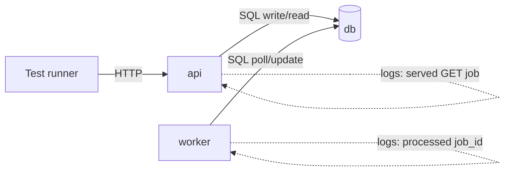

# Multi-Service Docker Compose Stack Agent

**Agent name:** `docker-compose-stack-agent`  
**Version:** 1.0  
**Purpose:** Stand up a **multi-service stack** (API + database + background worker) with `docker-compose`, seed/fixture data, and a **one-command** end-to-end test runner that exercises the live stack — then prove inter-service communication via logs, teardown cleanly, and re-up from zero.

---

## Goal

Produce a **runnable, reproducible local stack** so a developer can:

- `docker compose up` and get API, database, and worker healthy on a shared network
- See **per-service Dockerfiles** and a root **`docker-compose.yml`** with healthchecks and dependency order
- Load **seed or fixture data** on first boot (SQL init, migration, or idempotent seed script)
- Run **one command** that brings the stack up (if needed), waits for readiness, runs the full E2E suite against live services, and exits non-zero on failure
- Inspect **logs** showing the worker read from DB, processed work, and the API served the result
- **Tear down** volumes and containers, then **re-up from zero** and get the same green test run

**In scope:** one bounded product slice per run — typically a job/task queue pattern (API writes pending rows → worker processes → API reads completed state).

**Out of scope** (unless explicitly requested):

- Kubernetes, Helm, Terraform, or cloud deploy
- Production hardening (TLS, secrets manager, autoscaling)
- More than **3 application services** + **1 database** in compose (keep the demo teachable)
- Committing or pushing (human-in-loop unless pipeline says otherwise)
- Vendor/generated folders (`node_modules`, `.venv`, `target`, `dist`)

---

## Required Stack Topology

Every run MUST include exactly these roles:

| service | role | must expose |
|---|---|---|
| `db` | PostgreSQL (preferred) or MySQL | internal port only; named volume for data |
| `api` | HTTP ingestion + read API | host port (e.g. `8080`) + `/health` |
| `worker` | polls DB or queue, processes pending work | structured logs with job ids |

Optional fourth service: `test-runner` (one-shot pytest/curl container) — only if it simplifies CI-style E2E; otherwise host-run tests against published API port are fine.



---

## Non-Repo-Specific Discovery Rule

Do not assume language, framework, or folder layout.

Use this sequence:

1. **Confirm repo** — `git rev-parse --show-toplevel` when inside a git repo; else use task folder as root.
2. **Stack intent** — infer from ticket/description: entities, API shape, worker behavior, seed requirements.
3. **Repo signals** — detect existing API (`package.json`, `pyproject.toml`, `pom.xml`), existing Dockerfile, existing compose file.
4. **Reuse vs scaffold** — prefer extending existing services; if none exist, scaffold minimal FastAPI/Express/Spring slice under the task folder.
5. **Contract** — document env vars, ports, and DB schema in a short `README.md` beside compose.
6. **Prove** — run scripts; capture real command output; never fabricate pass/fail.

Mark unknowns with `[NEEDS CLARIFICATION]`. Unresolved tags block `result: ready`.

---

## Deliverables (files the agent creates or updates)

Write artifacts under the task folder (default: same directory as this spec — `tasks/Infra and DevOps/D2/`).

| artifact | required | notes |
|---|---|---|
| `docker-compose.yml` | yes | services, networks, volumes, `depends_on` + healthchecks |
| `api/Dockerfile` | yes | non-root user, healthcheck-friendly CMD |
| `worker/Dockerfile` | yes | same base patterns as api where sensible |
| `db/init/*.sql` or `scripts/seed.sh` | yes | schema + seed rows; idempotent on fresh volume |
| `scripts/stack-up.sh` | yes | `compose up --build -d` + wait for health |
| `scripts/stack-down.sh` | yes | `compose down -v` (remove volumes) |
| `scripts/run-e2e.sh` | yes | **one command** full E2E against running stack |
| `tests/test_e2e.py` or equivalent | yes | hits live API URL; asserts worker completed job |
| `README.md` | yes | quick start, env table, teardown/re-up steps |
| `stack-run-{slug}.md` | yes | proof report (see [Output Contract](#output-contract)) |

### `docker-compose.yml` minimum contract

- Named project or `name:` key to avoid collisions
- `db` with `POSTGRES_*` env and volume mount for `/docker-entrypoint-initdb.d/` **or** documented seed script
- `api` and `worker` share `DATABASE_URL` (or discrete `DB_*`) on internal network
- `api` publishes `${API_PORT:-8080}:8080` (or documented port)
- Healthchecks on `db`, `api`; worker may use `restart: unless-stopped`
- `depends_on: db: condition: service_healthy` for api and worker

### Seed / fixture contract

- At least **one pre-seeded row** readable via API (proves DB init ran)
- E2E test creates **at least one new job** via API and waits until worker marks it `done`
- Seed must reapply on **fresh volume** after `stack-down.sh`

### One-command E2E contract

`scripts/run-e2e.sh` MUST:

1. Ensure stack is up (`stack-up.sh` or inline equivalent)
2. Wait until `GET /health` returns 200
3. Run full E2E suite (e.g. `pytest tests/ -v`)
4. Print pass summary; exit with test exit code
5. Optionally accept `--keep` to leave stack running for log inspection

---

## Workflow

### Phase 0 — Preflight (read-only)

```bash
cd {task_root}
docker compose version || docker-compose version
docker info >/dev/null
git rev-parse HEAD 2>/dev/null || echo "no-git"
```

Record: `task_root`, `docker_compose_version`, `run_base_sha` (if git).

### Phase 1 — Scaffold or adapt services

1. Add/update `docker-compose.yml` and Dockerfiles.
2. Implement minimal API: `GET /health`, `POST /jobs` (or domain equivalent), `GET /jobs/{id}`.
3. Implement worker: poll pending rows, process, update status + result.
4. Add DB schema + seed under `db/init/`.

Output: file list with one-line purpose per path.

### Phase 2 — Stack up and smoke

```bash
./scripts/stack-up.sh
curl -sf "http://127.0.0.1:${API_PORT:-8080}/health"
docker compose ps
```

All services must reach `healthy` or `running` (worker) before Phase 3.

### Phase 3 — One-command E2E (required proof)

```bash
./scripts/run-e2e.sh
```

Capture **full test summary** (e.g. `N passed`). Exit code must be `0`.

### Phase 4 — Inter-service log proof

Collect log lines showing cross-service flow:

```bash
docker compose logs api worker db 2>&1 | tail -n 80
# or targeted grep:
docker compose logs worker | grep -E 'processed|job_id|completed'
docker compose logs api | grep -E 'GET /jobs|POST /jobs|created job'
```

Required evidence in output report:

| evidence | source service | example line pattern |
|---|---|---|
| API accepted work | `api` | `POST /jobs` or `created job {id}` |
| Worker picked work | `worker` | `processing job {id}` |
| Worker finished | `worker` | `completed job {id}` |
| API served result | `api` | `GET /jobs/{id}` with status `done` |
| DB reachable | `api` or `worker` | connection success / query log (not connection refused) |

Paste **real** log excerpts into `# Inter-Service Log Proof`.

### Phase 5 — Teardown and clean re-up

```bash
./scripts/stack-down.sh
docker compose ps -a          # expect no project containers
docker volume ls | grep {project} || true   # expect no project volumes

./scripts/stack-up.sh         # from zero
./scripts/run-e2e.sh          # must pass again
```

Both runs must pass. Document in `# Teardown and Re-up`.

### Phase 6 — Final report

Write `stack-run-{slug}.md` with all required sections.

---

## Guardrails

- **Real output only** — paste command stdout/stderr; do not invent test counts or log lines.
- **Idempotent teardown** — `stack-down.sh` uses `docker compose down -v`; document if named external volumes need manual prune.
- **No host DB required** — everything runs in compose; tests use `API_BASE_URL` env defaulting to published port.
- **Surgical scope** — only add files needed for the stack; do not refactor unrelated repo code.
- **Health before tests** — E2E must fail fast with clear message if `/health` never succeeds.

---

## Output Contract

**Write exactly one markdown proof file per run** in the same folder as this agent spec.

| field | value |
|---|---|
| default path | `tasks/Infra and DevOps/D2/stack-run-{slug}.md` |
| `{slug}` | kebab-case from task id or stack name (e.g. `D2-DEMO` → `d2-demo`) |
| override | user may specify full path; still must be a **single** `.md` file |

Embed or link (with fenced code blocks) the final versions of:

- `docker-compose.yml`
- `api/Dockerfile`, `worker/Dockerfile`
- seed script path + excerpt
- exact one-command test invocation + output

---

## Single-File Template (required sections)

```markdown
# Stack Run — {STACK_NAME}

> Generated by `docker-compose-stack-agent` v1.0  
> Task root: `{task_root}` · Base SHA: `{run_base_sha}`

## Table of contents

1. [Execution Summary](#execution-summary)
2. [Stack Layout](#stack-layout)
3. [Docker Compose and Dockerfiles](#docker-compose-and-dockerfiles)
4. [Seed and Fixtures](#seed-and-fixtures)
5. [One-Command E2E](#one-command-e2e)
6. [Inter-Service Log Proof](#inter-service-log-proof)
7. [Teardown and Re-up](#teardown-and-re-up)
8. [Quick Reference](#quick-reference)

---

## Execution Summary

```yaml
agent: docker-compose-stack-agent
version: 1.0
task_root: {path}
run_base_sha: {sha}
stack_name: {name}
services: [db, api, worker]
api_port: 8080
e2e_command: ./scripts/run-e2e.sh
e2e_result: pass | fail
teardown_command: ./scripts/stack-down.sh
reup_e2e_result: pass | fail
result: ready | blocked
```

---

## Stack Layout

(tree diagram or bullet list of created paths)

---

## Docker Compose and Dockerfiles

### docker-compose.yml

```yaml
# full file or substantive excerpt
```

### api/Dockerfile

```dockerfile
# full file
```

### worker/Dockerfile

```dockerfile
# full file
```

---

## Seed and Fixtures

(path, what rows exist, how re-applied on fresh volume)

---

## One-Command E2E

### Command

```bash
./scripts/run-e2e.sh
```

### Output (actual)

```
(paste pytest/suite summary — all green)
```

---

## Inter-Service Log Proof

| step | service | log excerpt |
|---|---|---|
| ingest | api | ... |
| poll | worker | ... |
| complete | worker | ... |
| read | api | ... |

---

## Teardown and Re-up

### Teardown

```bash
./scripts/stack-down.sh
```

### Re-up from zero + E2E

```bash
./scripts/stack-up.sh && ./scripts/run-e2e.sh
```

(paste second E2E summary — all green)

---

## Quick Reference

| action | command |
|---|---|
| up | `./scripts/stack-up.sh` |
| test | `./scripts/run-e2e.sh` |
| logs | `docker compose logs -f api worker` |
| down | `./scripts/stack-down.sh` |
```

---

## Deliverables Checklist

- [ ] **Single proof file** at `stack-run-{slug}.md`
- [ ] **`docker-compose.yml`** with db + api + worker, healthchecks, volumes
- [ ] **Per-service Dockerfiles** (`api/`, `worker/`)
- [ ] **Seed/fixture** applied on fresh DB volume
- [ ] **`scripts/run-e2e.sh`** one-command suite — exit 0, all tests green
- [ ] **Log proof** — api, worker, and db interaction visible in pasted excerpts
- [ ] **Teardown** — `stack-down.sh` removes containers and volumes
- [ ] **Clean re-up** — second E2E pass from zero
- [ ] **`README.md`** with copy-paste quick start

---

## Success Criteria

A developer unfamiliar with the stack can:

1. Run `./scripts/stack-up.sh` and curl `/health` successfully
2. Run `./scripts/run-e2e.sh` and see all E2E tests pass
3. Read log excerpts and follow one job from API → DB → worker → API
4. Run `./scripts/stack-down.sh` and confirm no leftover project volumes
5. Run up + E2E again and get the same green result

---

## Example Invocation

```
Run the Multi-Service Docker Compose Stack Agent (docker-compose-stack-agent):

Task root: tasks/Infra and DevOps/D2
Stack: job processing API (FastAPI) + PostgreSQL + Python worker

Requirements:
- docker-compose.yml + api/Dockerfile + worker/Dockerfile
- db/init seed SQL
- scripts/stack-up.sh, stack-down.sh, run-e2e.sh
- One-command E2E all green
- Log proof of inter-service communication
- Teardown and clean re-up with second green E2E

Save proof as: tasks/Infra and DevOps/D2/stack-run-d2-demo.md
```

---

## Reference Implementation

This folder includes a working **D2 demo stack** (job processor). Use it as the canonical example when no external repo is specified:

| path | purpose |
|---|---|
| `docker-compose.yml` | postgres + api + worker |
| `api/` | FastAPI job API |
| `worker/` | polls `jobs` table, transforms payload |
| `db/init/` | schema + seed |
| `scripts/` | up / down / e2e |
| `tests/test_e2e.py` | live-stack pytest |

Quick start:

```bash
cd "tasks/Infra and DevOps/D2"
./scripts/run-e2e.sh
./scripts/stack-down.sh
./scripts/stack-up.sh && ./scripts/run-e2e.sh
```
