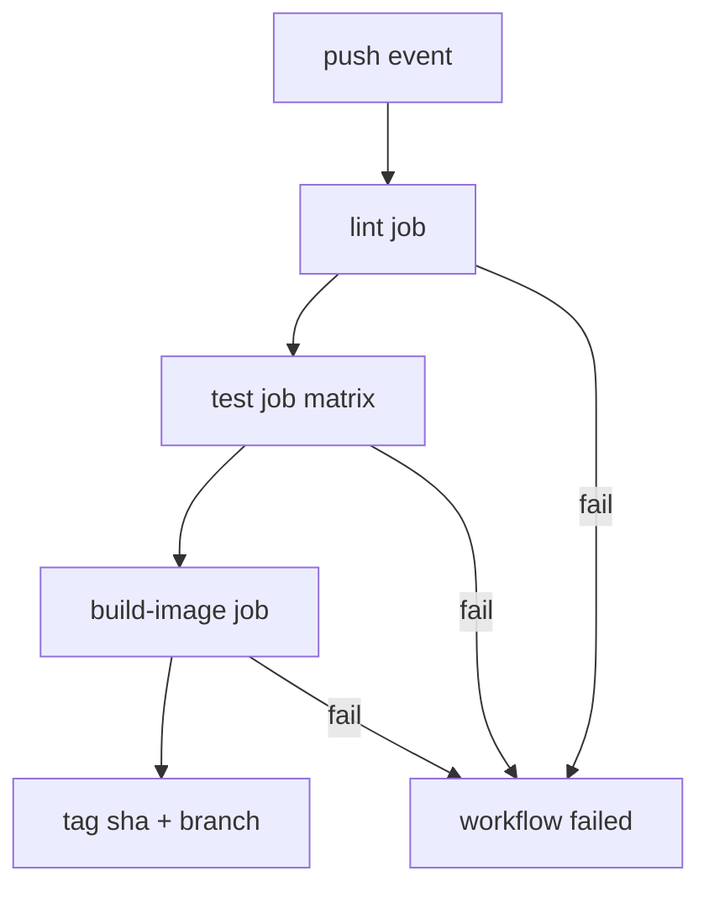

# CI Pipeline Agent (Lint · Test · Container Build)

**Agent name:** `ci-pipeline-writer`  
**Version:** 1.0  
**Purpose:** Author a **push-triggered CI workflow** (GitHub Actions or GitLab CI) that **lints**, **runs tests**, **builds and tags a container image**, and produce **evidence of a green run** plus a **deliberate failure demo** proving the pipeline catches regressions.

---

## Goal

Produce a **working, reproducible CI pipeline** so a developer can:

- Push (or simulate push) and see **lint → test → image build** run in order on every push
- Inspect the **workflow YAML** with **cache** and **matrix** configuration where they reduce wall time or cover multiple runtimes
- Reproduce a **green run** locally via [`act`](https://github.com/nektos/act) or an equivalent local runner script
- See a **failure mode demo** — one intentionally broken commit that fails lint or tests (not image build alone)
- Trust that the pipeline fails fast on the correct stage

**In scope:** one service/repo slice per run; GitHub Actions (default) or GitLab CI when the target repo uses `.gitlab-ci.yml`.

**Out of scope** (unless explicitly requested):

- Deploy to Kubernetes, ECS, or production registries with live credentials
- Multi-repo monorepo orchestration beyond path filters
- Committing or pushing (human-in-loop unless pipeline says otherwise)
- Vendor/generated folders (`node_modules`, `.venv`, `target`, `dist`, `build`)

---

## Pipeline Contract (hard requirements)

Every run MUST implement these stages on **`push`** (all branches unless user specifies `main` only):

| stage | order | must fail on | typical command (adapt to stack) |
|---|---|---|---|
| **lint** | 1 | style/type/syntax errors | `ruff check`, `eslint`, `mvn checkstyle:check`, `golangci-lint run` |
| **test** | 2 | failing assertions / test errors | `pytest`, `npm test`, `mvn test`, `go test ./...` |
| **build-image** | 3 | Dockerfile/build errors | `docker build` with explicit tags |

### Image tagging contract

On every green pipeline, the build stage MUST tag the image with **at least two** labels:

| tag pattern | example | source |
|---|---|---|
| `{registry}/{name}:sha-{short_sha}` | `ghcr.io/org/app:sha-a1b2c3d` | `${{ github.sha }}` / `$CI_COMMIT_SHORT_SHA` |
| `{registry}/{name}:{branch-slug}` | `ghcr.io/org/app:main` | branch ref slug |

For local/`act` runs without registry push: **build + tag locally** and record `docker images` output as proof.

### Cache contract

Use dependency caching when the stack has installable deps:

| platform | cache key inputs | paths |
|---|---|---|
| GitHub Actions | lockfile hash + runner OS + matrix axis | `~/.cache/pip`, `node_modules`, `.m2/repository` |
| GitLab CI | lockfile hash + job name | `.cache/pip`, `node_modules` |

Document cache **restore-keys** fallback for partial hits.

### Matrix contract

Use a matrix when **multiple runtime versions** are declared or sensible:

| stack | typical matrix axis | example |
|---|---|---|
| Python | `python-version` | `["3.11", "3.12"]` |
| Node | `node-version` | `["20", "22"]` |
| Java | `java-version` | `["17", "21"]` |
| Go | `go-version` | `["1.22", "1.23"]` |

If only one runtime is pinned in the repo, document `matrix: skipped — single version pinned` in the proof file.



---

## Non-Repo-Specific Discovery Rule

Do not assume language, package manager, or CI host.

Use this sequence:

1. **Confirm repo** — `git rev-parse --show-toplevel`; detect existing `.github/workflows/` or `.gitlab-ci.yml`.
2. **Stack signals** — manifests (`package.json`, `pyproject.toml`, `pom.xml`, `go.mod`, `Dockerfile`).
3. **Existing CI** — extend or replace; never duplicate conflicting workflows without documenting deprecation.
4. **Command detection** — read Makefile, `package.json` scripts, foundry casts, or README for lint/test/build commands.
5. **Container context** — locate `Dockerfile`; if missing, scaffold minimal production Dockerfile beside the service.
6. **Prove** — run pipeline locally; paste real output; never fabricate pass/fail.

Mark unknowns with `[NEEDS CLARIFICATION]`. Unresolved tags block `result: ready`.

---

## Platform Templates

### GitHub Actions (default)

Write `.github/workflows/ci.yml` (or stack-specific name) with:

- `on: push` (+ optional `pull_request` if user asks)
- Job `lint` — checkout, setup runtime, cache deps, lint command
- Job `test` — `needs: lint`, matrix, cache, test command
- Job `build-image` — `needs: test`, QEMU/setup-buildx if multi-arch not required skip, `docker/build-push-action` or `docker build`
- Concurrency group optional: `ci-${{ github.ref }}`

**Secrets:** registry push requires `REGISTRY_*` / `GITHUB_TOKEN` with `packages:write`. If secrets unavailable, set `push: false` and document local tag proof.

### GitLab CI (when target uses GitLab)

Write `.gitlab-ci.yml` with stages:

```yaml
stages: [lint, test, build]
```

- `lint` job — `cache:` keyed on lockfile
- `test` job — `parallel:matrix` for runtime versions
- `build` job — `docker build` with `$CI_REGISTRY_IMAGE:$CI_COMMIT_SHORT_SHA`

---

## Deliverables (files the agent creates or updates)

Write artifacts under the task folder (default: `tasks/Infra and DevOps/D3/`) or target repo root when user specifies a repo.

| artifact | required | notes |
|---|---|---|
| `.github/workflows/ci.yml` or `.gitlab-ci.yml` | yes | full pipeline with lint, test, build-image |
| `Dockerfile` | yes | if not already present for the service |
| lint config | yes | `ruff.toml`, `.eslintrc`, etc. |
| test suite | yes | at least one test that exercises main behavior |
| `scripts/run-ci-local.sh` | yes | runs same stages as workflow when `act` unavailable |
| `ci-run-{slug}.md` | yes | proof report (see [Output Contract](#output-contract)) |

Optional:

- `.actrc` or `act`-compatible event payload for local simulation
- `scripts/demo-failure.sh` — applies broken patch, runs CI, reverts

---

## Workflow

### Phase 0 — Preflight (read-only)

```bash
cd {task_root}
git rev-parse --show-toplevel 2>/dev/null || echo "no-git"
git rev-parse HEAD 2>/dev/null || echo "no-sha"
# detect stack
ls -la package.json pyproject.toml pom.xml go.mod Dockerfile 2>/dev/null
# detect CI host
ls -la .github/workflows .gitlab-ci.yml 2>/dev/null
# optional local runner
command -v act && act --version || echo "act-not-installed"
docker version
```

Record: `task_root`, `stack_detected`, `ci_platform`, `run_base_sha`, `act_available`.

### Phase 1 — Scaffold or adapt service

1. Ensure lint config and at least one meaningful test exist.
2. Ensure `Dockerfile` builds the service (multi-stage optional).
3. Document exact lint/test/build commands in proof file.

### Phase 2 — Author workflow YAML

1. Add push trigger and job DAG (lint → test → build-image).
2. Add cache blocks keyed on lockfile + matrix axis.
3. Add matrix for runtime versions when applicable.
4. Add image tag expressions (sha + branch).

Output: embed full YAML in proof file `# Workflow YAML`.

### Phase 3 — Green run (required proof)

**Option A — act (preferred when installed):**

```bash
cd {repo_root}
act push -W .github/workflows/ci.yml --container-architecture linux/amd64 2>&1 | tee /tmp/act-green.log
echo "exit: $?"
```

**Option B — local runner script (when act unavailable):**

```bash
./scripts/run-ci-local.sh 2>&1 | tee /tmp/ci-green.log
echo "exit: $?"
```

Capture:

- exit code `0`
- lint summary (e.g. `All checks passed`)
- test summary (e.g. `N passed`)
- docker build success + `docker images` lines showing both tags

### Phase 4 — Failure mode demo (required proof)

Introduce **one deliberate regression** that fails **lint or test** (not Dockerfile syntax unless no lint/test exists):

| break type | example | expected failing job |
|---|---|---|
| lint | unused import, ruff violation | `lint` |
| test | assert `1 == 2` in test | `test` |
| type | mypy error if in pipeline | `lint` or dedicated type job |

```bash
# example: break test
git apply /tmp/ci-break.patch   # or sed one line
./scripts/run-ci-local.sh 2>&1 | tee /tmp/ci-fail.log
echo "exit: $?"
git checkout -- .               # revert break
```

Capture:

- exit code non-zero
- exact failing step name and error line from log
- confirmation revert restores green run (optional quick re-run)

### Phase 5 — Final report

Write `ci-run-{slug}.md` with all required sections.

---

## Guardrails

- **Real output only** — paste command stdout/stderr; do not invent job URLs or test counts.
- **Fail-fast order** — lint before test before build; do not skip stages.
- **No silent push** — image `push: true` only when registry credentials exist; otherwise build+tag locally.
- **Surgical scope** — only add CI/service files needed; do not refactor unrelated code.
- **Revert failure demo** — broken commit must not remain in working tree at end of run.

---

## Output Contract

**Write exactly one markdown proof file per run** in the same folder as this agent spec.

| field | value |
|---|---|
| default path | `tasks/Infra and DevOps/D3/ci-run-{slug}.md` |
| `{slug}` | kebab-case from task id (e.g. `D3-DEMO` → `d3-demo`) |
| override | user may specify full path; still must be a **single** `.md` file |

Embed or link the final versions of:

- workflow YAML (full file)
- cache and matrix excerpts with explanation
- green run log summary + exit code
- failure run log with failing job/step highlighted
- image tag proof (`docker images` or registry URL)

---

## Single-File Template (required sections)

```markdown
# CI Run — {PIPELINE_NAME}

> Generated by `ci-pipeline-writer` v1.0  
> Task root: `{task_root}` · Base SHA: `{run_base_sha}`

## Table of contents

1. [Execution Summary](#execution-summary)
2. [Workflow YAML](#workflow-yaml)
3. [Cache and Matrix](#cache-and-matrix)
4. [Green Run Proof](#green-run-proof)
5. [Failure Mode Demo](#failure-mode-demo)
6. [Quick Reference](#quick-reference)

---

## Execution Summary

```yaml
agent: ci-pipeline-writer
version: 1.0
task_root: {path}
run_base_sha: {sha}
ci_platform: github-actions | gitlab-ci
stack_detected: {stack}
workflow_path: .github/workflows/ci.yml
lint_command: {cmd}
test_command: {cmd}
image_tags: [sha-{short}, {branch}]
green_run_method: act | run-ci-local.sh
green_run_exit: 0
failure_demo_job: lint | test
failure_demo_exit: 1
result: ready | blocked
```

---

## Workflow YAML

```yaml
# full ci.yml or .gitlab-ci.yml
```

---

## Cache and Matrix

### Cache configuration

(explain keys, paths, restore-keys)

### Matrix configuration

(table of axes and why each value)

---

## Green Run Proof

### Command

```bash
{act or run-ci-local.sh invocation}
```

### Output (actual)

```
(paste summary — lint pass, N tests passed, image built, tags listed)
```

### Image tags

```
(paste docker images | grep {image_name})
```

---

## Failure Mode Demo

### Deliberate break

(description: what was broken, which file/line)

### Command

```bash
{same runner after break}
```

### Output (actual — must show failure)

```
(paste failing step + error message)
```

### Revert confirmation

(brief note that working tree restored; optional second green snippet)

---

## Quick Reference

| action | command |
|---|---|
| run CI locally | `./scripts/run-ci-local.sh` |
| run with act | `act push -W .github/workflows/ci.yml` |
| demo failure | `./scripts/demo-failure.sh` |
| build image only | `docker build -t {tag} .` |
```

---

## Deliverables Checklist

- [ ] **Single proof file** at `ci-run-{slug}.md`
- [ ] **Workflow YAML** — push trigger, lint → test → build-image DAG
- [ ] **Cache** — dependency cache with documented key strategy
- [ ] **Matrix** — runtime matrix or documented skip reason
- [ ] **Image tags** — sha + branch (or equivalent) on successful build
- [ ] **Green run** — exit 0 with pasted evidence (act or local script)
- [ ] **Failure demo** — deliberate break fails correct stage; reverted afterward
- [ ] **`scripts/run-ci-local.sh`** — mirrors workflow stages for offline proof

---

## Success Criteria

A developer unfamiliar with the pipeline can:

1. Read `# Workflow YAML` and understand stage order and triggers
2. See cache/matrix rationale in `# Cache and Matrix`
3. Reproduce the green run with the documented local command
4. Run the failure demo and see the expected job turn red
5. Build the tagged image locally from the same Dockerfile CI uses

---

## Example Invocation

```
Run the CI Pipeline Agent (ci-pipeline-writer):

Task root: tasks/Infra and DevOps/D3
Service: Python FastAPI echo API in service/
CI platform: GitHub Actions
Requirements:
- push trigger: lint (ruff) → test (pytest matrix 3.11/3.12) → docker build + tag sha + branch
- pip cache in workflow
- green run via run-ci-local.sh or act
- failure demo: broken test must fail test job

Save proof as: tasks/Infra and DevOps/D3/ci-run-d3-demo.md
```

---

## Reference Implementation

This folder includes a working **D3 demo pipeline** (FastAPI echo service). Use it as the canonical example when no external repo is specified:

| path | purpose |
|---|---|
| `service/` | minimal FastAPI app + tests + Dockerfile |
| `.github/workflows/ci.yml` | lint → test matrix → build-image |
| `scripts/run-ci-local.sh` | local CI mirror (no act required) |
| `scripts/demo-failure.sh` | applies test break, runs CI, reverts |
| `ci-run-d3-demo.md` | proof report with green + failure logs |

Quick start:

```bash
cd "tasks/Infra and DevOps/D3"
./scripts/run-ci-local.sh          # green run
./scripts/demo-failure.sh          # failure demo (auto-reverts)
```

With [act](https://github.com/nektos/act) installed:

```bash
cd "tasks/Infra and DevOps/D3"
act push -W .github/workflows/ci.yml --container-architecture linux/amd64
```
