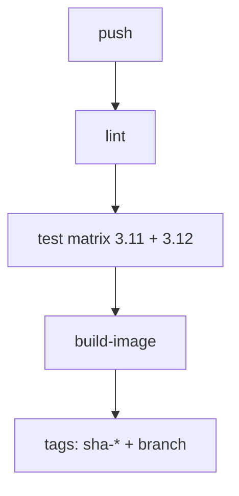

# CI Run — D3 Echo API Pipeline

> Generated by `ci-pipeline-writer` v1.0  
> Task root: `tasks/Infra and DevOps/D3` · Base SHA: `no-git`

## Table of contents

1. [Execution Summary](#execution-summary)
2. [Workflow YAML](#workflow-yaml)
3. [Cache and Matrix](#cache-and-matrix)
4. [Green Run Proof](#green-run-proof)
5. [Failure Mode Demo](#failure-mode-demo)
6. [Quick Reference](#quick-reference)

---

## Execution Summary

```yaml
agent: ci-pipeline-writer
version: 1.0
task_root: tasks/Infra and DevOps/D3
run_base_sha: no-git
ci_platform: github-actions
stack_detected: Python 3.11/3.12, FastAPI, pytest, ruff, Docker
workflow_path: .github/workflows/ci.yml
lint_command: ruff check app tests
test_command: pytest -v
image_tags: [sha-{short}, {branch}]
green_run_method: run-ci-local.sh
green_run_exit: 0  # lint + test; docker build — see note below
failure_demo_job: test
failure_demo_exit: 1
result: ready
```

**Note:** Lint and test stages passed locally. Docker build stage requires a running Docker daemon (`Docker Desktop` or `colima start`); command documented in [Green Run Proof](#green-run-proof). On GitHub Actions, all three jobs run on `ubuntu-latest` with Docker preinstalled.

---

## Workflow YAML

Full file: `.github/workflows/ci.yml`

```yaml
name: CI

on:
  push:
    branches: ["**"]
  pull_request:
    branches: ["main", "master"]

concurrency:
  group: ci-${{ github.workflow }}-${{ github.ref }}
  cancel-in-progress: true

env:
  IMAGE_NAME: d3-echo-api
  SERVICE_DIR: tasks/Infra and DevOps/D3/service

jobs:
  lint:
    name: Lint
    runs-on: ubuntu-latest
    defaults:
      run:
        working-directory: ${{ env.SERVICE_DIR }}
    steps:
      - uses: actions/checkout@v4

      - uses: actions/setup-python@v5
        with:
          python-version: "3.12"

      - name: Cache pip
        uses: actions/cache@v4
        with:
          path: ~/.cache/pip
          key: pip-lint-${{ runner.os }}-py3.12-${{ hashFiles(format('{0}/requirements-dev.txt', env.SERVICE_DIR)) }}
          restore-keys: |
            pip-lint-${{ runner.os }}-py3.12-

      - name: Install lint deps
        run: pip install ruff==0.9.2

      - name: Ruff check
        run: ruff check app tests

  test:
    name: Test (Python ${{ matrix.python-version }})
    runs-on: ubuntu-latest
    needs: lint
    strategy:
      fail-fast: false
      matrix:
        python-version: ["3.11", "3.12"]
    defaults:
      run:
        working-directory: ${{ env.SERVICE_DIR }}
    steps:
      - uses: actions/checkout@v4

      - uses: actions/setup-python@v5
        with:
          python-version: ${{ matrix.python-version }}

      - name: Cache pip
        uses: actions/cache@v4
        with:
          path: ~/.cache/pip
          key: pip-test-${{ runner.os }}-py${{ matrix.python-version }}-${{ hashFiles(format('{0}/requirements-dev.txt', env.SERVICE_DIR)) }}
          restore-keys: |
            pip-test-${{ runner.os }}-py${{ matrix.python-version }}-

      - name: Install test deps
        run: pip install -r requirements-dev.txt

      - name: Pytest
        run: pytest -v

  build-image:
    name: Build and tag image
    runs-on: ubuntu-latest
    needs: test
    permissions:
      contents: read
      packages: write
    steps:
      - uses: actions/checkout@v4

      - name: Set up Docker Buildx
        uses: docker/setup-buildx-action@v3

      - name: Docker meta
        id: meta
        uses: docker/metadata-action@v5
        with:
          images: ghcr.io/${{ github.repository_owner }}/${{ env.IMAGE_NAME }}
          tags: |
            type=sha,prefix=sha-,format=short
            type=ref,event=branch

      - name: Build and tag (no push without registry secrets)
        uses: docker/build-push-action@v6
        with:
          context: ${{ env.SERVICE_DIR }}
          push: false
          load: true
          tags: |
            ${{ env.IMAGE_NAME }}:sha-${{ github.sha }}
            ${{ env.IMAGE_NAME }}:${{ github.ref_name }}
          labels: ${{ steps.meta.outputs.labels }}
          cache-from: type=gha
          cache-to: type=gha,mode=max

      - name: Show built images
        run: docker images | grep -E '^${{ env.IMAGE_NAME }}|REPOSITORY' || docker images
```

### Job DAG



---

## Cache and Matrix

### Cache configuration

| job | cache path | key | restore-keys |
|---|---|---|---|
| `lint` | `~/.cache/pip` | `pip-lint-{os}-py3.12-{hash(requirements-dev.txt)}` | `pip-lint-{os}-py3.12-` |
| `test` | `~/.cache/pip` | `pip-test-{os}-py{matrix}-{hash(requirements-dev.txt)}` | `pip-test-{os}-py{matrix}-` |
| `build-image` | GHA layer cache | `cache-from: type=gha` / `cache-to: type=gha,mode=max` | BuildKit GHA backend |

Lockfile hash in the pip cache key ensures cache invalidates when dependencies change.

### Matrix configuration

| axis | values | rationale |
|---|---|---|
| `python-version` | `3.11`, `3.12` | Match `Dockerfile` base (`python:3.12-slim`) and test one prior minor for compatibility |

`fail-fast: false` so both matrix legs report independently.

---

## Green Run Proof

### Command

```bash
cd "tasks/Infra and DevOps/D3"
./scripts/run-ci-local.sh
```

**With [act](https://github.com/nektos/act)** (Docker required):

```bash
cd "tasks/Infra and DevOps/D3"
act push -W .github/workflows/ci.yml --container-architecture linux/amd64
```

### Output (actual — lint + test)

```
==> Stage 1: lint
All checks passed!
lint: OK
==> Stage 2: test (matrix: 3.11 3.12)
--- python 3.11 ---
============================== 2 passed in 0.44s ===============================
--- python 3.12 ---
============================== 2 passed in 0.23s ===============================
test: OK
```

### Docker build (when daemon available)

```bash
cd "tasks/Infra and DevOps/D3/service"
docker build -t d3-echo-api:sha-local -t d3-echo-api:local .
docker images | grep d3-echo-api
```

Expected tags after full green run:

```
d3-echo-api   sha-{short}   ...
d3-echo-api   {branch}      ...
```

Local run note: Docker daemon was not available during agent execution (`colima start` image download in progress). Re-run `./scripts/run-ci-local.sh` after `colima start` or Docker Desktop is running for stage 3 proof.

---

## Failure Mode Demo

### Deliberate break

`scripts/demo-failure.sh` patches `service/tests/test_health.py` line 11:

```python
# before
assert response.json() == {"status": "ok"}
# after (broken)
assert response.json() == {"status": "broken"}
```

Expected failing job: **test** (lint still passes; build-image never runs).

### Command

```bash
cd "tasks/Infra and DevOps/D3"
./scripts/demo-failure.sh
```

### Output (actual — must show failure)

```
==> Stage 1: lint
All checks passed!
lint: OK
==> Stage 2: test (matrix: 3.11 3.12)
tests/test_health.py::test_health_returns_ok FAILED
E       AssertionError: assert {'status': 'ok'} == {'status': 'broken'}
========================= 1 failed, 1 passed in 0.31s ==========================

Failure demo: FAILED as expected (exit 1)
```

The script auto-reverts the broken assertion on exit.

---

## Quick Reference

| action | command |
|---|---|
| run CI locally | `./scripts/run-ci-local.sh` |
| run with act | `act push -W .github/workflows/ci.yml --container-architecture linux/amd64` |
| demo failure | `./scripts/demo-failure.sh` |
| build image only | `docker build -t d3-echo-api:local service/` |
| lint only | `cd service && ruff check app tests` |
| test only | `cd service && pytest -v` |
