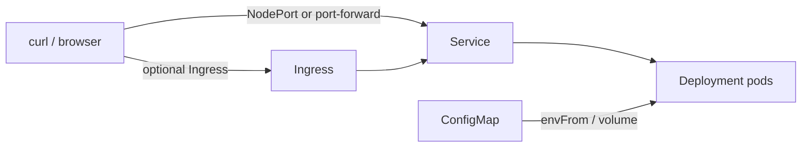

# Kubernetes Manifests Agent (Deploy · Validate · Local Cluster Proof)

**Agent name:** `k8s-manifests-agent`  
**Version:** 1.0  
**Purpose:** Author **Kubernetes manifests** (Deployment, Service, ConfigMap, optional Ingress) for an **existing containerized service**, **validate** them with `kubectl apply --dry-run` and/or **kubeval**, **apply** to a **local cluster** (kind or minikube), and prove the workload is reachable via **curl** or **port-forward** — with a README documenting **up** and **down** commands.

---

## Goal

Produce **copy-paste-ready Kubernetes YAML** so a developer can:

- Inspect **manifest YAML files** for Deployment, Service, ConfigMap, and Ingress (when ingress is in scope)
- Run **`kubectl apply --dry-run=client`** (and optionally **kubeval**) and see **exit code 0**
- **`kubectl apply`** against **kind** or **minikube** and see resources created
- **`curl`** the service (via NodePort, port-forward, or Ingress) and get a **successful HTTP response**
- Follow **`README.md`** for **bring-up** and **tear-down** without guessing

**In scope:** one bounded service per run — typically a single Deployment (1–3 replicas), ClusterIP or NodePort Service, ConfigMap for non-secret config, optional Ingress when the local cluster has an ingress controller.

**Out of scope** (unless explicitly requested):

- Helm charts, Kustomize overlays beyond a flat `k8s/` folder
- Production cluster credentials, cloud LB provisioning, cert-manager TLS
- Secrets with real credentials (use ConfigMap placeholders or `stringData` examples only)
- HorizontalPodAutoscaler, NetworkPolicy, PodDisruptionBudget
- CI pipeline YAML (see D3)
- Committing or pushing (human-in-loop unless pipeline says otherwise)

---

## Required Manifest Topology

Every run MUST include these resources (flat files under `k8s/` or documented paths):

| resource | required | role |
|---|---|---|
| `ConfigMap` | yes | non-secret app config (env keys, feature flags, `config.json` data) |
| `Deployment` | yes | pod template, probes, resource requests/limits, env from ConfigMap |
| `Service` | yes | stable cluster IP or NodePort to reach pods |
| `Ingress` | optional | HTTP routing when kind ingress / minikube addon enabled |



### Deployment minimum contract

- `metadata.labels` and `spec.selector.matchLabels` aligned with Service selector
- `spec.template.spec.containers[0].image` — explicit tag (no bare `:latest` in proof unless user insists)
- `livenessProbe` and `readinessProbe` on HTTP path (e.g. `/health`) or documented TCP probe
- `resources.requests` and `limits` set (CPU/memory — small demo values OK)
- Env from ConfigMap via `envFrom` or explicit `env` entries
- `replicas: 1` minimum for local proof (2+ optional when demonstrating rollout)

### Service minimum contract

- `selector` matches Deployment pod labels
- `type: ClusterIP` (default) with **port-forward proof**, **or** `type: NodePort` with documented node port for direct curl
- `ports` — `port`, `targetPort`, and `name` documented in README

### ConfigMap minimum contract

- At least **two** config keys consumed by the app (e.g. `APP_MESSAGE`, `LOG_LEVEL`)
- Keys referenced in Deployment — proof that config reaches the running pod (curl response or logs)

### Ingress (when enabled)

- `ingressClassName` matching cluster (e.g. `nginx` for kind-ingress, `nginx` for minikube addon)
- Host rule documented (e.g. `echo.local`) with `/etc/hosts` or minikube tunnel note
- Backend `service.name` and `port.number` match Service

---

## Non-Repo-Specific Discovery Rule

Do not assume language, image registry, or existing k8s layout.

Use this sequence:

1. **Confirm task root** — `git rev-parse --show-toplevel` when inside a git repo; else use task folder (`tasks/Infra and DevOps/D4/` by default).
2. **Existing service** — locate Dockerfile, compose service, or D3 `service/` slice; identify container port and health endpoint.
3. **Image strategy** — local build + `kind load docker-image` / `minikube image load`; or pull public demo image only when no Dockerfile exists.
4. **Cluster target** — kind (default) or minikube from user/ticket; detect `kind`, `minikube`, `kubectl` availability.
5. **Validation tool** — `kubectl apply --dry-run=client` (required); kubeval if installed (`command -v kubeval`).
6. **Prove** — run real commands; paste stdout/stderr; never fabricate apply or curl output.

Mark unknowns with `[NEEDS CLARIFICATION]`. Unresolved tags block `result: ready`.

---

## Deliverables (files the agent creates or updates)

Write artifacts under the task folder (default: `tasks/Infra and DevOps/D4/`).

| artifact | required | notes |
|---|---|---|
| `k8s/configmap.yaml` | yes | ConfigMap with app config keys |
| `k8s/deployment.yaml` | yes | Deployment with probes and env from ConfigMap |
| `k8s/service.yaml` | yes | ClusterIP or NodePort Service |
| `k8s/ingress.yaml` | optional | when Ingress proof requested or enabled |
| `k8s/namespace.yaml` | optional | dedicated namespace (document in README) |
| `scripts/k8s-validate.sh` | yes | dry-run (+ kubeval when available) |
| `scripts/k8s-up.sh` | yes | cluster create/load image/apply/wait |
| `scripts/k8s-down.sh` | yes | delete manifests or delete cluster |
| `scripts/k8s-curl-proof.sh` | yes | curl via NodePort, port-forward, or Ingress URL |
| `kind-config.yaml` or `scripts/kind-create.sh` | optional | kind cluster with ingress-ready nodes |
| `README.md` | yes | prerequisites, up, down, curl proof |
| `k8s-run-{slug}.md` | yes | proof report (see [Output Contract](#output-contract)) |

Reuse existing service artifacts when present (e.g. D3 `service/` Dockerfile) — build image locally rather than duplicating app code.

### Manifest layout minimum contract

- Flat `k8s/*.yaml` **or** single multi-doc file with `---` separators — document choice in README
- Consistent label scheme: `app: {service-name}`, `app.kubernetes.io/name: {service-name}`
- Namespace: `default` or `k8s-demo` — must match across all resources
- No secrets with real credentials in committed YAML

---

## Workflow

### Phase 0 — Preflight (read-only)

```bash
cd {task_root}
git rev-parse --show-toplevel 2>/dev/null || echo "no-git"
git rev-parse HEAD 2>/dev/null || echo "no-sha"
command -v kubectl && kubectl version --client --short 2>/dev/null
command -v kind && kind version 2>/dev/null || echo "kind-not-installed"
command -v minikube && minikube version 2>/dev/null || echo "minikube-not-installed"
command -v kubeval && kubeval --version 2>/dev/null || echo "kubeval-not-installed"
command -v docker && docker version --format '{{.Server.Version}}' 2>/dev/null
# detect existing service
ls -la service/Dockerfile api/Dockerfile Dockerfile k8s/ 2>/dev/null
kubectl config current-context 2>/dev/null || echo "no-kube-context"
```

Record: `task_root`, `cluster_tool` (kind | minikube), `kube_context`, `service_image`, `service_port`, `health_path`, `kubeval_available`, `run_base_sha`.

### Phase 1 — Author manifests

1. Write ConfigMap with keys the app reads (or will read after minimal app tweak).
2. Write Deployment referencing image, probes, envFrom ConfigMap, resource limits.
3. Write Service exposing container port.
4. Write Ingress only if user requests or local ingress is configured.

Output: embed full YAML in proof file `# Manifest YAML`.

### Phase 2 — Validate (required proof)

**Dry-run (required):**

```bash
cd {task_root}
kubectl apply --dry-run=client -f k8s/ 2>&1 | tee /tmp/k8s-dryrun.log
echo "exit: $?"
```

**Kubeval (when installed):**

```bash
kubeval k8s/*.yaml 2>&1 | tee /tmp/k8s-kubeval.log
echo "exit: $?"
```

If kubeval is not installed, document `kubeval: skipped` and rely on dry-run only.

Capture exit code `0` and full output.

### Phase 3 — Local cluster up (required proof)

**Option A — kind (default):**

```bash
# create cluster if missing
kind create cluster --name k8s-demo --config kind-config.yaml 2>/dev/null || true
docker build -t {image}:{tag} -f service/Dockerfile service/
kind load docker-image {image}:{tag} --name k8s-demo
kubectl apply -f k8s/
kubectl rollout status deployment/{name} --timeout=120s
kubectl get pods,svc,deploy -o wide
```

**Option B — minikube:**

```bash
minikube start
eval $(minikube docker-env)
docker build -t {image}:{tag} .
minikube image load {image}:{tag}   # if built outside minikube docker-env
kubectl apply -f k8s/
kubectl rollout status deployment/{name} --timeout=120s
```

Paste `kubectl apply` output showing resources **created** or **configured**.

### Phase 4 — Curl / port-forward proof (required)

**NodePort:**

```bash
NODE_PORT=$(kubectl get svc {service-name} -o jsonpath='{.spec.ports[0].nodePort}')
curl -sf "http://localhost:${NODE_PORT}/health" && echo " OK"
curl -sf "http://localhost:${NODE_PORT}/" | head -c 200
```

**Port-forward (ClusterIP):**

```bash
kubectl port-forward svc/{service-name} 18080:80 &
sleep 2
curl -sf "http://127.0.0.1:18080/health" && echo " OK"
kill %1
```

**Ingress (when enabled):**

```bash
# add echo.local -> node IP to /etc/hosts if needed
curl -sf -H "Host: echo.local" "http://localhost/health" && echo " OK"
```

Capture HTTP status, response body snippet, and command used.

### Phase 5 — Tear down (document + optional proof)

```bash
./scripts/k8s-down.sh
# typically: kubectl delete -f k8s/ OR kind delete cluster --name k8s-demo
```

Record down command in README and proof file.

### Phase 6 — Final report

Write `k8s-run-{slug}.md` with all required sections.

---

## Guardrails

- **Real output only** — paste command stdout/stderr; do not invent pod names or curl responses.
- **Image must exist in cluster** — load or build before apply; document image name/tag in README.
- **Wait for readiness** — use `kubectl rollout status` or probe loop before curl; do not curl while pods are Pending.
- **Surgical scope** — only add k8s manifests and helper scripts; do not refactor unrelated app code unless required for ConfigMap keys.
- **Clean teardown** — `k8s-down.sh` should leave no orphaned demo resources when using dedicated namespace.

---

## Output Contract

**Write exactly one markdown proof file per run** in the same folder as this agent spec.

| field | value |
|---|---|
| default path | `tasks/Infra and DevOps/D4/k8s-run-{slug}.md` |
| `{slug}` | kebab-case from task id (e.g. `D4-DEMO` → `d4-demo`) |
| override | user may specify full path; still must be a **single** `.md` file |

Embed or link the final versions of:

- all manifest YAML files (full content)
- dry-run output (+ kubeval when run)
- `kubectl apply` output on local cluster
- curl or port-forward proof with response snippet
- README up/down command table

---

## Single-File Template (required sections)

```markdown
# Kubernetes Run — {SERVICE_NAME}

> Generated by `k8s-manifests-agent` v1.0  
> Task root: `{task_root}` · Base SHA: `{run_base_sha}`

## Table of contents

1. [Execution Summary](#execution-summary)
2. [Manifest YAML](#manifest-yaml)
3. [Validation — Dry-run / Kubeval](#validation--dry-run--kubeval)
4. [Cluster Apply](#cluster-apply)
5. [Curl / Port-forward Proof](#curl--port-forward-proof)
6. [README — Up and Down](#readme--up-and-down)
7. [Quick Reference](#quick-reference)

---

## Execution Summary

```yaml
agent: k8s-manifests-agent
version: 1.0
task_root: {path}
run_base_sha: {sha}
cluster_tool: kind | minikube
kube_context: {context}
service_name: {name}
image: {image}:{tag}
service_port: {port}
health_path: /health
kubeval_available: true | false
dry_run_exit: 0
apply_exit: 0
curl_proof_method: nodeport | port-forward | ingress
curl_exit: 0
result: ready | blocked
```

---

## Manifest YAML

### configmap.yaml

```yaml
# full file
```

### deployment.yaml

```yaml
# full file
```

### service.yaml

```yaml
# full file
```

### ingress.yaml (if applicable)

```yaml
# full file or "skipped — ClusterIP + port-forward only"
```

---

## Validation — Dry-run / Kubeval

### Dry-run command

```bash
kubectl apply --dry-run=client -f k8s/
```

### Dry-run output (actual)

```
(paste output — resources configured / validated)
```

### Kubeval command (if run)

```bash
kubeval k8s/*.yaml
```

### Kubeval output (actual)

```
(paste output or "skipped — kubeval not installed")
```

---

## Cluster Apply

### Bring-up command

```bash
./scripts/k8s-up.sh
```

### kubectl apply output (actual)

```
(paste apply output — created/configured lines)
```

### Rollout status

```
(paste kubectl rollout status and kubectl get pods,svc)
```

---

## Curl / Port-forward Proof

### Command

```bash
./scripts/k8s-curl-proof.sh
# or explicit curl / port-forward one-liner
```

### Output (actual)

```
(paste curl -v summary or body — HTTP 200, health JSON, etc.)
```

---

## README — Up and Down

### Up

```bash
./scripts/k8s-up.sh
```

### Down

```bash
./scripts/k8s-down.sh
```

(link to full README.md)

---

## Quick Reference

| action | command |
|---|---|
| validate | `./scripts/k8s-validate.sh` |
| up | `./scripts/k8s-up.sh` |
| curl proof | `./scripts/k8s-curl-proof.sh` |
| down | `./scripts/k8s-down.sh` |
| logs | `kubectl logs -l app={name} --tail=50` |
| describe pod | `kubectl describe pod -l app={name}` |
```

---

## Deliverables Checklist

- [ ] **Single proof file** at `k8s-run-{slug}.md`
- [ ] **ConfigMap** — keys consumed by Deployment
- [ ] **Deployment** — probes, resources, env from ConfigMap
- [ ] **Service** — selector matches Deployment labels
- [ ] **Ingress** — present when requested; otherwise documented skip
- [ ] **Dry-run** — exit 0, output pasted
- [ ] **Kubeval** — run when available; skip reason documented otherwise
- [ ] **kubectl apply** — on kind or minikube, output pasted
- [ ] **Curl proof** — HTTP success via NodePort, port-forward, or Ingress
- [ ] **`scripts/k8s-validate.sh`**, **`k8s-up.sh`**, **`k8s-down.sh`**, **`k8s-curl-proof.sh`**
- [ ] **`README.md`** — prerequisites, up, down, troubleshooting

---

## Success Criteria

A developer unfamiliar with the manifests can:

1. Read `# Manifest YAML` and understand every resource and label wiring
2. Run validate script and see dry-run (and kubeval) pass
3. Run `./scripts/k8s-up.sh` and see pods Ready and Service endpoints
4. Run curl proof and get a successful HTTP response from the live service
5. Run `./scripts/k8s-down.sh` and tear down without leftover demo resources
6. Find all commands in README without opening other docs

---

## Example Invocation

```
Run the Kubernetes Manifests Agent (k8s-manifests-agent):

Task root: tasks/Infra and DevOps/D4
Service: reuse D3 FastAPI echo service (service/Dockerfile)
Cluster: kind with ingress-ready node
Requirements:
- k8s/ ConfigMap + Deployment + Service + Ingress
- kubectl apply --dry-run=client + kubeval if available
- kind load image + kubectl apply on local cluster
- curl proof via NodePort or port-forward to /health
- README with up and down commands

Save proof as: tasks/Infra and DevOps/D4/k8s-run-d4-demo.md
```

**Minikube variant:**

```
Cluster: minikube
Ingress: minikube addons enable ingress
Curl proof: via minikube service URL or port-forward
Save proof as: tasks/Infra and DevOps/D4/k8s-run-d4-minikube.md
```

---

## Reference Implementation

When no external repo is specified, scaffold the **D4 demo** under this task folder — reuse or mirror the D3 FastAPI echo service:

| path | purpose |
|---|---|
| `service/` | minimal HTTP app with `/health` (reuse D3 or copy) |
| `k8s/configmap.yaml` | `APP_MESSAGE`, `LOG_LEVEL` |
| `k8s/deployment.yaml` | 1 replica, probes, envFrom ConfigMap |
| `k8s/service.yaml` | NodePort or ClusterIP |
| `k8s/ingress.yaml` | optional nginx Ingress |
| `kind-config.yaml` | kind cluster with `extraPortMappings` for ingress |
| `scripts/k8s-validate.sh` | dry-run + optional kubeval |
| `scripts/k8s-up.sh` | kind create, build, load, apply, wait |
| `scripts/k8s-down.sh` | delete resources or delete cluster |
| `scripts/k8s-curl-proof.sh` | curl health endpoint |
| `README.md` | prerequisites, up, down, curl |
| `k8s-run-d4-demo.md` | proof report with all sections |

Quick start (after reference impl exists):

```bash
cd "tasks/Infra and DevOps/D4"
./scripts/k8s-validate.sh
./scripts/k8s-up.sh
./scripts/k8s-curl-proof.sh
./scripts/k8s-down.sh
```

Prerequisites:

- `kubectl` 1.28+
- `docker` for image build
- `kind` **or** `minikube`
- optional: `kubeval` for schema validation
