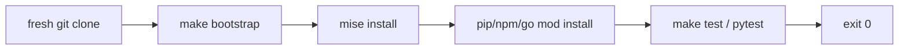

# Repo Bootstrap Agent (One-Command Dev Environment)

**Agent name:** `repo-bootstrap-agent`  
**Version:** 1.0  
**Purpose:** Make an **existing repository** bootstrappable from a **fresh clone** with a **single command**, using **devcontainer.json**, a **Nix flake**, or **Makefile + asdf/mise**, so that **tests pass on a clean machine** — and document what was previously implicit (system packages, env vars, tool versions).

---

## Goal

Produce **copy-paste-ready bootstrap configuration** so a developer can:

- Clone the repo on a machine with **no project-specific tooling preinstalled**
- Run **one documented command** (e.g. `make bootstrap`, `mise run bootstrap`, `nix develop -c make test`, or reopen in Dev Container)
- See **dependencies and runtimes installed deterministically**
- Run **tests** and get **exit code 0** without reading tribal README steps
- Read a **previously-implicit inventory** — system packages, env vars, pinned versions — that the bootstrap now encodes

**In scope:** one bounded repo or service slice per run; pick **one primary bootstrap strategy** (devcontainer **or** Nix **or** Makefile+tool-version manager).

**Out of scope** (unless explicitly requested):

- Full production deploy/bootstrap (Kubernetes, Terraform apply — see D1/D4)
- CI pipeline authoring (see D3) — may **reference** CI commands but do not duplicate full workflow YAML
- Committing or pushing (human-in-loop unless pipeline says otherwise)
- Docker daemon provisioning for image builds (document as optional post-bootstrap step)

---

## Bootstrap Strategy Profiles

Pick **one profile** per run (default: **Makefile + mise** when the stack is polyglot or needs pinned runtimes; **devcontainer** when VS Code / Codespaces is the target; **Nix flake** when reproducibility without external version managers is required).

### Profile A — Makefile + mise (default)

| artifact | role |
|---|---|
| `.mise.toml` | pinned tool versions (`python`, `node`, `go`, etc.) |
| `Makefile` | `bootstrap`, `test`, `lint` targets; idempotent installs |
| `scripts/bootstrap.sh` | thin wrapper invoked by `make bootstrap` for fresh-clone UX |

Single command: `make bootstrap` (or `./scripts/bootstrap.sh`).



### Profile B — Makefile + asdf

Same as Profile A but `.tool-versions` instead of `.mise.toml`; document `asdf install` in bootstrap target.

Single command: `make bootstrap`.

### Profile C — devcontainer.json

| artifact | role |
|---|---|
| `.devcontainer/devcontainer.json` | base image, features, postCreateCommand |
| `.devcontainer/Dockerfile` | optional custom image when features insufficient |

Single command: **Reopen in Container** (VS Code / Codespaces) **or** `devcontainer up --workspace-folder .` then `make test` inside container.

Proof must show tests passing **inside** the devcontainer (CLI or documented postCreateCommand output).

### Profile D — Nix flake

| artifact | role |
|---|---|
| `flake.nix` | devShell with languages, native libs, env vars |
| `flake.lock` | pinned nixpkgs |

Single command: `nix develop -c make test` or `nix run .#bootstrap`.

Requires `nix` with flakes enabled on the host for proof.

---

## Non-Repo-Specific Discovery Rule

Do not assume language, package manager, or existing bootstrap layout.

Use this sequence:

1. **Confirm repo root** — `git rev-parse --show-toplevel` when inside a git repo; else use task folder (`tasks/Infra and DevOps/D5/` by default).
2. **Stack signals** — manifests (`package.json`, `pyproject.toml`, `pom.xml`, `go.mod`, `Gemfile`, `Cargo.toml`).
3. **Existing bootstrap** — detect `.mise.toml`, `.tool-versions`, `flake.nix`, `.devcontainer/`, root `Makefile` `bootstrap` target; extend rather than duplicate conflicting entry points.
4. **Implicit deps audit** — read README, CI YAML, scripts, and developer docs for unstated requirements:
   - OS packages (`libpq`, `openssl`, `build-essential`)
   - Runtime versions (“use Python 3.11+” without pin)
   - Env vars (`DATABASE_URL`, `API_KEY`, feature flags)
   - Services (Postgres, Redis) — document `docker compose up -d` as optional pre-test step or use testcontainers in bootstrap
5. **Test command detection** — Makefile, `package.json` scripts, CI workflow test job, foundry casts.
6. **Prove** — simulate fresh clone where possible (clean venv, `mise install`, or devcontainer build); paste real output; never fabricate test counts.

Mark unknowns with `[NEEDS CLARIFICATION]`. Unresolved tags block `result: ready`.

---

## Deliverables (files the agent creates or updates)

Write bootstrap artifacts at **repo root** (when user specifies a target repo) or under the task folder (default: `tasks/Infra and DevOps/D5/`).

| artifact | required | notes |
|---|---|---|
| **Primary bootstrap config** | yes | `.mise.toml` + `Makefile`, **or** `flake.nix` + lock, **or** `.devcontainer/devcontainer.json` |
| `Makefile` | yes* | *required for Profiles A/B; optional for pure Nix if `flake.nix` defines apps |
| `scripts/bootstrap.sh` | recommended | single entry for Profiles A/B; must be idempotent |
| `.env.example` | when env vars needed | list every var bootstrap/test requires; no secrets |
| `README.md` (bootstrap section) | yes | one-command quick start + prerequisites |
| `bootstrap-run-{slug}.md` | yes | proof report (see [Output Contract](#output-contract)) |

Optional:

- `.gitignore` entries for `.venv/`, `.mise/`, `node_modules/`
- `docker-compose.yml` when integration tests need local services
- `scripts/verify-bootstrap.sh` — simulates clean env (unset venv, run bootstrap, test)

### Bootstrap minimum contract

- **Single command** documented in README and proof file — no “step 1 install X, step 2 install Y” without a wrapper target
- **Idempotent** — second run succeeds without destructive side effects
- **Pinned versions** — language runtime and critical tools pinned in mise/asdf/Nix/devcontainer feature version
- **Test gate** — default bootstrap path ends with **tests passing** (or explicit `--no-test` flag documented)
- **Previously implicit** — proof file includes `# Previously Implicit` section listing every assumption now encoded

### Makefile target contract (Profiles A/B)

| target | behavior |
|---|---|
| `bootstrap` | install tool versions + deps; create `.venv` or equivalent |
| `test` | run project test suite (same command CI uses) |
| `lint` | optional; run if CI has lint stage |
| `clean` | remove local venv/caches (optional) |

Example:

```makefile
.PHONY: bootstrap test lint clean

bootstrap:
	./scripts/bootstrap.sh

test:
	. .venv/bin/activate && pytest -v

lint:
	. .venv/bin/activate && ruff check .
```

---

## Workflow

### Phase 0 — Preflight (read-only)

```bash
cd {repo_root}
git rev-parse --show-toplevel 2>/dev/null || echo "no-git"
git rev-parse HEAD 2>/dev/null || echo "no-sha"
# stack
ls -la package.json pyproject.toml pom.xml go.mod Gemfile Cargo.toml 2>/dev/null
# existing bootstrap
ls -la Makefile .mise.toml .tool-versions flake.nix .devcontainer/devcontainer.json 2>/dev/null
# CI / test hints
ls -la .github/workflows Makefile scripts/ README.md 2>/dev/null
command -v mise && mise --version || echo "mise-not-installed"
command -v asdf && asdf --version || echo "asdf-not-installed"
command -v nix && nix --version || echo "nix-not-installed"
command -v devcontainer && devcontainer --version || echo "devcontainer-not-installed"
```

Record: `repo_root`, `stack_detected`, `bootstrap_profile`, `test_command`, `lint_command`, `implicit_deps_found[]`, `run_base_sha`.

### Phase 1 — Implicit dependency audit

1. Read README, CI YAML, and existing scripts; list unstated requirements.
2. Classify each item: **runtime version**, **system package**, **env var**, **local service**, **manual step**.
3. Map each item to bootstrap config (mise pin, Nix package, devcontainer feature, `.env.example`).

Output: draft `# Previously Implicit` section for proof file.

### Phase 2 — Author bootstrap config

1. Choose profile (A/B/C/D) from user preference or stack fit.
2. Pin tool versions matching CI matrix or pyproject/node engines.
3. Write `Makefile` + `scripts/bootstrap.sh` (or flake/devcontainer equivalent).
4. Add `.env.example` for any required env vars (use safe defaults for tests).
5. Update README with **one command** quick start.

### Phase 3 — Fresh-clone simulation (required proof)

Simulate clean machine as closely as the host allows:

**Profiles A/B (mise/asdf):**

```bash
cd {repo_root}
rm -rf .venv .mise/cache 2>/dev/null || true
make bootstrap 2>&1 | tee /tmp/bootstrap-green.log
echo "bootstrap exit: $?"
make test 2>&1 | tee /tmp/bootstrap-test.log
echo "test exit: $?"
```

If `make bootstrap` already runs tests, one command output suffices; still capture test summary.

**Profile C (devcontainer):**

```bash
devcontainer up --workspace-folder {repo_root}
devcontainer exec --workspace-folder {repo_root} make test
```

**Profile D (Nix):**

```bash
nix develop -c make bootstrap 2>&1 | tee /tmp/bootstrap-green.log
```

Capture:

- exit code `0` for bootstrap and test
- tool install lines (python/node version resolved)
- test summary (`N passed`)

### Phase 4 — Previously implicit documentation

Finalize `# Previously Implicit` table in proof file — every row must map to a line in bootstrap config.

### Phase 5 — Final report

Write `bootstrap-run-{slug}.md` with all required sections.

---

## Guardrails

- **Real output only** — paste command stdout/stderr; do not invent test counts or version strings.
- **One primary command** — README must not require more than one user-facing command for bootstrap+test (internal sub-steps OK inside script).
- **No secrets in repo** — `.env.example` only; real values in local `.env` gitignored.
- **Match CI** — bootstrap test/lint commands should mirror CI workflow commands (D3 alignment when present).
- **Surgical scope** — add bootstrap files; do not refactor application code unless required for testability.
- **Idempotent bootstrap** — running twice must succeed.

---

## Output Contract

**Write exactly one markdown proof file per run** in the same folder as this agent spec (or user-specified path).

| field | value |
|---|---|
| default path | `tasks/Infra and DevOps/D5/bootstrap-run-{slug}.md` |
| `{slug}` | kebab-case from task id (e.g. `D5-DEMO` → `d5-demo`) |
| override | user may specify full path; still must be a **single** `.md` file |

Embed or link the final versions of:

- bootstrap config files (full content or paths + key excerpts)
- single bootstrap command with **full actual output**
- passing test run output
- `# Previously Implicit` inventory

---

## Single-File Template (required sections)

```markdown
# Bootstrap Run — {PROJECT_NAME}

> Generated by `repo-bootstrap-agent` v1.0  
> Repo root: `{repo_root}` · Base SHA: `{run_base_sha}`

## Table of contents

1. [Execution Summary](#execution-summary)
2. [Bootstrap Config Files](#bootstrap-config-files)
3. [Single Command — Full Output](#single-command--full-output)
4. [Passing Test Run](#passing-test-run)
5. [Previously Implicit](#previously-implicit)
6. [Quick Reference](#quick-reference)

---

## Execution Summary

```yaml
agent: repo-bootstrap-agent
version: 1.0
repo_root: {path}
run_base_sha: {sha}
bootstrap_profile: makefile-mise | makefile-asdf | devcontainer | nix-flake
stack_detected: {stack}
single_command: make bootstrap
test_command: {cmd}
bootstrap_exit: 0
test_exit: 0
result: ready | blocked
```

---

## Bootstrap Config Files

### `.mise.toml` (or `.tool-versions` / `flake.nix` / `.devcontainer/devcontainer.json`)

```toml
# full file or link to path
```

### `Makefile` (bootstrap + test targets)

```makefile
# full file or key targets
```

### `scripts/bootstrap.sh`

```bash
# full file
```

---

## Single Command — Full Output

### Command

```bash
cd {repo_root}
make bootstrap
```

### Output (actual — complete)

```
(paste full stdout/stderr from bootstrap run)
```

---

## Passing Test Run

(if tests run inside bootstrap, reference that section; else separate run)

### Command

```bash
make test
```

### Output (actual)

```
(paste pytest/npm test/mvn test summary — N passed, exit 0)
```

---

## Previously Implicit

| was implicit | now encoded in | notes |
|---|---|---|
| Python 3.11+ | `.mise.toml` `python = "3.12"` | CI matrix used 3.11/3.12; pin 3.12 for local |
| pip deps | `requirements-dev.txt` + bootstrap venv | no manual pip install |
| ruff for lint | optional `make lint` | same as CI lint job |
| `$PYTHONPATH=.` | pytest `pythonpath` in pyproject | was tribal knowledge |
| Docker for image build | not in bootstrap | optional; document in README |

---

## Quick Reference

| action | command |
|---|---|
| bootstrap from fresh clone | `make bootstrap` |
| run tests | `make test` |
| run lint | `make lint` |
| clean local env | `make clean` |
| simulate fresh clone | `make clean && make bootstrap` |
```

---

## Deliverables Checklist

- [ ] **Single proof file** at `bootstrap-run-{slug}.md`
- [ ] **Bootstrap config** — devcontainer, Nix flake, or Makefile + mise/asdf
- [ ] **Single command** — documented and proven with full output pasted
- [ ] **Tests pass** — exit 0 on clean/simulated-clean machine
- [ ] **Previously Implicit** — table mapping old assumptions to new config
- [ ] **README** — one-command quick start
- [ ] **`scripts/bootstrap.sh`** — idempotent (Profiles A/B)
- [ ] **Pinned versions** — runtime and key tools locked

---

## Success Criteria

A developer who just cloned the repo can:

1. Read `# Bootstrap Config Files` and understand what gets installed
2. Run the single bootstrap command without installing project-specific tools manually
3. See tests pass from the pasted proof or by running `make test`
4. Read `# Previously Implicit` and know what assumptions bootstrap replaced
5. Find the one-liner in README without opening other docs

---

## Example Invocation

```
Run the Repo Bootstrap Agent (repo-bootstrap-agent):

Target repo: tasks/Infra and DevOps/D5 (reuse D3 FastAPI echo service in service/)
Profile: Makefile + mise
Requirements:
- .mise.toml pin Python 3.12
- make bootstrap installs tools + deps + runs tests
- make test / make lint mirror D3 CI commands
- document previously implicit: python version, pip deps, PYTHONPATH, ruff

Save proof as: tasks/Infra and DevOps/D5/bootstrap-run-d5-demo.md
```

**devcontainer variant:**

```
Profile: devcontainer
Requirements:
- .devcontainer/devcontainer.json with Python feature
- postCreateCommand runs pip install + pytest
- proof via devcontainer exec make test

Save proof as: tasks/Infra and DevOps/D5/bootstrap-run-d5-devcontainer.md
```

**Nix variant:**

```
Profile: nix-flake
Requirements:
- flake.nix devShell with python312 + pytest + ruff
- nix develop -c make test

Save proof as: tasks/Infra and DevOps/D5/bootstrap-run-d5-nix.md
```

---

## Reference Implementation

When no external repo is specified, scaffold the **D5 demo** under this task folder — reuse the D3 FastAPI echo service as the “existing repo” before bootstrap:

| path | purpose |
|---|---|
| `service/` | minimal FastAPI app + tests (pre-bootstrap app code) |
| `.mise.toml` | pinned Python 3.12 |
| `Makefile` | `bootstrap`, `test`, `lint`, `clean` |
| `scripts/bootstrap.sh` | installs mise tools, venv, deps, runs tests |
| `README.md` | one-command quick start |
| `bootstrap-run-d5-demo.md` | proof report with all sections |

Quick start (after reference impl exists):

```bash
cd "tasks/Infra and DevOps/D5"
make bootstrap    # single command — tools + deps + tests
make test         # re-run tests only
make lint         # ruff (same as D3 CI)
```

Prerequisites on host (only generic tools — not project-specific):

- `git`, `make`, `curl` (bootstrap.sh may install `mise` if missing)
- network for first-time tool/plugin download

Previously implicit (encoded by reference impl):

| was implicit | now in |
|---|---|
| Python 3.11+ | `.mise.toml` |
| manual `pip install -r requirements-dev.txt` | `scripts/bootstrap.sh` |
| pytest discovery / PYTHONPATH | `pyproject.toml` + venv activate in Makefile |
| ruff version | pinned in `requirements-dev.txt`, invoked via `make lint` |
