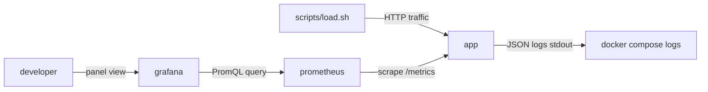

# Observability Stack Agent (Structured Logs · Metrics · Prometheus · Grafana)

**Agent name:** `observability-stack-agent`  
**Version:** 1.0  
**Purpose:** Instrument a **small HTTP service** with **structured logging** and a **`/metrics` Prometheus endpoint**, stand up a **Prometheus + Grafana** Docker Compose stack with **provisioned datasource and dashboard**, generate **real traffic** via a load script, and prove **one live dashboard panel** reflects that traffic — with a README documenting **run order**.

---

## Goal

Produce a **copy-paste-ready observability slice** so a developer can:

- Inspect a **code diff** that adds JSON structured logs and Prometheus metrics to an existing or scaffolded service
- Run **`docker compose up`** and get the app, Prometheus, and Grafana healthy on a shared network
- See Prometheus **scrape the app** at `/metrics` (targets UP in UI or `prometheus/query` API)
- Open Grafana with a **pre-provisioned datasource** pointing at Prometheus and **one dashboard panel** (e.g. request rate or latency p95)
- Run a **load script** that generates sustained HTTP traffic against the app
- View **live data** in the panel — captured as a **screenshot** or **Grafana panel JSON / query API response**
- Follow **`README.md`** for exact **run order** (app → observability stack → load → verify)

**In scope:** one bounded HTTP service per run — typically FastAPI, Express, or Go `net/http` echo/health API reused from D3/D5 `service/`.

**Out of scope** (unless explicitly requested):

- Production-grade tracing (OpenTelemetry, Jaeger, Tempo)
- Alertmanager, Loki, or log aggregation pipelines
- Kubernetes ServiceMonitor / PodMonitor (see D4)
- Multi-service RED dashboards across many microservices
- Committing or pushing (human-in-loop unless pipeline says otherwise)
- Vendor/generated folders (`node_modules`, `.venv`, `grafana/data`)

---

## Required Observability Topology

Every run MUST wire these components:

| component | role | must expose |
|---|---|---|
| `app` | instrumented HTTP service | host port (e.g. `8080`), `/health`, `/metrics`, JSON logs on stdout |
| `prometheus` | scrape + store metrics | host port `9090`, scrape config for `app:8080/metrics` |
| `grafana` | visualize metrics | host port `3000`, provisioned Prometheus datasource + dashboard |



### Structured logging contract

Logs MUST be **JSON lines** on stdout (one object per line), parseable by `jq`:

| field | required | example |
|---|---|---|
| `timestamp` | yes | ISO-8601 UTC |
| `level` | yes | `INFO`, `WARN`, `ERROR` |
| `message` | yes | human-readable event |
| `method` | on HTTP | `GET`, `POST` |
| `path` | on HTTP | `/echo/hello` |
| `status_code` | on HTTP | `200` |
| `duration_ms` | on HTTP | `12.4` |
| `request_id` | recommended | UUID or short id per request |

**Minimum events logged:**

- application startup (service name, version, listen port)
- each HTTP request completion (method, path, status, duration)
- at least one error-path log when load script hits a 404 or invalid route (optional but recommended for demo)

**Stack-specific libraries (pick one, do not mix):**

| stack | logging approach |
|---|---|
| Python / FastAPI (default) | `structlog` or `python-json-logger` + middleware |
| Node / Express | `pino` or `winston` JSON transport |
| Go | `log/slog` JSON handler or `zerolog` |

### Metrics contract (`/metrics`)

Expose Prometheus text exposition format at **`GET /metrics`** (content-type `text/plain; version=0.0.4`).

**Required metrics** (names may use app prefix but MUST include these semantics):

| metric | type | labels | purpose |
|---|---|---|---|
| `http_requests_total` | counter | `method`, `path`, `status` | request count for dashboard |
| `http_request_duration_seconds` | histogram | `method`, `path` | latency panel (optional but recommended) |

Additional metrics (`process_*`, `python_gc_*`) from client libraries are fine — dashboard panel MUST query at least `http_requests_total` or a rate derived from it.

**Stack-specific clients:**

| stack | library |
|---|---|
| Python / FastAPI | `prometheus-client` + `prometheus-fastapi-instrumentator` or manual middleware |
| Node / Express | `prom-client` |
| Go | `prometheus/client_golang` |

`/health` MUST remain un-instrumented for high-cardinality path labels OR use a low-cardinality label (`path="/health"`) — document choice in README.

### Prometheus scrape contract

File: `prometheus/prometheus.yml` (or `observability/prometheus.yml`)

```yaml
global:
  scrape_interval: 15s
  evaluation_interval: 15s

scrape_configs:
  - job_name: app
    static_configs:
      - targets: ["app:8080"]
    metrics_path: /metrics
```

Proof MUST show target **UP** — via `curl http://localhost:9090/api/v1/targets` or Prometheus UI screenshot excerpt.

### Grafana provisioning contract

Use **file provisioning** (no manual UI clicks required for datasource or dashboard import):

| file | purpose |
|---|---|
| `grafana/provisioning/datasources/prometheus.yml` | auto-add Prometheus datasource |
| `grafana/provisioning/dashboards/default.yml` | dashboard provider pointing at `grafana/dashboards/` |
| `grafana/dashboards/app-overview.json` | dashboard with **≥1 panel** querying live metric |

**Datasource minimum:**

```yaml
apiVersion: 1
datasources:
  - name: Prometheus
    type: prometheus
    access: proxy
    url: http://prometheus:9090
    isDefault: true
    editable: false
```

**Dashboard panel minimum:**

- Title documents what it shows (e.g. `HTTP Request Rate`)
- PromQL example: `rate(http_requests_total[1m])` or `sum(rate(http_requests_total[1m])) by (status)`
- Panel type: `timeseries` or `stat` with `refresh` enabled
- Time range covers load-test window

---

## Non-Repo-Specific Discovery Rule

Do not assume language, existing metrics, or compose layout.

Use this sequence:

1. **Confirm task root** — `git rev-parse --show-toplevel` when inside a git repo; else use task folder (`tasks/Infra and DevOps/D6/` by default).
2. **Existing service** — locate D3/D5 `service/`, D2 `api/`, or standalone FastAPI/Express app; identify port and routes (`/health`, `/echo/{message}`).
3. **Instrumentation baseline** — check for existing logging/metrics; extend surgically (Article VII — observability-only diff).
4. **Compose strategy** — single `docker-compose.yml` with `app`, `prometheus`, `grafana` **or** split `docker-compose.observability.yml` overlay; document one primary up command.
5. **Prove** — run real commands; paste stdout, curl output, or Grafana API JSON; never fabricate scrape or panel data.

Mark unknowns with `[NEEDS CLARIFICATION]`. Unresolved tags block `result: ready`.

---

## Deliverables (files the agent creates or updates)

Write artifacts under the task folder (default: `tasks/Infra and DevOps/D6/`).

| artifact | required | notes |
|---|---|---|
| **Service code diff** | yes | structured logging + `/metrics` — show as unified diff or before/after in proof file |
| `service/app/main.py` (or equivalent) | yes | instrumented app entrypoint |
| `service/requirements.txt` | yes | include metrics/logging deps |
| `docker-compose.yml` | yes | `app`, `prometheus`, `grafana` on shared network |
| `prometheus/prometheus.yml` | yes | scrape config for app |
| `grafana/provisioning/datasources/prometheus.yml` | yes | provisioned datasource |
| `grafana/provisioning/dashboards/default.yml` | yes | dashboard file provider |
| `grafana/dashboards/app-overview.json` | yes | ≥1 panel with PromQL |
| `scripts/load.sh` | yes | generates sustained HTTP traffic (curl loop, `hey`, or `wrk`) |
| `scripts/obs-up.sh` | yes | `compose up --build -d` + wait for health |
| `scripts/obs-down.sh` | yes | `compose down -v` |
| `scripts/verify-metrics.sh` | recommended | curl `/metrics`, assert counters increase after load |
| `README.md` | yes | **run order**, ports, URLs, teardown |
| `obs-run-{slug}.md` | yes | proof report (see [Output Contract](#output-contract)) |

Optional:

- `service/Dockerfile` — when app not already containerized (reuse D3 Dockerfile pattern)
- `grafana/dashboards/screenshots/panel-live.png` — screenshot artifact committed or linked from proof file
- `scripts/grafana-panel-json.sh` — fetch panel query result via Grafana HTTP API

### `docker-compose.yml` minimum contract

- Project `name:` key (e.g. `d6-obs-stack`)
- `app` builds from `service/` or `api/`; publishes `${APP_PORT:-8080}:8080`
- `prometheus` mounts `./prometheus/prometheus.yml`; publishes `9090:9090`
- `grafana` mounts provisioning + dashboards dirs; env `GF_SECURITY_ADMIN_USER/PASSWORD` (demo defaults documented); publishes `3000:3000`
- Shared network — all services resolve by service name
- `depends_on`: prometheus and grafana depend on app (or app starts first — document order in README)
- Healthchecks on `app` (`/health`) recommended

### Load script contract

`scripts/load.sh` MUST:

1. Accept optional `BASE_URL` (default `http://localhost:8080`)
2. Hit at least **two routes** (e.g. `/health` and `/echo/load-test`) for **≥30 seconds** or **≥100 requests**
3. Print summary (requests sent, errors if any)
4. Exit 0 on completion

Example pattern:

```bash
#!/usr/bin/env bash
set -euo pipefail
BASE_URL="${BASE_URL:-http://localhost:8080}"
for i in $(seq 1 120); do
  curl -sf "${BASE_URL}/health" >/dev/null
  curl -sf "${BASE_URL}/echo/load-${i}" >/dev/null
  sleep 0.25
done
echo "load complete: 240 requests"
```

Prefer `hey -z 30s` or `wrk -t2 -c10 -d30s` when installed — document in README.

---

## Workflow

### Phase 0 — Preflight (read-only)

```bash
cd {task_root}
git rev-parse --show-toplevel 2>/dev/null || echo "no-git"
git rev-parse HEAD 2>/dev/null || echo "no-sha"
# existing service
ls -la service/app/main.py api/app/main.py Dockerfile 2>/dev/null
# observability artifacts
ls -la docker-compose.yml prometheus/ grafana/ scripts/ 2>/dev/null
command -v docker && docker compose version
command -v curl && curl --version | head -1
command -v jq && jq --version || echo "jq-not-installed"
command -v hey && hey -version 2>/dev/null || echo "hey-not-installed"
```

Record: `task_root`, `stack_detected`, `app_port`, `base_routes[]`, `run_base_sha`, `pre_instrumentation_sha`.

### Phase 1 — Instrument service (structured logs + metrics)

1. Add logging middleware / handler — JSON stdout, request fields on each HTTP completion.
2. Add Prometheus client — expose `/metrics` with `http_requests_total` (+ histogram if used).
3. Keep `/health` behavior unchanged for probes.
4. Update deps (`requirements.txt`, `package.json`, etc.).
5. Capture **code diff** — `git diff service/` or embedded before/after blocks in proof file.

**Python / FastAPI reference diff shape:**

```diff
+import structlog
+from prometheus_client import Counter, Histogram, generate_latest
+from prometheus_fastapi_instrumentator import Instrumentator
+
+logger = structlog.get_logger()
+
+@app.on_event("startup")
+async def startup():
+    structlog.configure(processors=[structlog.processors.JSONRenderer()])
+    Instrumentator().instrument(app).expose(app, endpoint="/metrics")
```

Adapt to detected stack; do not copy blindly if middleware patterns differ.

### Phase 2 — Author observability compose stack

1. Write `prometheus/prometheus.yml` with app scrape target.
2. Write Grafana provisioning YAML + dashboard JSON with one working panel.
3. Write root `docker-compose.yml` wiring volumes and ports.
4. Write `scripts/obs-up.sh` and `scripts/obs-down.sh`.

### Phase 3 — Bring up stack (required proof)

```bash
cd {task_root}
./scripts/obs-up.sh 2>&1 | tee /tmp/obs-up.log
docker compose ps
curl -sf http://localhost:8080/health
curl -sf http://localhost:8080/metrics | head -20
curl -sf http://localhost:9090/-/ready
curl -sf http://localhost:3000/api/health
```

Capture: all services healthy, `/metrics` returns Prometheus text, Prometheus ready, Grafana ready.

### Phase 4 — Verify scrape + generate traffic

```bash
# prometheus target UP
curl -s http://localhost:9090/api/v1/targets | jq '.data.activeTargets[] | {job: .labels.job, health: .health}'

# generate traffic
./scripts/load.sh 2>&1 | tee /tmp/load.log

# metrics increased
curl -s http://localhost:8080/metrics | grep http_requests_total | head -5

# optional PromQL spot-check
curl -sG http://localhost:9090/api/v1/query \
  --data-urlencode 'query=sum(rate(http_requests_total[1m]))' | jq .
```

Wait **≥15s** after load for scrape interval before capturing panel data.

### Phase 5 — Capture live dashboard panel (required proof)

**Option A — Screenshot (preferred when GUI available):**

1. Open `http://localhost:3000` (admin/admin or documented creds).
2. Navigate to provisioned dashboard `App Overview`.
3. Set time range **Last 5 minutes**; confirm panel shows non-zero series.
4. Save screenshot to `grafana/dashboards/screenshots/panel-live.png` or attach to proof file.

**Option B — Grafana panel / query JSON (headless):**

```bash
# datasource uid from provisioning (often "prometheus")
curl -s -u admin:admin http://localhost:3000/api/datasources | jq .

# panel query via Grafana API or raw PromQL (acceptable proof)
curl -sG http://localhost:9090/api/v1/query \
  --data-urlencode 'query=sum(rate(http_requests_total[1m]))' \
  | jq '{status: .status, result: .data.result}' \
  > /tmp/panel-query-proof.json
```

Proof MUST show **non-empty `result`** after load (not all zero/null).

### Phase 6 — Structured log sample (required proof)

```bash
docker compose logs app --tail 30 2>&1 | tee /tmp/app-json-logs.log
docker compose logs app --tail 5 | jq -e . 2>/dev/null || echo "validate JSON lines manually"
```

Paste at least **3 JSON log lines** showing request fields.

### Phase 7 — Final report

Write `obs-run-{slug}.md` with all required sections.

Teardown (document in proof, run after capture):

```bash
./scripts/obs-down.sh
```

---

## README Run Order (required section)

`README.md` MUST document this exact sequence:

| step | command | expected outcome |
|---|---|---|
| 1 | `./scripts/obs-up.sh` | app, prometheus, grafana running |
| 2 | `curl http://localhost:8080/health` | `{"status":"ok"}` |
| 3 | `curl http://localhost:8080/metrics \| head` | Prometheus text with `http_requests_total` |
| 4 | Open `http://localhost:9090/targets` | `app` job **UP** |
| 5 | `./scripts/load.sh` | traffic generated, summary printed |
| 6 | Open `http://localhost:3000` → dashboard | panel shows live data |
| 7 | `docker compose logs app \| tail` | JSON request logs |
| 8 | `./scripts/obs-down.sh` | stack stopped, volumes removed |

Single happy-path one-liner optional: `./scripts/obs-up.sh && ./scripts/load.sh` then open Grafana.

---

## Guardrails

- **Real output only** — paste command stdout, curl responses, PromQL JSON; do not invent metric values or fake screenshots.
- **Surgical instrumentation** — touch only logging, metrics, deps, and compose/provisioning files; do not refactor business logic.
- **Low-cardinality labels** — avoid unbounded path labels (normalize `/echo/{id}` → `/echo/{message}` template or use `handler` label).
- **No secrets in repo** — Grafana demo password in compose env is OK when documented; no production credentials.
- **Provisioned, not manual** — datasource and dashboard MUST load on Grafana startup without UI import steps.
- **One panel minimum** — dashboard may have multiple panels; proof requires **one** clearly tied to load-test traffic.

---

## Output Contract

**Write exactly one markdown proof file per run** in the same folder as this agent spec (or user-specified path).

| field | value |
|---|---|
| default path | `tasks/Infra and DevOps/D6/obs-run-{slug}.md` |
| `{slug}` | kebab-case from task id (e.g. `D6-DEMO` → `d6-demo`) |
| override | user may specify full path; still must be a **single** `.md` file |

Embed or link:

- **code diff** (structured logging + metrics)
- full `docker-compose.yml` and provisioning files (or paths + key excerpts)
- load script output
- Prometheus target health JSON
- **screenshot** OR **panel query JSON** with non-empty results after load
- sample JSON log lines
- README run order table

---

## Single-File Template (required sections)

```markdown
# Observability Run — {PROJECT_NAME}

> Generated by `observability-stack-agent` v1.0  
> Task root: `{task_root}` · Base SHA: `{run_base_sha}`

## Table of contents

1. [Execution Summary](#execution-summary)
2. [Code Diff — Logs and Metrics](#code-diff--logs-and-metrics)
3. [Docker Compose and Provisioning](#docker-compose-and-provisioning)
4. [Stack Bring-Up](#stack-bring-up)
5. [Load Test](#load-test)
6. [Live Dashboard Panel](#live-dashboard-panel)
7. [Structured Log Samples](#structured-log-samples)
8. [Run Order (README)](#run-order-readme)
9. [Quick Reference](#quick-reference)

---

## Execution Summary

```yaml
agent: observability-stack-agent
version: 1.0
task_root: {path}
run_base_sha: {sha}
stack_detected: python-fastapi | node-express | go
app_port: 8080
prometheus_port: 9090
grafana_port: 3000
metrics_endpoint: /metrics
dashboard_title: App Overview
panel_promql: sum(rate(http_requests_total[1m]))
load_requests: {n}
prometheus_target_health: up
panel_has_live_data: true
result: ready | blocked
```

---

## Code Diff — Logs and Metrics

### Unified diff

```diff
(paste git diff service/ or equivalent)
```

### Key additions summary

| area | change |
|---|---|
| structured logging | JSON stdout via {library} |
| metrics | `/metrics` with http_requests_total + histogram |
| middleware | request duration + status labels |

---

## Docker Compose and Provisioning

### `docker-compose.yml`

```yaml
(full file or path reference)
```

### `prometheus/prometheus.yml`

```yaml
(full file)
```

### Grafana provisioning

- `grafana/provisioning/datasources/prometheus.yml`
- `grafana/provisioning/dashboards/default.yml`
- `grafana/dashboards/app-overview.json` — panel: `{panel title}`

---

## Stack Bring-Up

### Command

```bash
./scripts/obs-up.sh
```

### Output (actual)

```
(paste docker compose ps, health curls)
```

### Prometheus targets

```json
(paste curl .../api/v1/targets excerpt — job app health up)
```

---

## Load Test

### Command

```bash
./scripts/load.sh
```

### Output (actual)

```
(paste load summary)
```

### Metrics after load

```
(paste grep http_requests_total from curl /metrics)
```

---

## Live Dashboard Panel

### Option A — Screenshot


### Option B — Query JSON

```json
(paste PromQL query API or Grafana panel query result — non-empty result array)
```

---

## Structured Log Samples

```
(paste 3+ JSON log lines from docker compose logs app)
```

---

## Run Order (README)

| step | command | expected |
|---|---|---|
| 1 | `./scripts/obs-up.sh` | stack healthy |
| ... | ... | ... |

---

## Quick Reference

| action | command |
|---|---|
| start stack | `./scripts/obs-up.sh` |
| generate traffic | `./scripts/load.sh` |
| app metrics | `curl localhost:8080/metrics` |
| prometheus UI | http://localhost:9090 |
| grafana UI | http://localhost:3000 |
| app logs | `docker compose logs app -f` |
| stop stack | `./scripts/obs-down.sh` |
```

---

## Deliverables Checklist

- [ ] **Single proof file** at `obs-run-{slug}.md`
- [ ] **Code diff** — structured JSON logging + `/metrics` endpoint
- [ ] **docker-compose.yml** — app + prometheus + grafana
- [ ] **Prometheus scrape config** — app target, proven UP
- [ ] **Grafana provisioned datasource** — Prometheus auto-configured
- [ ] **Grafana dashboard JSON** — ≥1 panel with PromQL on `http_requests_total`
- [ ] **Load script** — sustained traffic against app routes
- [ ] **Live panel proof** — screenshot OR query JSON with non-empty data after load
- [ ] **JSON log samples** — request fields visible in compose logs
- [ ] **README** — explicit run order table

---

## Success Criteria

A developer can:

1. Read the **code diff** and understand what logging/metrics were added
2. Run `./scripts/obs-up.sh` and reach app, Prometheus, and Grafana without manual provisioning
3. Run `./scripts/load.sh` and see counters increase on `/metrics`
4. Open Grafana and see **one panel** reflecting live traffic (or trust screenshot/JSON in proof file)
5. Follow README **run order** without opening other docs
6. Tear down with `./scripts/obs-down.sh` and re-up for a repeatable demo

---

## Example Invocation

```
Run the Observability Stack Agent (observability-stack-agent):

Target: tasks/Infra and DevOps/D6
Reuse: D3 FastAPI echo service in service/ (or scaffold minimal app)
Requirements:
- structlog JSON logs on every request (method, path, status_code, duration_ms)
- GET /metrics with prometheus-client (http_requests_total + duration histogram)
- docker-compose: app, prometheus, grafana on shared network
- grafana provisioning: datasource + dashboard with one "HTTP Request Rate" timeseries panel
- scripts/load.sh — 30s sustained traffic to /health and /echo/{n}
- proof: obs-run-d6-demo.md with diff, compose files, load output, panel JSON or screenshot

Save proof as: tasks/Infra and DevOps/D6/obs-run-d6-demo.md
```

**Node / Express variant:**

```
Stack: Express + pino + prom-client
Same compose/provisioning layout; adapt instrumentation diff section.
Save proof as: tasks/Infra and DevOps/D6/obs-run-d6-express.md
```

**Existing D2 api variant:**

```
Instrument tasks/Infra and DevOps/D2/api instead of scaffolding new service.
Prometheus scrapes api:8080; load script hits D2 job API routes.
Save proof as: tasks/Infra and DevOps/D6/obs-run-d6-d2-api.md
```

---

## Reference Implementation

When no external repo is specified, scaffold the **D6 demo** under this task folder — extend the D3 FastAPI echo service:

| path | purpose |
|---|---|
| `service/` | instrumented FastAPI app (structlog + prometheus) |
| `service/Dockerfile` | container image for app (reuse D3 pattern) |
| `docker-compose.yml` | app + prometheus + grafana |
| `prometheus/prometheus.yml` | scrape `app:8080/metrics` |
| `grafana/provisioning/` | datasource + dashboard provider |
| `grafana/dashboards/app-overview.json` | one request-rate panel |
| `scripts/obs-up.sh`, `obs-down.sh`, `load.sh` | lifecycle + traffic |
| `README.md` | run order |
| `obs-run-d6-demo.md` | proof report with diff, JSON panel, log samples |

Quick start (after reference impl exists):

```bash
cd "tasks/Infra and DevOps/D6"
./scripts/obs-up.sh
./scripts/load.sh
open http://localhost:3000    # login admin/admin — App Overview dashboard
curl -s http://localhost:8080/metrics | grep http_requests_total
./scripts/obs-down.sh
```

Prerequisites on host:

- Docker with Compose v2
- `curl`, `jq` (recommended for log validation)
- optional: `hey` or `wrk` for heavier load

Default ports:

| service | port |
|---|---|
| app | 8080 |
| prometheus | 9090 |
| grafana | 3000 (admin/admin) |

Panel PromQL (reference):

```promql
sum(rate(http_requests_total[1m]))
```

Previously plain (now observable):

| was missing | now in |
|---|---|
| unstructured print/logging | JSON structlog per request |
| no metrics | `/metrics` + Prometheus scrape |
| manual Grafana setup | file provisioning on startup |
| no traffic proof | `scripts/load.sh` + live panel |
