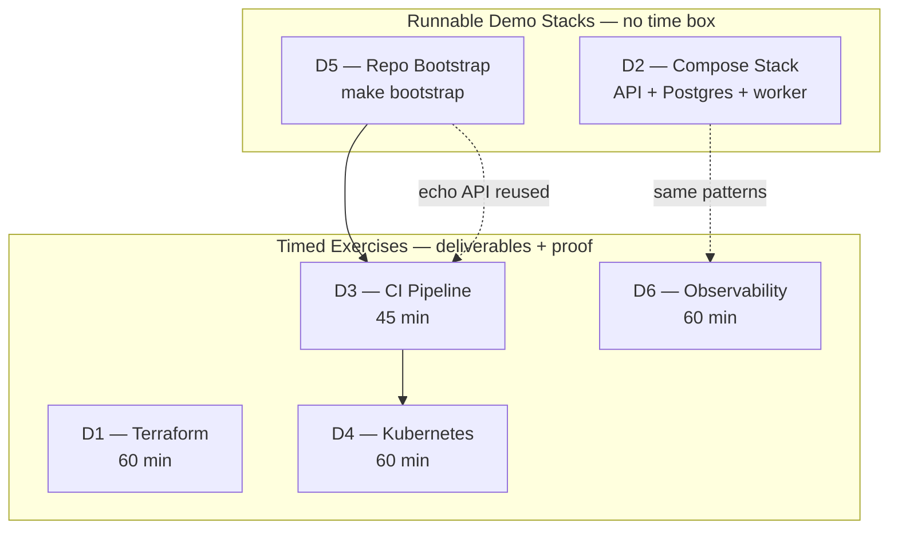
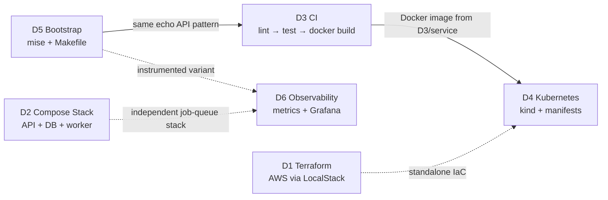
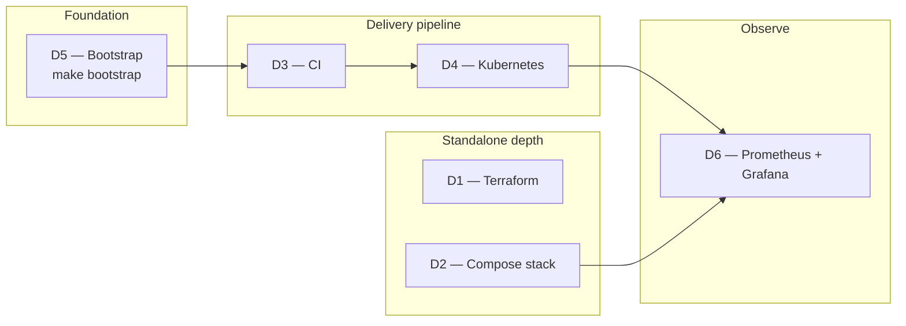

# Infra and DevOps Track — Ship, Deploy & Observe

Six exercises that teach the **full delivery path from code to running systems**: infrastructure as code, multi-service local stacks, CI/CD pipelines, Kubernetes manifests, developer bootstrap tooling, and production-style observability.

This track is the **fourth and final difficulty tier** in the [Agent Evaluation Tasks](../README.md) library. It builds on skills from [Intermediate](../Intermediate/README.md) (especially [I5 — Dockerize and run](../Intermediate/I5/README.md)) and connects naturally to real-world platform engineering work.

---

## Table of contents

- [What this track teaches](#what-this-track-teaches)
- [Two kinds of content](#two-kinds-of-content)
- [Task catalog at a glance](#task-catalog-at-a-glance)
- [How the tasks connect](#how-the-tasks-connect)
- [Recommended learning path](#recommended-learning-path)
- [Timed exercises (D1, D3, D4, D6)](#timed-exercises-d1-d3-d4-d6)
- [Runnable demo stacks (D2, D5)](#runnable-demo-stacks-d2-d5)
- [Prerequisites & tooling](#prerequisites--tooling)
- [Agent workflow specs](#agent-workflow-specs)
- [What each task folder contains](#what-each-task-folder-contains)
- [Pass criteria summary](#pass-criteria-summary)
- [Hygiene & conventions](#hygiene--conventions)
- [What's next](#whats-next)

---

## What this track teaches

| Skill | Where you practice it | Why it matters |
|-------|----------------------|----------------|
| **Infrastructure as code** | D1 | Define cloud resources declaratively; validate and plan before apply |
| **Multi-service orchestration** | D2 | Wire API + database + worker with Docker Compose, healthchecks, and E2E proof |
| **CI/CD pipelines** | D3 | Lint → test matrix → container build on every push |
| **Kubernetes deployment** | D4 | Manifests, ConfigMaps, kind clusters, port-forward verification |
| **Developer experience** | D5 | One-command repo bootstrap with mise + Makefile |
| **Observability** | D6 | Structured JSON logs, Prometheus metrics, Grafana dashboards |

Every timed task has explicit **pass criteria**, helper **scripts**, and optional **agent workflow specs** for AI-assisted eval runs.

---

## Two kinds of content

The Infra and DevOps track splits into **timed build exercises** and **runnable reference stacks**:



### Timed exercises (D1, D3, D4, D6)

Hands-on build tasks with a time box and checklist. You produce working Terraform, CI YAML, K8s manifests, or an observability stack — then prove it with scripts.

### Runnable demo stacks (D2, D5)

Reference implementations you can run immediately. No strict time limit — use them to learn patterns or as fixtures for downstream tasks.

---

## Task catalog at a glance

| Task | Type | Time | Goal | Stack | Start here |
|------|------|------|------|-------|------------|
| [D1](D1/README.md) | Exercise | 60 min | Terraform: S3 + Lambda + API Gateway + IAM | Terraform, LocalStack | [README](D1/README.md) |
| [D2](D2/README.md) | Demo stack | — | FastAPI + PostgreSQL + background worker | Docker Compose | [README](D2/README.md) |
| [D3](D3/README.md) | Exercise | 45 min | GitHub Actions: lint → test matrix → image build | GHA, ruff, Docker | [README](D3/README.md) |
| [D4](D4/README.md) | Exercise | 60 min | Deploy D3 echo service to local **kind** cluster | kubectl, kind | [README](D4/README.md) |
| [D5](D5/README.md) | Demo stack | — | One-command repo bootstrap (`make bootstrap`) | mise, Makefile | [README](D5/README.md) |
| [D6](D6/README.md) | Exercise | 60 min | structlog JSON + Prometheus + Grafana dashboard | Docker Compose | [README](D6/README.md) |

**Total timed exercise time:** ~4 hours (D1 + D3 + D4 + D6). Demo stacks (D2, D5) run at your own pace.

---

## How the tasks connect

Several tasks **reuse the same FastAPI echo service** and build on each other:



| Dependency | What carries over |
|------------|-------------------|
| **D5 → D3** | Same FastAPI echo API (`GET /health`, `GET /echo/{message}`) |
| **D3 → D4** | D4 builds its container image from `D3/service/` — run D3 CI or `docker build` first |
| **D5 → D6** | D6 service is a D5-style echo API + structlog + Prometheus instrumentation |
| **D2** | Standalone — job-queue pattern (API writes pending rows → worker processes → API reads) |

> **Rule of thumb:** For the **D3 → D4 → D6 pipeline**, start with D5 (bootstrap) or D3 (CI), then D4 (K8s), then D6 (observability). D1 and D2 can run in parallel — they do not block each other.

---

## Recommended learning path



| Step | Action | Why |
|------|--------|-----|
| **1** | [D5 — Bootstrap](D5/README.md) — `make bootstrap` | Fastest win: pinned Python, venv, passing tests in one command |
| **2** | [D3 — CI](D3/README.md) — `./scripts/run-ci-local.sh` | Learn lint → matrix test → Docker build before touching K8s |
| **3** | [D4 — Kubernetes](D4/README.md) — cluster-up → deploy → verify | Reuses D3 image; practice manifests and kind |
| **4** | [D6 — Observability](D6/README.md) — obs-up → load → verify-metrics | Metrics, logs, and dashboards on a running stack |
| **5** | [D1 — Terraform](D1/README.md) — validate → plan (LocalStack) | IaC fundamentals — independent of the echo pipeline |
| **6** | [D2 — Compose stack](D2/README.md) — `./scripts/run-e2e.sh` | Multi-service patterns: API + DB + worker with E2E proof |

> **Shortcut:** If you already know Docker and CI, jump straight to D3 → D4 → D6. If you are new to containers, do [Intermediate I5](../Intermediate/I5/README.md) first, then D2.

---

## Timed exercises (D1, D3, D4, D6)

### D1 — Terraform Small Service

**Goal:** Author Terraform for a small AWS HTTP API — **S3 bucket + Lambda + API Gateway HTTP API + IAM**. Prove `terraform validate` passes and produce a clean plan against **LocalStack** (no real AWS spend).

**Architecture:**

```
HTTP client → API Gateway (HTTP API) → Lambda (Python) → S3 bucket
                     ↑
              IAM execution role
```

**Quick start (validate only — no Docker):**

```bash
cd "tasks/Infra and DevOps/D1"
chmod +x scripts/*.sh
./scripts/validate.sh
```

**Full LocalStack flow:** start LocalStack → `terraform init` → `plan-localstack.sh` → optional apply → destroy.

| Resource | Link |
|----------|------|
| Task brief | [D1/README.md](D1/README.md) |
| Agent workflow | [terraform-small-service-agent.md](D1/terraform-small-service-agent.md) |
| Golden sample | [terraform-run-d1-aws-demo.md](D1/terraform-run-d1-aws-demo.md) |

---

### D3 — CI Pipeline

**Goal:** GitHub Actions workflow for the D3 Echo FastAPI service: **lint (ruff) → test (Python 3.11 + 3.12 matrix) → build and tag container image** on every push.

**Architecture:**

```
push / pull_request → lint → test (matrix) → build-image (sha + branch tags)
```

**Quick start:**

```bash
cd "tasks/Infra and DevOps/D3"
chmod +x scripts/*.sh
./scripts/run-ci-local.sh
```

Expected: `CI local run: PASSED (exit 0)`

**Failure demo:** `./scripts/demo-failure.sh` — deliberately breaks a test, expects exit 1, auto-reverts.

| Resource | Link |
|----------|------|
| Task brief | [D3/README.md](D3/README.md) |
| Agent workflow | [ci-pipeline-writer.md](D3/ci-pipeline-writer.md) |
| Golden sample | [ci-run-d3-demo.md](D3/ci-run-d3-demo.md) |

---

### D4 — Kubernetes Manifests

**Goal:** Deploy the **existing D3 echo FastAPI service** to a local **kind** cluster. No new application code — manifests + scripts only.

**Architecture:**

```
curl → port-forward → Service (ClusterIP) → Deployment → D3 echo API (:8080)
                              ↑
                         ConfigMap (LOG_LEVEL, APP_NAME)
```

**Quick start:**

```bash
cd "tasks/Infra and DevOps/D4"
chmod +x scripts/*.sh
./scripts/cluster-up.sh    # kind create + build D3 image + load
./scripts/deploy.sh        # dry-run + apply + rollout wait
./scripts/verify.sh        # port-forward + curl /health
```

Expected verify output: `{"status":"ok"}`

| Resource | Link |
|----------|------|
| Task brief | [D4/README.md](D4/README.md) |
| Agent workflow | [k8s-manifests-agent.md](D4/k8s-manifests-agent.md) |
| Golden sample | [k8s-run-d4-demo.md](D4/k8s-run-d4-demo.md) |

---

### D6 — Observability Stack

**Goal:** Instrument a D5-style echo FastAPI service with **structlog JSON logs** and **Prometheus metrics**, then run **Prometheus + Grafana** via Docker Compose. Generate traffic and prove metrics appear in Grafana.

**Architecture:**

```
load.sh → app (:8080) → JSON logs (stdout)
              ↑
         /metrics ← prometheus (:9090) → grafana (:3000)
```

**Quick start:**

```bash
cd "tasks/Infra and DevOps/D6"
chmod +x scripts/*.sh
./scripts/obs-up.sh
./scripts/load.sh
sleep 20
./scripts/verify-metrics.sh
```

| Service | URL | Credentials |
|---------|-----|-------------|
| App | http://127.0.0.1:8080/health | — |
| Prometheus | http://127.0.0.1:9090 | — |
| Grafana | http://127.0.0.1:3000 | `admin` / `admin` |

Dashboard: **D6 Echo API Overview** → panel **HTTP Request Rate**

| Resource | Link |
|----------|------|
| Task brief | [D6/README.md](D6/README.md) |
| Agent workflow | [observability-stack-agent.md](D6/observability-stack-agent.md) |
| Golden sample | [obs-run-d6-demo.md](D6/obs-run-d6-demo.md) |

---

## Runnable demo stacks (D2, D5)

### D2 — Multi-Service Docker Compose Stack

**Goal:** Job processing stack — **FastAPI API** + **PostgreSQL** + **Python worker**. One command brings everything up and runs E2E tests against the live API.

**Architecture:**

```
POST /jobs  -->  api  -->  db (pending row)
                              ^
worker polls db ------------|
worker updates row (done) --> db
GET /jobs/{id}  <--  api  <-- db
```

**Quick start:**

```bash
cd "tasks/Infra and DevOps/D2"
chmod +x scripts/*.sh
./scripts/run-e2e.sh
```

| action | command |
|--------|---------|
| bring stack up | `./scripts/stack-up.sh` |
| full E2E | `./scripts/run-e2e.sh` |
| tail logs | `docker compose logs -f api worker db` |
| teardown | `./scripts/stack-down.sh` |

**Seed data:** `db/init/02-seed.sql` inserts job `seed-welcome` with status `done` — E2E test proves init scripts ran on a fresh volume.

→ Full details: [D2/README.md](D2/README.md)

---

### D5 — Repo Bootstrap Demo

**Goal:** Fresh clone → working tests in **one command** using mise + Makefile.

**Quick start:**

```bash
cd "tasks/Infra and DevOps/D5"
make bootstrap
```

That single command:

1. Installs [mise](https://mise.jdx.dev) if missing
2. Installs Python **3.12** from `.mise.toml`
3. Creates `service/.venv` and installs dev dependencies
4. Runs `pytest -v` (must pass)

| action | command |
|--------|---------|
| tests only | `make test` |
| lint | `make lint` |
| simulate fresh clone | `make clean && make bootstrap` |

→ Full details: [D5/README.md](D5/README.md) · Golden sample: [bootstrap-run-d5-demo.md](D5/bootstrap-run-d5-demo.md)

---

## Prerequisites & tooling

### Tooling by task

| Tool | Version | Needed for |
|------|---------|------------|
| Python | 3.11+ | D3, D5, D6 (host tests); D2 (E2E only) |
| Docker + Compose | 24+ | D1 (LocalStack), D2, D3, D4, D6 |
| Terraform | ≥ 1.5 | D1 |
| kind + kubectl | latest | D4 |
| make + curl | any | D5 bootstrap |
| mise | optional | D5 (auto-installed by bootstrap) |
| git | any | D3 (SHA/branch image tags) |
| [act](https://github.com/nektos/act) | optional | D3 (run GHA YAML locally) |

Create Python virtualenvs locally — **never commit** `.venv/`, `node_modules/`, Terraform `*.tfstate*`, or Docker volumes.

### Minimum host setup

```bash
# Verify core tools
docker --version          # 24+
docker compose version    # v2
python3 --version         # 3.11+
terraform version         # >= 1.5 (D1 only)
kind version              # D4 only
kubectl version --client  # D4 only
```

---

## Agent workflow specs

Each timed exercise includes a **repeatable AI workflow** — inputs, step-by-step procedure, output schema, and stop conditions.

| Task | Spec file | Agent name |
|------|-----------|------------|
| D1 | [terraform-small-service-agent.md](D1/terraform-small-service-agent.md) | `terraform-small-service-agent` |
| D2 | [docker-compose-stack-agent.md](D2/docker-compose-stack-agent.md) | `docker-compose-stack-agent` |
| D3 | [ci-pipeline-writer.md](D3/ci-pipeline-writer.md) | `ci-pipeline-writer` |
| D4 | [k8s-manifests-agent.md](D4/k8s-manifests-agent.md) | `k8s-manifests-agent` |
| D5 | [repo-bootstrap-agent.md](D5/repo-bootstrap-agent.md) | `repo-bootstrap-agent` |
| D6 | [observability-stack-agent.md](D6/observability-stack-agent.md) | `observability-stack-agent` |

**For AI-assisted eval runs:**

1. Read the task [README](D1/README.md) first
2. Then read the agent workflow spec
3. Produce deliverables matching the golden `*-run-*-demo.md` sample format
4. Run the task's verification scripts and capture output

---

## What each task folder contains

```
Infra and DevOps/
├── README.md                              ← you are here
│
├── D1/  Terraform small service
│   ├── README.md                          # task brief + LocalStack flow
│   ├── terraform/                         # .tf files, lambda handler
│   ├── scripts/                           # validate, plan, apply, destroy
│   ├── docker-compose.localstack.yml
│   ├── terraform-small-service-agent.md   # agent workflow
│   ├── terraform-run-d1-aws-demo.md       # golden sample
│   └── EVALUATOR.md                       # graders only
│
├── D2/  Multi-service Compose stack
│   ├── README.md
│   ├── docker-compose.yml                 # api + db + worker
│   ├── api/ worker/ db/init/              # service source + SQL seeds
│   ├── tests/test_e2e.py                  # live-stack E2E
│   ├── scripts/                           # stack-up, run-e2e, stack-down
│   ├── docker-compose-stack-agent.md
│   └── stack-run-d2-demo.md               # golden sample
│
├── D3/  CI pipeline
│   ├── README.md
│   ├── .github/workflows/ci.yml           # lint → test matrix → build
│   ├── service/                           # FastAPI echo API + Dockerfile
│   ├── scripts/                           # run-ci-local, demo-failure
│   ├── ci-pipeline-writer.md
│   ├── ci-run-d3-demo.md
│   └── EVALUATOR.md
│
├── D4/  Kubernetes manifests
│   ├── README.md
│   ├── k8s/                               # namespace, configmap, deployment, service, ingress
│   ├── kind-config.yaml
│   ├── scripts/                           # cluster-up, deploy, verify, teardown
│   ├── k8s-manifests-agent.md
│   ├── k8s-run-d4-demo.md
│   └── EVALUATOR.md
│
├── D5/  Repo bootstrap
│   ├── README.md
│   ├── .mise.toml                         # Python 3.12 pin
│   ├── Makefile                           # bootstrap, test, lint, clean
│   ├── service/                           # echo API (D3 pattern)
│   ├── scripts/bootstrap.sh
│   ├── repo-bootstrap-agent.md
│   └── bootstrap-run-d5-demo.md
│
└── D6/  Observability stack
    ├── README.md
    ├── service/                           # echo API + structlog + prometheus_client
    ├── observability/                     # prometheus, grafana, compose
    ├── scripts/                           # obs-up, load, verify-metrics, obs-down
    ├── observability-stack-agent.md
    ├── obs-run-d6-demo.md
    └── EVALUATOR.md
```

| Artifact | Purpose |
|----------|---------|
| `README.md` | **Start here** for each task — goal, setup, pass criteria |
| `*-agent.md` | Step-by-step workflow for AI-assisted runs |
| `*-run-*-demo.md` | Golden sample — reference quality bar for deliverables |
| `scripts/` | Repeatable commands (`validate.sh`, `run-e2e.sh`, `obs-up.sh`, etc.) |
| `EVALUATOR.md` | Hidden answer key for graders — **do not read during exercise** |

---

## Pass criteria summary

| Task | Pass when |
|------|-----------|
| **D1** | `terraform validate` exits 0; LocalStack plan shows ~10 resources to add; README documents full lifecycle |
| **D2** | `./scripts/run-e2e.sh` exits 0; worker logs show job processing; seed data readable after fresh volume |
| **D3** | `./scripts/run-ci-local.sh` exits 0; `./scripts/demo-failure.sh` exits 1 as expected; CI YAML has lint + matrix test + image build |
| **D4** | `kubectl apply --dry-run=client` exits 0; `/health` returns `{"status":"ok"}` via port-forward; ConfigMap env vars visible in pod |
| **D5** | `make bootstrap` installs deps and `pytest -v` passes on fresh clone |
| **D6** | Prometheus target UP; request rate > 0 after load; Grafana dashboard shows live data; stdout logs are JSON one-liners |

---

## Hygiene & conventions

- **Do not commit** generated artifacts: `.venv/`, `node_modules/`, `.terraform/`, `*.tfstate*`, Docker volume data
- **EVALUATOR.md** — hidden answer keys; candidates must not read them during the exercise
- **Image reuse** — D4 builds from `D3/service/`; do not fork the echo API unless the task brief asks for it
- **LocalStack only for D1 apply** — real AWS is optional and may incur cost; never commit `terraform.tfvars`
- **Golden samples** — compare your output to `*-run-*-demo.md`; capture your own command output as proof
- **Scripts are the source of truth** — if README and script disagree, follow the script and file an issue

---

## What's next

After completing this track, you have covered the full [Agent Evaluation Tasks](../README.md) library:

| Prior track | What you already know |
|-------------|----------------------|
| [Basics](../Basics/README.md) | Read unfamiliar repos — artifact inventory, routes, tests |
| [Intermediate](../Intermediate/README.md) | Operate repos — diagrams, patches, Docker, polyglot builds |
| [Advanced](../Advanced/README.md) | Plan and execute at scale — parallel git, review, performance |
| **Infra and DevOps** (this track) | Ship and observe — IaC, CI, K8s, bootstrap, metrics |

**Suggested real-world follow-ups:**

- Wire D3 CI to push images to a container registry (GHCR, ECR)
- Replace LocalStack D1 with a remote Terraform backend (S3 + DynamoDB)
- Extend D6 with alerting rules (Alertmanager) or distributed tracing (OpenTelemetry)
- Combine D2 job-queue pattern with D3 CI and D4 K8s for a full microservice deploy

Full catalog: [tasks/README.md](../README.md)

---

## Getting started

1. Pick a [task from the catalog](#task-catalog-at-a-glance) — or follow the [learning path](#recommended-learning-path).
2. Open that task's `README.md` for goal, setup, and pass criteria.
3. Install prerequisites from the [tooling table](#prerequisites--tooling).
4. For AI-assisted runs, also read the linked agent workflow spec.
5. Compare your output to the golden `*-run-*-demo.md` sample when one exists.

**Suggested first session (~30 min):**

```bash
cd "tasks/Infra and DevOps/D5"
make bootstrap                    # D5 — one-command bootstrap
cd ../D3 && ./scripts/run-ci-local.sh   # D3 — local CI green run
```

You will have touched developer bootstrap and a full CI pipeline before diving into Terraform or Kubernetes.
