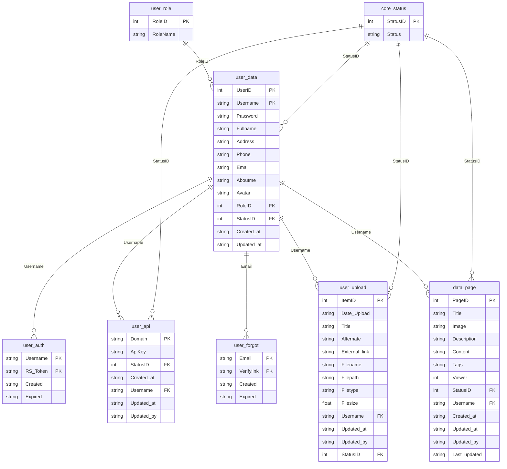

# ER Diagram Report — agent repo

```yaml
agent: er-diagram-mapper
version: 1.0
repo_root: /Users/mayanksrivastava/Desktop/agent
scanned_at: 2026-06-17
schema_sources_found: 2
table_count: 8
entity_count: 5
fk_declared: 11
fk_inferred: 0
```

## Executive summary

The repo’s only relational schema lives in **reSlim** (MariaDB/MySQL). `reSlim/resources/database/reSlim.sql` defines **8 tables** centered on `user_data`, with `core_status` and `user_role` as shared lookup tables. Eleven **declared** foreign keys enforce cascading updates/deletes. Application PHP classes (`User`, `Auth`, `Upload`, `Pages`) map to these tables via raw SQL. Separate tutorial apps under `tasks/Basics/B4` and `tasks/Basics/B5` define **in-memory** `Transaction` models with no SQL tables or FKs.

---

## Tables inventory

| table | columns (summary) | primary key | source |
|---|---|---|---|
| `core_status` | StatusID, Status | StatusID | `reSlim/resources/database/reSlim.sql:26-29` |
| `data_page` | PageID, Title, Image, Description, Content, Tags, Viewer, StatusID, Username, Created_at, Updated_at, Updated_by, Last_updated | PageID | `reSlim/resources/database/reSlim.sql:95-109` |
| `user_api` | Domain, ApiKey, StatusID, Created_at, Username, Updated_at, Updated_by | Domain | `reSlim/resources/database/reSlim.sql:117-125` |
| `user_auth` | Username, RS_Token, Created, Expired | (Username, RS_Token) | `reSlim/resources/database/reSlim.sql:133-138` |
| `user_data` | UserID, Username, Password, Fullname, Address, Phone, Email, Aboutme, Avatar, RoleID, StatusID, Created_at, Updated_at | (UserID, Username) | `reSlim/resources/database/reSlim.sql:146-160` |
| `user_forgot` | Email, Verifylink, Created, Expired | (Email, Verifylink) | `reSlim/resources/database/reSlim.sql:175-180` |
| `user_role` | RoleID, Role | RoleID | `reSlim/resources/database/reSlim.sql:188-191` |
| `user_upload` | ItemID, Date_Upload, Title, Alternate, External_link, Filename, Filepath, Filetype, Filesize, Username, Updated_at, Updated_by, StatusID | ItemID | `reSlim/resources/database/reSlim.sql:210-224` |

---

## Application entities

| entity (class) | maps_to_table | role | source |
|---|---|---|---|
| `classes\User` | `user_data`, `user_role`, `user_forgot`, `core_status` | User CRUD, roles, password reset | `reSlim/src/classes/User.php:22-27`, SQL e.g. `:72-73`, `:298`, `:677`, `:731` |
| `classes\Auth` | `user_auth`, `user_api` | Tokens & API keys | `reSlim/src/classes/Auth.php:22`, SQL e.g. `:179`, `:507` |
| `classes\Upload` | `user_upload`, `core_status` | File upload metadata | `reSlim/src/classes/Upload.php:21`, SQL e.g. `:147`, `:322` |
| `modules\pages\Pages` | `data_page`, `core_status` | CMS pages | `reSlim/src/modules/pages/Pages.php:17`, SQL e.g. `:88`, `:390` |
| `classes\middleware\ApiKey` | `user_api`, `user_data` | API key validation join | `reSlim/src/classes/middleware/ApiKey.php:49-50` |

---

## Primary keys

| table | primary key column(s) | composite | auto_increment | source |
|---|---|---|---|---|
| `core_status` | StatusID | no | yes (→53) | `reSlim/resources/database/reSlim.sql:233-235`, `:312-313` |
| `data_page` | PageID | no | yes | `reSlim/resources/database/reSlim.sql:240-241`, `:317-318` |
| `user_api` | Domain | no | no | `reSlim/resources/database/reSlim.sql:252-253` |
| `user_auth` | Username, RS_Token | yes | no | `reSlim/resources/database/reSlim.sql:262-264` |
| `user_data` | UserID, Username | yes | UserID only (→2) | `reSlim/resources/database/reSlim.sql:269-270`, `:322-323` |
| `user_forgot` | Email, Verifylink | yes | no | `reSlim/resources/database/reSlim.sql:281-282` |
| `user_role` | RoleID | no | yes (→6) | `reSlim/resources/database/reSlim.sql:289-291`, `:327-328` |
| `user_upload` | ItemID | no | yes | `reSlim/resources/database/reSlim.sql:296-297`, `:332-333` |

---

## Foreign keys & relationships

All relationships below are **declared** in DDL (`ON DELETE CASCADE ON UPDATE CASCADE` unless noted).

| from_table | from_column | to_table | to_column | type | declared_or_inferred | source |
|---|---|---|---|---|---|---|
| `data_page` | StatusID | `core_status` | StatusID | many-to-one | declared (`data_page_ibfk_1`) | `reSlim/resources/database/reSlim.sql:341-343` |
| `data_page` | Username | `user_data` | Username | many-to-one | declared (`data_page_ibfk_2`) | `reSlim/resources/database/reSlim.sql:341-343` |
| `user_api` | StatusID | `core_status` | StatusID | many-to-one | declared (`user_api_ibfk_1`) | `reSlim/resources/database/reSlim.sql:348-350` |
| `user_api` | Username | `user_data` | Username | many-to-one | declared (`user_api_ibfk_2`) | `reSlim/resources/database/reSlim.sql:348-350` |
| `user_auth` | Username | `user_data` | Username | many-to-one | declared (`user_token`) | `reSlim/resources/database/reSlim.sql:355-356` |
| `user_data` | StatusID | `core_status` | StatusID | many-to-one | declared (`user_data_ibfk_1`) | `reSlim/resources/database/reSlim.sql:361-363` |
| `user_data` | RoleID | `user_role` | RoleID | many-to-one | declared (`user_data_ibfk_2`) | `reSlim/resources/database/reSlim.sql:361-363` |
| `user_forgot` | Email | `user_data` | Email | many-to-one | declared (`user_forgot_ibfk_1`) | `reSlim/resources/database/reSlim.sql:368-369` |
| `user_upload` | Username | `user_data` | Username | many-to-one | declared (`user_upload_ibfk_1`) | `reSlim/resources/database/reSlim.sql:374-376` |
| `user_upload` | StatusID | `core_status` | StatusID | many-to-one | declared (`user_upload_ibfk_2`) | `reSlim/resources/database/reSlim.sql:374-376` |

**Application joins mirroring FKs** (confirm usage, not additional constraints):

- `User.php` — `user_data` ⟕ `user_role` ⟕ `core_status` (`:791-792`)
- `Auth.php` — `user_auth` ⟕ `user_data` (`:226-227`)
- `Upload.php` — `user_upload` ⟕ `core_status` (`:321-322`)
- `Pages.php` — `data_page` ⟕ `core_status` (`:389-390`)

---

## Non-relational models

| model | storage | fields | source |
|---|---|---|---|
| `TransactionResponse` | in-memory list (`TransactionStore`) | id, amount, type, description | `tasks/Basics/B4/app/schemas.py:26-31`, `tasks/Basics/B4/app/store.py:6-9` |
| `Transaction` (JS object) | in-memory list (`TransactionStore`) | id, amount, type, description | `tasks/Basics/B5/src/store.js:42-47`, `tasks/Basics/B5/src/app.js:14-15` |

No FKs or ER edges apply to these models.

---

## Mermaid ER diagram



> **Note:** Mermaid attribute blocks support only `PK`, `FK`, or `UK` suffixes (not `PK_FK`). SQL types are normalized to `string` / `int` / `float` for renderer compatibility. The `user_role.Role` column is labeled `RoleName` in the diagram to avoid clashing with relationship labels.

---

## Manual follow-up

- **`data_page.Viewer`** is an `int` counter incremented in PHP (`Pages.php:280`), not a FK to another table.
- **`user_data` composite PK** `(UserID, Username)` is unusual; FKs reference `Username` alone — verify uniqueness expectations.
- **`user_forgot` → `user_data.Email`** FK requires every reset row to match an existing user email; nullable emails in `user_data` could block inserts.
- **Scheduler** `event_delete_all_expired_auth_scheduler.sql` only deletes from `user_auth`; no schema change.
- **B4/B5** tutorial stores are intentionally omitted from the Mermaid diagram (no relational schema).
