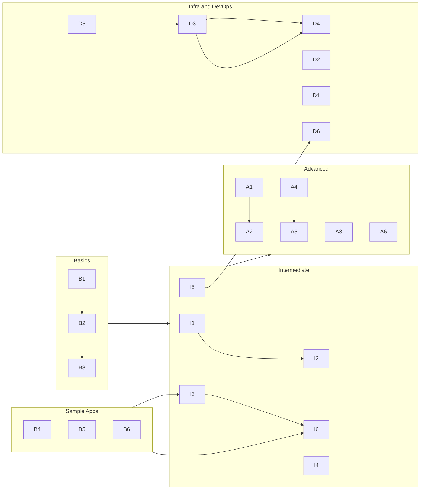

# Agent Evaluation Tasks

A curated library of **timed engineering exercises** for humans and AI agents. Each task tests a specific skill — repo discovery, safe patching, parallel execution, polyglot builds, infra-as-code, and performance work — with explicit deliverables, pass criteria, and optional agent workflow specs.

This folder is the **single source of truth** for all eval content. Every task lives in its own directory with a task brief (`README.md`), and most include golden samples, evaluator keys, or runnable reference code.

---

## Table of contents

- [Folder structure](#folder-structure)
- [Four difficulty tracks](#four-difficulty-tracks)
- [Task catalog](#task-catalog)
- [Recommended learning path](#recommended-learning-path)
- [What each task folder contains](#what-each-task-folder-contains)
- [Shared sample applications](#shared-sample-applications)
- [External dependencies](#external-dependencies)
- [Agent workflow specs](#agent-workflow-specs)
- [Hygiene and conventions](#hygiene-and-conventions)
- [Quick links](#quick-links)

---

## Folder structure

```
tasks/
├── README.md                    ← you are here
│
├── Basics/                      ← discovery & repo literacy (B1–B6)
│   ├── B1/  Repo artifact inventory
│   ├── B2/  API endpoint map
│   ├── B3/  Test discovery & execution
│   ├── B4/  FastAPI transaction ledger (sample app)
│   ├── B5/  Express transaction ledger (sample app)
│   └── B6/  Rust log-counter CLI (sample app)
│
├── Intermediate/                ← repo operator & polyglot builder (I1–I6)
│   ├── README.md                ← track overview + reSlim setup
│   ├── I1/  ER diagram from repo
│   ├── I2/  End-to-end flow trace
│   ├── I3/  Small safe change
│   ├── I4/  Polyglot service pair (FastAPI + Node CLI)
│   ├── I5/  Dockerize and run
│   └── I6/  Seeded bug diagnosis
│
├── Advanced/                    ← planning, execution, review, perf (A1–A6)
│   ├── A1/  Multi-worktree parallel plan (plan only)
│   ├── A2/  Execute parallel worktrees (execution)
│   ├── A3/  Mini fraud score system (Python + Node + Rust)
│   ├── A4/  Repository modernization plan + first step
│   ├── A5/  Agent-generated PR review
│   └── A6/  Performance profiling + targeted fix
│
└── Infra and DevOps/            ← IaC, CI/CD, K8s, observability (D1–D6)
    ├── D1/  Terraform small service (LocalStack)
    ├── D2/  Multi-service Docker Compose stack
    ├── D3/  CI pipeline (GitHub Actions)
    ├── D4/  Kubernetes manifests (kind)
    ├── D5/  Repo bootstrap demo (mise + Makefile)
    └── D6/  Observability stack (Prometheus + Grafana)
```

**24 tasks total** — 6 per track. Time boxes range from **15 minutes** (B3) to **90 minutes** (A2, A4, A6, I4).

---

## Four difficulty tracks

| Track | Focus | Typical skills tested |
|-------|--------|------------------------|
| [**Basics**](Basics/) | Read unfamiliar code fast | Artifact inventory, route mapping, test discovery |
| [**Intermediate**](Intermediate/) | Operate and extend repos | ER diagrams, flow traces, surgical patches, Docker, polyglot services |
| [**Advanced**](Advanced/) | Plan, execute, review at scale | Parallel git worktrees, multi-language pipelines, modernization, PR review, perf |
| [**Infra and DevOps**](Infra%20and%20DevOps/) | Ship and observe systems | Terraform, Compose, CI, Kubernetes, bootstrap tooling, metrics |

Tracks are **independent** — you can start anywhere — but the [recommended path](#recommended-learning-path) below builds skills in a logical order.

---

## Task catalog

### Basics — discovery & repo literacy

| Task | Time | Goal | Primary target | Details |
|------|------|------|----------------|---------|
| [B1](Basics/B1/README.md) | 30 min | Structured inventory of classes, services, controllers, configs | `reSlim/` or B4/B5 | [code-artifact-mapper](Basics/B1/code-artifact-mapper.md) |
| [B2](Basics/B2/README.md) | 30 min | Map every externally exposed HTTP route to its handler | `reSlim/` or B4/B5 | [route-discovery-mapper](Basics/B2/route-discovery-mapper.md) |
| [B3](Basics/B3/README.md) | 15 min | Detect test framework, run tests, interpret results | B4, B5, B6, or reSlim | [test-discovery-executor](Basics/B3/test-discovery-executor.md) |
| [B4](Basics/B4/README.md) | — | **Sample app:** FastAPI transaction ledger | in-repo | `pytest`, `uvicorn` |
| [B5](Basics/B5/README.md) | — | **Sample app:** Express transaction ledger (B4 counterpart) | in-repo | `npm test`, `npm start` |
| [B6](Basics/B6/README.md) | — | **Sample app:** Rust log-counter CLI | in-repo | `cargo test`, `cargo run` |

B1–B3 are **analysis-only** exercises (markdown deliverables). B4–B6 are **runnable reference apps** used as smaller targets for discovery tasks and as fixtures for Intermediate/Advanced work.

---

### Intermediate — repo operator & polyglot builder

See also the track overview: [Intermediate/README.md](Intermediate/README.md).

| Task | Time | Goal | Primary target | Agent spec |
|------|------|------|----------------|------------|
| [I1](Intermediate/I1/README.md) | 45 min | ER inventory + Mermaid `erDiagram` with citations | `reSlim/` | [er-diagram-mapper](Intermediate/I1/er-diagram-mapper.md) |
| [I2](Intermediate/I2/README.md) | 45 min | One flow trace + Mermaid `sequenceDiagram` | `reSlim/` | [flow-tracer](Intermediate/I2/flow-tracer.md) |
| [I3](Intermediate/I3/README.md) | 60 min | Minimal diff + test + risk report (≤2 prod files) | B4 or B5 | [surgical-patcher](Intermediate/I3/surgical-patcher.md) |
| [I4](Intermediate/I4/README.md) | 90 min | FastAPI `/convert` + Node CLI + tests | `I4/` (in-repo) | reference implementation |
| [I5](Intermediate/I5/README.md) | 60 min | Dockerfile + running container proof | `I5/` (in-repo) | reference implementation |
| [I6](Intermediate/I6/README.md) | 60 min | Reproduce seeded bug, root cause, minimal fix | `I6/fixture/sandbox/` | [seeded-bug-diagnoser](Intermediate/I6/seeded-bug-diagnoser.md) |

I4 and I5 ship **runnable reference implementations** for verification. I6 uses a **disposable sandbox copy** of B5 — never modify canonical `Basics/B5`.

---

### Advanced — planning, execution, review, performance

| Task | Time | Goal | Primary target | Agent spec |
|------|------|------|----------------|------------|
| [A1](Advanced/A1/README.md) | 45 min | Split one feature into 2–5 parallel lanes (**plan only**) | `reSlim/` | [parallel-task-splitter](Advanced/A1/parallel-task-splitter.md) |
| [A2](Advanced/A2/README.md) | 90 min | **Execute** A1 plan: worktrees, merges, verification | `reSlim/` | [parallel-worktree-executor](Advanced/A2/parallel-worktree-executor.md) |
| [A3](Advanced/A3/README.md) | — | **Build task:** Python + Node + Rust fraud scoring pipeline | `A3/` (in-repo) | multi-component system |
| [A4](Advanced/A4/README.md) | 90 min | Modernization findings + one safe first step | `A4/starter/` | [modernization-first-stepper](Advanced/A4/modernization-first-stepper.md) |
| [A5](Advanced/A5/README.md) | 60 min | Review agent-generated PR — structured issue list + verdict (analysis only) | `A5/fixture/` | [agent-pr-reviewer](Advanced/A5/agent-pr-reviewer.md) |
| [A6](Advanced/A6/README.md) | 90 min | Profile bottleneck, minimal fix, ≥10% improvement | `A6/fixture/` | [targeted-perf-fixer](Advanced/A6/targeted-perf-fixer.md) |

**A1 → A2 pair:** A1 produces a parallel plan; A2 executes it. Do not create worktrees or commits in A1.

**A4 → A5 chain:** A5 reviews a simulated agent PR against the A4 legacy starter baseline.

**A3** is the flagship **polyglot build** — a three-service pipeline documented end-to-end in [Advanced/A3/README.md](Advanced/A3/README.md).

---

### Infra and DevOps — ship and observe

| Task | Time | Goal | Stack | Agent spec |
|------|------|------|-------|------------|
| [D1](Infra%20and%20DevOps/D1/README.md) | 60 min | Terraform: S3 + Lambda + API Gateway + IAM | Terraform, LocalStack | [terraform-small-service-agent](Infra%20and%20DevOps/D1/terraform-small-service-agent.md) |
| [D2](Infra%20and%20DevOps/D2/README.md) | — | **Demo stack:** FastAPI + PostgreSQL + worker | Docker Compose | [docker-compose-stack-agent](Infra%20and%20DevOps/D2/docker-compose-stack-agent.md) |
| [D3](Infra%20and%20DevOps/D3/README.md) | 45 min | GitHub Actions: lint → test matrix → image build | GHA, ruff, Docker | [ci-pipeline-writer](Infra%20and%20DevOps/D3/ci-pipeline-writer.md) |
| [D4](Infra%20and%20DevOps/D4/README.md) | 60 min | Deploy D3 echo service to local **kind** cluster | kubectl, kind | [k8s-manifests-agent](Infra%20and%20DevOps/D4/k8s-manifests-agent.md) |
| [D5](Infra%20and%20DevOps/D5/README.md) | — | One-command repo bootstrap (`make bootstrap`) | mise, Makefile | [repo-bootstrap-agent](Infra%20and%20DevOps/D5/repo-bootstrap-agent.md) |
| [D6](Infra%20and%20DevOps/D6/README.md) | 60 min | structlog JSON + Prometheus + Grafana dashboard | Docker Compose | [observability-stack-agent](Infra%20and%20DevOps/D6/observability-stack-agent.md) |

**D3 → D4 dependency:** D4 reuses the D3 FastAPI service Docker image — build D3's service before deploying to kind.

---

## Recommended learning path



| Stage | Suggested order | Why |
|-------|-----------------|-----|
| **1 — Read code** | B1 → B2 → B3 | Learn to inventory artifacts, map routes, and run tests |
| **2 — Warm-up apps** | B4, B5, or B6 | Smaller targets before reSlim; required for I3/I6 |
| **3 — Operate repos** | I1 → I2 → I3 → I4 → I5 → I6 | Diagrams, traces, patches, polyglot build, Docker, debugging |
| **4 — Advanced delivery** | A1 → A2, then A3 or A4 → A5 → A6 | Parallel git, multi-language systems, modernization, review, perf |
| **5 — Infra** | D5 → D3 → D4, plus D1/D2/D6 | Bootstrap, CI, Kubernetes, Terraform, observability |

---

## What each task folder contains

Most task directories follow a consistent layout:

```
{TaskId}/
├── README.md                 # Task brief: goal, deliverables, pass criteria, setup
├── {skill}-*.md              # Optional agent workflow spec (step-by-step for AI runs)
├── agent-run-output-*.md     # Golden sample output from a completed agent run
├── EVALUATOR.md              # Answer key for graders (do not read during exercise)
├── scripts/                  # Helper scripts (benchmark, bootstrap, stack-up, etc.)
├── fixture/ or starter/      # Target code, patches, or seeded bugs
└── proof/                    # Screenshot or terminal output evidence (where applicable)
```

| Artifact | Purpose |
|----------|---------|
| `README.md` | **Start here** — everything needed to attempt the task |
| `*-mapper.md`, `*-splitter.md`, etc. | Structured workflow for AI-assisted eval runs |
| `agent-run-output-*.md` | Reference quality bar for human or agent deliverables |
| `EVALUATOR.md` | Hidden from candidates; used by reviewers for scoring |
| `scripts/` | Repeatable commands (`benchmark.sh`, `run-e2e.sh`, `validate.sh`) |
| `proof/` | Visual evidence that the system runs (see A3, B4, B5, B6) |

---

## Shared sample applications

Three in-repo apps appear across multiple tasks:

| App | Path | Stack | Used by |
|-----|------|-------|---------|
| **FastAPI Ledger** | [Basics/B4](Basics/B4/README.md) | Python, FastAPI, pytest | B1–B3 (alt target), I3, I6 sandbox source |
| **Express Ledger** | [Basics/B5](Basics/B5/README.md) | Node.js, Express, Vitest | B1–B3 (alt target), I3, I6 seeded bug |
| **Log Counter CLI** | [Basics/B6](Basics/B6/README.md) | Rust, clap | B3 (alt target) |

Both ledgers expose the same API contract:

| Method | Path | Description |
|--------|------|-------------|
| `POST` | `/transactions` | Create credit or debit |
| `GET` | `/transactions` | List all transactions |
| `GET` | `/balance` | Current balance |

---

## External dependencies

Several tasks target **[reSlim](https://github.com/aalfiann/reSlim)** — a PHP Slim 3 REST API with MariaDB schema. Clone it once at the **repository root** (sibling to `tasks/`):

```bash
# from repo root
git clone --depth 1 https://github.com/aalfiann/reSlim.git reSlim
```

| Tasks requiring reSlim |
|------------------------|
| B1, B2, B3 (primary target), I1, I2, I6 (PHP variant), A1, A2, A4 (alternate) |

> **Note:** If an older checkout used a broken submodule pin, use the clone command above instead of `git submodule update`.

### Tooling summary

| Tool | Version | Needed for |
|------|---------|------------|
| Python | 3.9+ | B4, I4, I5, A3, D2–D6 |
| Node.js | 18+ | B5, I4, A3, I6 |
| Rust (`cargo`) | stable | B6, A3 |
| Docker + Compose | 24+ | I5, D2, D3–D6 |
| Terraform | ≥ 1.5 | D1 |
| kind + kubectl | latest | D4 |
| PHP + Composer | 7.4+ / 8.x | reSlim, A4 starter |

Create Python virtualenvs locally — **never commit** `.venv/`, `node_modules/`, `target/`, or Terraform state.

---

## Agent workflow specs

Each `*-agent.md` or `*-mapper.md` file defines a **repeatable AI workflow**: inputs, steps, output schema, and stop conditions. These map to Cursor skills installed in the parent agent repo (e.g. `code-artifact-mapper`, `parallel-task-splitter`, `targeted-perf-fixer`).

| Skill file (in task folder) | Cursor skill name | Tasks |
|-----------------------------|-------------------|-------|
| `code-artifact-mapper.md` | code-artifact-mapper | B1 |
| `route-discovery-mapper.md` | route-discovery-mapper | B2 |
| `test-discovery-executor.md` | test-discovery-executor | B3 |
| `er-diagram-mapper.md` | er-diagram-mapper | I1 |
| `flow-tracer.md` | flow-tracer | I2 |
| `surgical-patcher.md` | surgical-patcher | I3 |
| `seeded-bug-diagnoser.md` | — | I6 |
| `parallel-task-splitter.md` | parallel-task-splitter | A1 |
| `parallel-worktree-executor.md` | parallel-worktree-executor | A2 |
| `modernization-first-stepper.md` | modernization-first-stepper | A4 |
| `agent-pr-reviewer.md` | agent-pr-reviewer | A5 |
| `targeted-perf-fixer.md` | targeted-perf-fixer | A6 |
| `terraform-small-service-agent.md` | — | D1 |
| `docker-compose-stack-agent.md` | — | D2 |
| `ci-pipeline-writer.md` | — | D3 |
| `k8s-manifests-agent.md` | — | D4 |
| `repo-bootstrap-agent.md` | — | D5 |
| `observability-stack-agent.md` | — | D6 |

For AI eval runs: read the task `README.md` first, then the agent workflow spec, then produce deliverables matching the golden sample format.

---

## Hygiene and conventions

- **Do not commit** generated or local artifacts: `.venv/`, `node_modules/`, `vendor/`, `target/`, `.pytest_cache/`, Terraform `*.tfstate*`
- **Source citations** — analysis tasks require `source: path:line-range` on every finding
- **Time boxes** — pass criteria assume the stated duration; scope accordingly
- **EVALUATOR.md** — hidden answer keys; candidates must not read them during the exercise
- **Canonical apps** — modify `I6/fixture/sandbox/`, not `Basics/B5`, when debugging I6
- **Proof screenshots** — store under `proof/` in the task folder (see A3, B4, B5, B6)

---

## Quick links

### Track overviews

- [Intermediate track README](Intermediate/README.md)

### Flagship build tasks (runnable systems)

- [A3 — Mini Fraud Score System](Advanced/A3/README.md) — Python FastAPI + Node worker + Rust scorer
- [D2 — Multi-Service Docker Compose Stack](Infra%20and%20DevOps/D2/README.md) — API + PostgreSQL + worker
- [I4 — Polyglot Service Pair](Intermediate/I4/README.md) — FastAPI + Node CLI

### Parallel git workflow

- [A1 — Plan](Advanced/A1/README.md) → [A2 — Execute](Advanced/A2/README.md)
- Golden plan: [parallel-plan-a1-demo.md](Advanced/A1/parallel-plan-a1-demo.md)
- Golden run: [parallel-run-a1-demo.md](Advanced/A2/parallel-run-a1-demo.md)

### Modernization & review chain

- [A4 — Modernization first step](Advanced/A4/README.md) → [A5 — PR review](Advanced/A5/README.md)

### Infra pipeline

- [D5 — Bootstrap](Infra%20and%20DevOps/D5/README.md) → [D3 — CI](Infra%20and%20DevOps/D3/README.md) → [D4 — Kubernetes](Infra%20and%20DevOps/D4/README.md) → [D6 — Observability](Infra%20and%20DevOps/D6/README.md)

---

## Getting started

1. Pick a task from the [catalog](#task-catalog) (or follow the [learning path](#recommended-learning-path)).
2. Open that task's `README.md` — it has goal, deliverables, setup, and pass criteria.
3. Clone [reSlim](https://github.com/aalfiann/reSlim) if the task requires it.
4. For AI-assisted runs, also read the agent workflow spec linked in the task README.
5. Compare your output to the golden `agent-run-output-*.md` sample when one exists.

For the most detailed single-task documentation in this repo, see **[Advanced/A3/README.md](Advanced/A3/README.md)** — layout, data contract, run order, environment variables, tests, and proof screenshots for the three-component fraud scoring pipeline.
